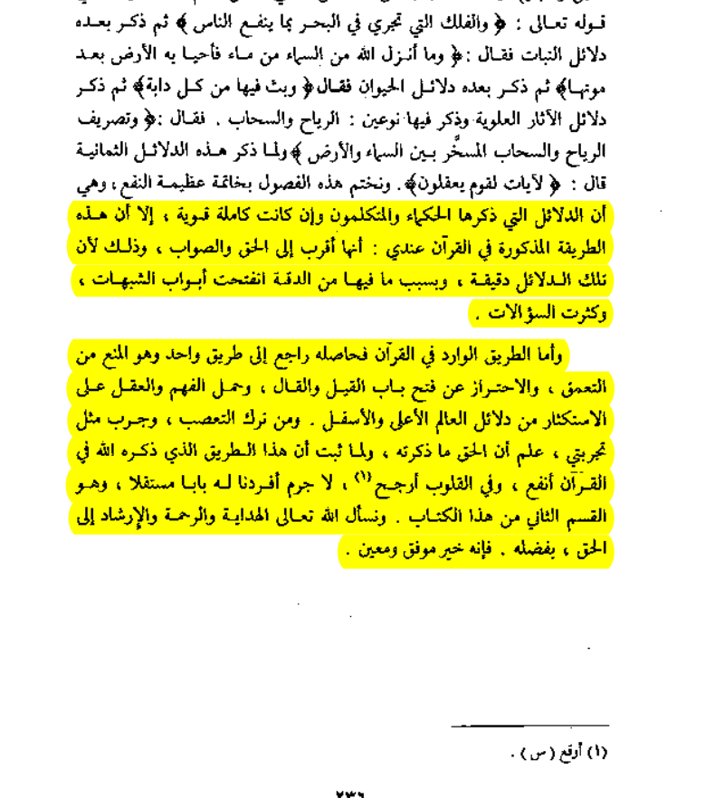
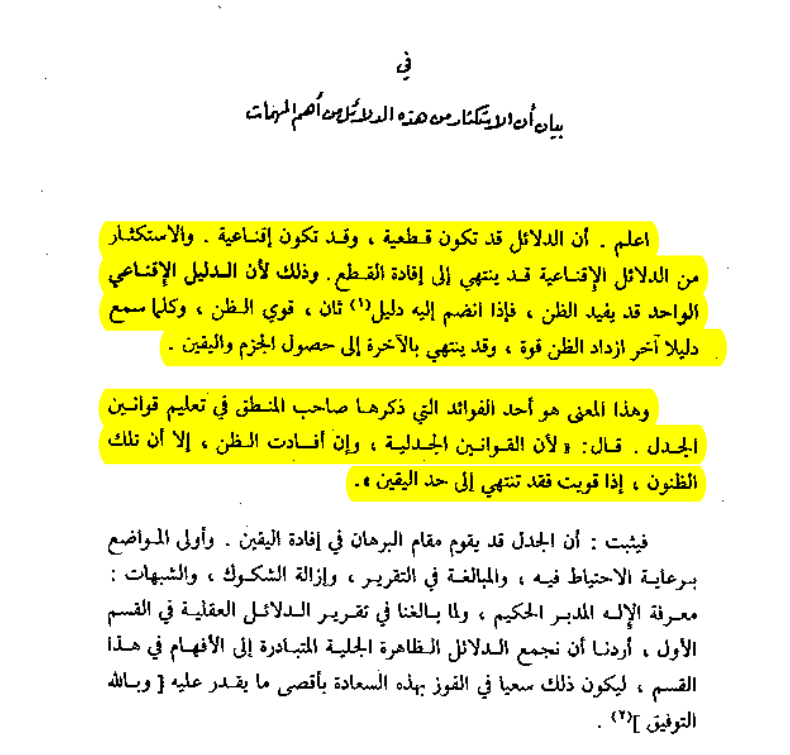
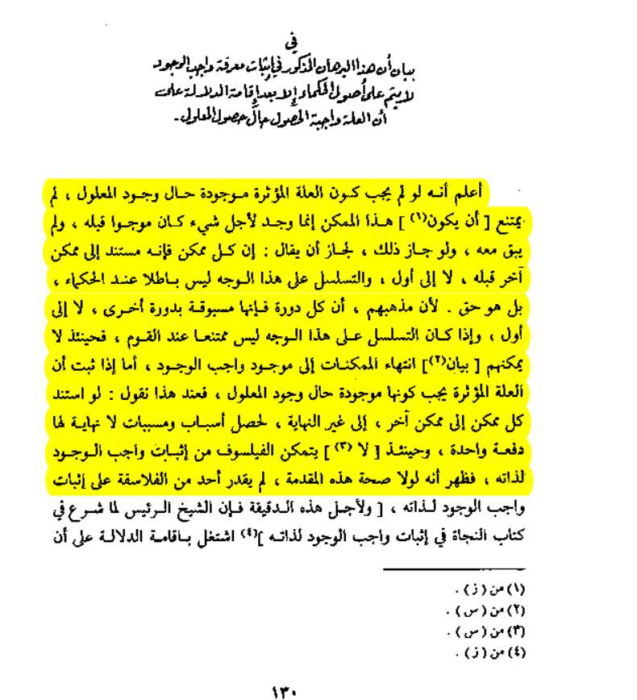
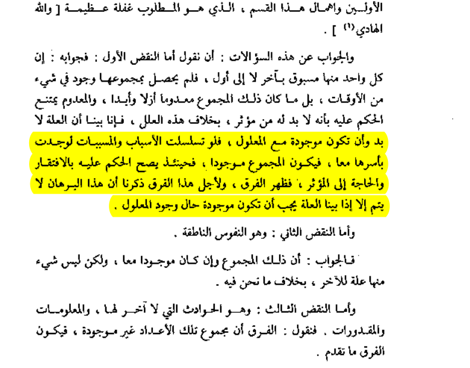
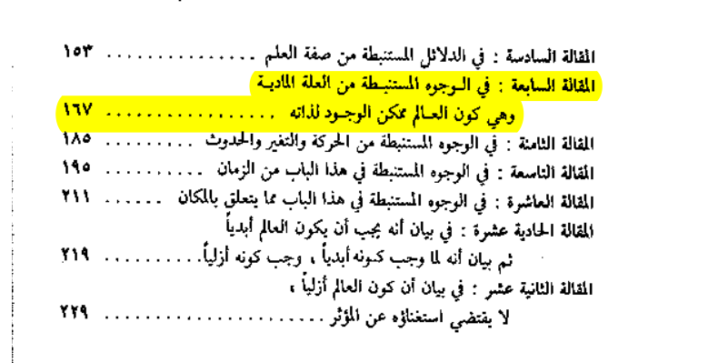

# Fasıl I — El-Vücûd

## Bu Fasıl Nasıl Okunur

- Yeni geçen **her işaret**, kullanılmadan önce tarif edilir; hiçbir sembol, tanıtılmadan bir formülün içinde çıkmaz.
- Her yabancı kelimenin kökü, lise seviyesinde, ayrı bir kutuda verilir.
- Açıklamalar **"Çoban için"** satırlarında en sade misalle verilir; birden çok ihtimal varsa cümleyle değil **şema**yla gösterilir.
- Bu fasılda **iki müstakil yol** birlikte yürür: (A) felsefî-kelâmî **Burhân-ı İmkân** (mefhumların tahkikinden hükme giden silsile-i mantık), (B) doğrudan Kur'ân'ın kendi kullandığı **Burhân-ı Tahsis** ve kardeşleri. İkisi de burhânîdir; biri diğerinin yerine geçmez, biri diğerini **tamamlar**.
- Sıra hep aynıdır: **kelime → çoban misali → şema → formül → netice.**
- **Tertip:** Bu uygulama bir **şerh** — sözlü akıl yürütmeyi de taşıyan bir ders kitabıdır; saf sembolik formüller ayrıca `risale/fasil_1_vucud/formuller.md`de mühürlüdür. §0'dan §14'e **bütün fasıl** aynı şekildedir: her formülün altında Okunuşu ve Bağlamıyla vardır.
- **Her formülün altında üç okunuş:** (1) formülün kendisi, (2) **Okunuşu** — sembolleri birebir Türkçe kelimelerle, sırasıyla söyleyiş (izah değil, salt telaffuz: `¬(P∧¬P)` → "değildir (p ve p değil)"), (3) **Bağlamıyla** — aynı okunuşun, o formülün konuştuğu şeyle doldurulmuş hâli (bu, şerhin kendisidir).

## 0. Mebâdî-i Mantıkiyye

### 0.1 Kullanılacak İşaretler

| İşaret | Menşe | Bu risalede ne demek |
| :-- | :-- | :-- |
| κ (kappa) | yalnız kısaltma harfi | "hangi suale göre ayırıyoruz?" |
| ⟺ₜ | — | "bu bölüş hiçbir ihtimali dışarda bırakmıyor" |
| ⟹ | — | "―den zorunlu olarak şu çıkar" |
| ↯ | — | "çelişki, burada duvara çarpıyoruz" |
| ∴ | — | "öyleyse, netice olarak" |
| ⊳ | — | "şu başlığın alt kolu" |
| ⋉ | — | "şu kaide, buraya tatbik ediliyor" |
| X ─sebeb→ Y | — | "X, Y'yi var eder; X, Y'nin var oluşunun illetidir" |

**Parantez kaidesi:** `(...)` yalnız, hemen önündeki adı tarif edilmiş bir işlevin/yüklemin gerçek parametreleri için kullanılır (mesela `muhal(x)`, `İlim(Vâcib,x,t)`). Bir maddeye atıf (mesela "§3'e bakınız") veya kısa bir izah/hüküm kelimesi (mesela "muhal") hiçbir zaman `(...)` içine yazılmaz — bunlar köşeli parantez `[...]` içine konur.

### 0.2 Akıl Kaideleri (Evveliyyât) — Bu Risalenin Üzerine Bastığı Zemin

Şimdiye kadar okunan ve bundan sonra okunacak her burhan, aslında tek bir şeyi tekrar tekrar farklı yerlere tatbik etmekten ibarettir: **aklın, hiçbir tecrübeye, hiçbir keşfe muhtaç olmadan, doğrudan kendi kendine bildiği birkaç kaide.** Bunlara kelâmda ve mantıkta **evveliyyât** (en baştan bilinenler) denir. Bir muarız çıkıp "belki bir şey aynı anda hem var hem yok olabilir" veya "sebepsiz yere yokluktan varlık çıkabilir" dediği vakit, ona verilecek cevap işte bu kaidelerdir — bu yüzden onları risalenin en başına, her burhandan önce koyuyoruz. Bu zemin sağlam kurulmazsa, ileride kurulan hiçbir bina ayakta duramaz.

**Kaç tanedirler? Bir tasnif tashihi.** Klasik mantıkta "aklın dört temel ilkesi" denince dört kaide kastedilir: Ayniyet, Nakzeyn (tenakuzun butlânı), Üçüncü Hâlin İmkânsızlığı, ve Kâfi Sebep. Bazı metinlerde bunlara beşinci olarak **Gayelilik** (her nizamlı fiilin bir gayeye matuf olması) de eklenir; fakat bu, dikkatli bakılınca aynı mertebede değildir. İlk dördü, **var olan HER ŞEYE** istisnasız şamildir — bir taş için de geçerlidir, bir düşünce için de. Gayelilik ise yalnız **şuur ve irade sahibi bir fâilin fiiline** hastır; bir taşın düşmesi için "gayesi ne?" diye sorulmaz, ama bir insanın veya Hakîm bir Fâil'in fiili için sorulur. Bu yüzden Gayelilik'i burada dördüncüye eklemiyoruz — o, kendi asıl yerinde (§9, Hakîm—Gaye—Şer bahsinde) ayrıca ve gereği gibi işlenecektir. Burada yalnız, istisnasız her şeye şamil olan dört evveliyyâtı ele alıyoruz.

#### 0.2.1 Ayniyet Kanunu (Mebde-i Hüviyet)

Bir şey ne ise odur; kendi zâtının aynıdır, başkası değildir. Elindeki koyun koyundur — ona, aynı anda, "hayır bu attır" diyemezsin. Bu o kadar bedihîdir ki ispatı değil, yalnız hatırlatılması gerekir: bir mefhumun içini neyle doldurduysan, hüküm verirken o içerik değişmeden kalır; değişirse zaten başka bir mefhumdan bahsediyorsun demektir, aynı şeyden değil.

```
A ≡ A          ∀x (x = x)
```
**Okunuşu:** A aynıdır A. Her x için: x eşittir x.
**Bağlamıyla:** "Bir şey" kendi kendinin aynıdır; ne ise odur.

#### 0.2.2 Nakzeyn Kanunu (Tenakuzun Butlânı)

İki çelişik hüküm, aynı anda, aynı cihetten, aynı nisbetle, ikisi birden doğru olamaz. Elindeki taş şu an hem buradadır hem burada değildir diyemezsin — "aynı cihetten" kaydı mühimdir: taş bir bakımdan (mekânda) buradadır, başka bir bakımdan (rengiyle) da tarif edilebilir, bunda çelişki yok; çelişki, AYNI bakımdan hem-hem denildiğinde doğar. Bu risalenin **tamamı**, aslında bu tek kaideyi tekrar tekrar, farklı yerlere tatbik etmekten ibarettir.

```
¬(P ∧ ¬P)          ∀x ¬(Mevcud(x) ∧ ¬Mevcud(x))
```
**Okunuşu:** Değildir (p ve p değil). Her x için: değildir (x mevcuttur ve x mevcut değildir).
**Bağlamıyla:** "Bir şey" (aynı anda, aynı cihetten) (hem var hem var değil) olamaz.

Bunun kendisi başka bir şeyden ispat edilmez — inkârı bile kendini nakzeder: "Nakzeyn yanlıştır" diyen kişi bile, kendi cümlesinin "doğru" ile "yanlış"ın aynı anda aynı şey olmadığını zaten kabul etmiş olur (bu savunmanın genel şekli §0.3'te ayrıca kurulacaktır).

#### 0.2.3 Üçüncü Hâlin İmkânsızlığı (İmtinâ-ı Şıkk-ı Sâlis)

Birbirine çelişik iki hâl arasında üçüncü bir orta yol yoktur. Koyun ya canlıdır ya ölüdür; "ne canlı ne ölü, üçüncü bir hâl" diye bir şey olamaz. Dikkat edilsin: bu, Nakzeyn'in aynısı değil, onun **ikizi**dir — Nakzeyn "ikisi birden olamaz" der, bu kaide "ikisinin dışında üçüncüsü de olamaz" der. İkisi birlikte, bir mefhumu ikiye böldüğünüzde (κ, Nakzeyn'le tükenmişlik ⟺ₜ) hiçbir ihtimalin dışarıda kalmadığını garanti eder — bu risaledeki her taksimin (Vücûb taksimi, Sıfat çeşidi, Gaye çeşidi…) sağlamlığı buradan gelir.

```
P ∨ ¬P          ∀x (Mevcud(x) XOR ¬Mevcud(x))
```
**Okunuşu:** P veya p değil. Her x için: x mevcuttur veya x mevcut değildir, ikisi birden değil.
**Bağlamıyla:** "Bir şey" ya vardır ya yoktur; üçüncü bir orta hâli yoktur.

#### 0.2.4 Kâfi Sebep Kanunu (Mebde-i İllet)

Kendiliğinden zarurî olmayan (mümkin) hiçbir şey, kendi kendine varlık sahasına çıkamaz veya bir hâlden başka bir hâle geçemez; her hudûs ve her tebeddül için dıştan kâfi bir illet şarttır. Terazinin iki boş kefesi dengede durur; dışarıdan biri bir kefeye dokunmadıkça, kefelerden biri kendi kendine aşağı inmez.

```
Mümkin(x) ∧ Hudûs(x)  ⟹  ∃y (y≠x ∧ İllet(y,x))
```
**Okunuşu:** x mümkindir ve x sonradan olmuştur ise, öyle bir y vardır ki: y, x'e eşit değildir ve y, x'in illetidir.
**Bağlamıyla:** "Kendiliğinden zarurî olmayıp da sonradan ortaya çıkan bir şey" varsa, o şeyden başka, onu var eden bir sebep mutlaka vardır.

**Bir itiraza cevap — bu kaide keyfî bir varsayım mıdır?** Bazı filozoflar (meşhuren Hume) nedensellik ilkesinin, Ayniyet ve Nakzeyn gibi saf mantıkî bir zaruret olmadığını, yalnız tecrübeden gelen bir alışkanlık olduğunu ileri sürmüştür — yani "sebepsiz bir şeyin vuku bulması" mantıken çelişkili değil, yalnız alışılmadıktır, denilir. Bu itiraz ciddiye alınmalı ve şöyle cevaplanmalıdır: Kâfi Sebep Kanunu, aslında Nakzeyn'in **var olma sahasına dolaylı bir tatbikinden** başka bir şey değildir, keyfî bir ilave değildir:

```
Sebepsiz-tercih(x, H₁, H₂) ≔ Fark(H₁,H₂) = ∅   [H₁ ile H₂ arasında hiçbir ayırt edici sebep yok]
                            ∧ Vaki(H₁) ≠ Vaki(H₂)   [yine de biri gerçekleşti, öbürü değil]
↯ — "aralarında fark yok" ile "aralarında (netice) farkı var" aynı anda doğru olamaz;
    netice farkı da bir fark çeşididir, bu da Nakzeyn'in ihlâlidir
```
**Okunuşu:** x'in H₁-H₂ arasındaki sebepsiz tercihi şöyledir: H₁ ile H₂'nin farkı boş kümedir, ve H₁'in vukuu H₂'nin vukuuna eşit değildir — çelişki.
**Bağlamıyla:** "İki ihtimal" arasında (aralarında hiçbir ayırt edici sebep yokken) (biri gerçekleşip öbürünün gerçekleşmemesi) olamaz.

Demek, "tereccüh bilâ müreccih" (sebepsiz tercih) yalnız alışılmadık değil, doğrudan çelişkilidir: sebepsiz bir tercih, "fark yokken fark iddia etmek"tir. Bu risalenin bütün İsbât-ı Vâcib bahsi (§3) zaten bu tatbikin üzerine kuruludur; oradaki devir ve teselsül butlânları da, aynı Kâfi Sebep Kanunu'nun iki ayrı sahaya (döngüsel sebep, sonsuz zincir) tatbikinden ibarettir — burada tekrar kurulmayacak, yalnız işaret edilmiştir.

### 0.3 Bu Kaideler Neden Hiçbir Keşifle Çürütülemez? (Burhân-ı İmtinâ-ı Nakz-ı Zâtî)

Yukarıdaki dört kaidenin ortak bir hususiyeti vardır: hiçbiri, gelecekte yapılacak bir tecrübe veya keşifle çürütülebilecek türden değildir. Sebebi şudur — bunları çürütmeye kalkan her teşebbüs, teşebbüsün kendisinde onları zaten kullanmak zorunda kalır. Bir kimse "İleride öyle bir keşif olacak ki, Nakzeyn Kanunu çürüyecek" dese, şu adımlar zarurî olarak işler:

1. Bu iddia (T) anlamlı bir hüküm olabilmesi için kendi zıddından (¬T, "çürümeyecek") ayrışmış, ondan farklı olmak zorundadır — bu, bizzat Ayniyet ve Nakzeyn'in ta kendisidir.
2. Eğer iddia doğruysa ve Nakzeyn gerçekten çökmüşse, o vakit T ile ¬T aynı anda doğru kabul edilebilir hâle gelir; ama bu durumda "çürüdü" sözü ile "çürümedi" sözü arasındaki fark da kalkar — iddianın kendisi anlamsız bir gürültüye döner, hiçbir şey iddia etmemiş olur.
3. Öte yandan bu iddiayı taşıyan her fizikî teori (kuantum mekaniği dâhil) bizzat riyaziyat üzerine kuruludur, riyaziyatın temelinde ise `1 ≠ 0` gibi saf mantıkî ayrımlar yatar. Nakzeyn'i iptal etmek, mantıkta "patlama ilkesi" (ex falso quodlibet) gereği, sistemden **her önermenin** aynı anda hem ispatlanabilir hem çürütülebilir olması demektir — bu durumda "kuantum mekaniği" diye bir teoriden de, onun iddia ettiği "çürüdü" hükmünden de geriye hiçbir şey kalmaz.

```
∀ iddia T: T anlamlı ⟹ T ≠ ¬T   [Ayniyet + Nakzeyn'in tatbiki]
T ∧ ¬T kabul edilirse ⟹ (patlama ilkesi) her önerme ispatlanır ⟹ "T" sözünün de bir mânâsı kalmaz
∴ Nakzeyn'i inkâr etmek, inkârı SÖYLEMEK için dahi Nakzeyn'i doğru kabul etmeyi gerektirir
```
**Okunuşu:** Her T iddiası için: T anlamlıdır ise, T, T-değile eşit değildir. T ve T-değil kabul edilirse, öyleyse her önerme ispatlanır.
**Bağlamıyla:** "Herhangi bir iddia" (anlamlı olabilmesi için bile) (kendi zıddından ayrışmış olmak) zorundadır.

**Netice:** Mantık kaidelerini inkâr etmeye kalkan her zihin, inkârını ifade edebilmek için dahi bu kaideleri doğru kabul etmek mecburiyetindedir. Bu, yalnız Nakzeyn'e mahsus değildir — "her şey görecelidir" diyenin bu hükmün kendisini mutlak sayması, "hiçbir şey bilinemez" diyenin bu bilgiyi nasıl bildiği sorusuyla çökmesi gibi, aynı aileden pek çok iddia aynı tarzda kendi kendini çürütür. Mantık kaideleri işte bu sebeple tecrübenin veya fiziğin konusu değil, **her türlü tecrübenin ve her türlü fiziğin sıhhat şartıdır** — aşağıda, bu genel kaidenin en meşhur güncel itirazına (kuantum mekaniği) nasıl tatbik edildiği gösterilecektir.

### 0.4 Bir Tatbik Misali: Kuantum Mekaniği Mantığı Nakzetti mi?

**Kısaca cevap: Hayır, nakzedemez de.** "Kuantum mantığı çürüttü" sözü, fizikteki matematiksel bir tasvir ile ontolojik bir hakikati birbirine karıştıran bir kategori hatasından (mugalata-i cins) ibarettir. Bu iddia yaygın olduğu için, risalenin en başında, tek tek çürütülmesi gerekir.

#### 0.4.1 Kategori Hatası: Fizikî Kanun ile Aklî Kaide Ayrı Cinstir

Yerçekimi, termodinamik, Schrödinger denklemi gibi kaideler, hâricî âlemde tecrübeyle tespit edilmiş **âdetullah**tır — bunların zıddı aklen muhal değildir, yalnız âdet dışıdır (bir parçacığın dalga gibi yayılması aklen imkânsız değil, alışılmadıktır). Ayniyet, Nakzeyn, Üçüncü Hâlin İmkânsızlığı ve Kâfi Sebep ise fizikî kâinatın maddesine bağlı kaideler değildir; bizzat **anlamın, idrakin ve varlığın kendisinin var olma şartı**dır. Bir elektronun iki delikten birden geçmesi fizikî bir hayret kaynağıdır, fakat "bir elektron aynı anda, aynı cihetten hem vardır hem yoktur" demek aklen muhaldir — birincisi âdetin dışına çıkar, ikincisi aklın kendisini iptal eder.

**Çoban için:** Elindeki koyunun rengi yeşil olsa veya koyun uçsa, bu fizikî olarak gariptir ama aklen imkânsız değildir. Fakat o koyunun "aynı anda hem bir koyun olması hem de sıfır koyun (yokluk) olması" aklen imkânsızdır. Kuantum mekaniği, koyunun kanat çırpışını keşfetmiş olabilir; koyunun hem var hem yok olduğunu değil.

#### 0.4.2 Dört İddia ve Hakikatleri

| İddia | Zannedilen | Hakikat |
| :-- | :-- | :-- |
| **Süperpozisyon** (Schrödinger'in kedisi) | "Kedi ölçülene kadar hem canlı hem ölüdür — Nakzeyn çöktü" | `\|ψ⟩ = α\|canlı⟩ + β\|ölü⟩` ifadesindeki `+`, mantıksal VE (∧) değil, bir ihtimal genliğidir (vektör toplamı). Kedi zâtında iki zıt hükmü cem etmez; bilgimiz sınırlıdır veya sistem henüz etkileşime girmemiş bir potansiyeldir. Bilfiil ölçüldüğü an kedi ya ölüdür ya diridir — üçüncüsü yoktur, ve hiçbir dedektör "yarı canlı" bir sonuç kaydetmemiştir. |
| **Dalga-parçacık ikiliği** | "Işık hem dalgadır hem parçacıktır — zıtlar birleşti" | Nakzeyn'in şartı "aynı cihetten"dir. Işık yayılırken dalga karakteri (girişim), maddeyle etkileşirken parçacık karakteri (fotoelektrik) gösterir — bunlar iki ayrı deney şartıdır, iki ayrı cihettir. Aynı deneyde, aynı anda, ışık hem bütünüyle dalga hem bütünüyle tekil parçacık olarak ölçülmez. |
| **Kuantum tünelleme** | "Parçacık bariyerin hem içinde hem dışında" | Dalga fonksiyonunun genliği bariyer içinde azalarak ama sıfırlanmadan devam eder; bu, parçacığın konumu hakkında bir **ihtimal** verir. Ölçüldüğünde parçacık ya bariyerin bir yanındadır ya öbür yanında — "aynı anda ikisi birden" değil. |
| **Vakum dalgalanmaları** | "Boşlukta parçacıklar sebepsiz, yoktan var oluyor — Kâfi Sebep çöktü" | Fizikteki "vakum," kelâmdaki mutlak adem (hiçlik) değildir; sıfır-noktası enerjisi olan, kuantum alanlarıyla dolu fizikî bir zemindir. Bir potansiyelin fiile çıkması için zaten bir zemin ve kanun mevcuttur — ortada fâilsiz, zeminsiz bir "hiçlikten fışkırma" yoktur. |

**Bir ayrıntı — farklı yorumlar da Nakzeyn'e dokunmaz.** Kuantum mekaniğinin "ölçüm problemi"ne dair Kopenhag, Çoklu-Dünyalar (Everett) ve Bohm mekaniği gibi birbirinden farklı fizik-felsefesi yorumları vardır; bunlar birbirinden çok ayrı metafizik tablolar çizer, fakat **hiçbiri** "aynı anda, aynı cihetten hem X hem ¬X" demez: Kopenhag'a göre ölçümden önce netice henüz belirlenmemiştir (hangisi olacağı belirsizdir, ama "ikisi birden vaki" değildir); Everett'e göre her ihtimal kendi ayrı dalında kesin bir netice alır (aynı dalda çelişki yoktur, yalnız dallar çoğalır); Bohm'a göre netice baştan beri bellidir, yalnız bizim bilgimiz eksiktir. Üç yorum da birbirinden ayrılır, fakat üçü de Nakzeyn'e aynı derecede saygılıdır — mesele fizikte hangi yorumun doğru olduğudur, mantığın çökmesi değildir.

#### 0.4.3 Netice: Akıl Kaideleri Keşfin Konusu Değil, Şartıdır

```
Mebâdi-i Akliyye  ≻  Kavânîn-i Tabîiyye

∀ Teori Θ (kuantum dâhil):
  Θ'nın vaz'olunabilmesi bizzat (P(Θ) ∧ ¬P(Θ) ⟹ Butlân) şartına bağlıdır
  [bkz. §0.3, patlama ilkesi]

∴ Mantık kaideleri tecrübî/fizikî keşiflerin konusu değildir;
  her türlü keşfin sıhhat şartıdır (şart-ı evvelîdir)
```
**Okunuşu:** Akıl kaideleri, tabiat kanunlarından üstündür. Her Θ teorisi için: Θ'nın ortaya konabilmesi, "Θ doğrudur ve Θ yanlıştır ise batıldır" şartına bağlıdır.
**Bağlamıyla:** "Herhangi bir fizik teorisi" (kuantum mekaniği dâhil), ortaya atılabilmesi için bile, (kendi içinde çelişki barındırmaması) şartına bağlıdır.

| Netice | (T) |
| :-- | :-- |
| Akıl kaideleri (Ayniyet, Nakzeyn, Üçüncü Hâlin İmkânsızlığı, Kâfi Sebep) hiçbir keşifle çürütülemez | burhânî |
| Kuantum mekaniğindeki "çelişki" iddiaları kategori hatasıdır; Nakzeyn'e dokunmaz | burhânî |

## 1. Taksim-i Aklî — Zihindeki Bir Mâhiyet Üç Hâlden Hangisindedir?

| Kelime | Kök | Lugat mânâsı | Neden bu isim |
| :-- | :-- | :-- | :-- |
| Mâhiyet | م ا ه (mâ huve = "o nedir?") | "bir şeyin ne'liği, tarifi" | zihne gelen, henüz vücûd şartı taşımayan mefhum |
| Vâcib | و ج ب (vücûb) | "gerekli, zorunlu düşmüş" | hâriçte bulunmaması imkânsız olan |
| Mümkin | م ك ن (imkân) | "güç yetme, olabilme" | hâriçte bulunması da bulunmaması da mümkün |
| Mümteni | م ن ع (men) | "engellenmiş, alıkonmuş" | hâriçte bulunması bizatihi imkânsız |
| Taksim | ق س م | "bölme, paylaştırma" | bir bütünü, hiçbir parça dışarıda kalmayacak biçimde ayırma |

### 1.1 Neden "Mevcûd mu?" Diye Değil de "Mâhiyet" Diye Başlıyoruz?

Taksime "Bu şey mevcûd mudur?" diye başlamak yanlış olurdu. Çünkü **mümteni** (mesela "dört köşeli daire") hâricî vücûd taşımaz; onu "mevcûdlar" arasında sayıp sonra taksim etmeye kalkarsak, daha ilk adımda onu dışarıda bırakmış oluruz. Doğru başlangıç, **zihinde tasavvur edilen bir mâhiyettir**: sual, o mâhiyetin hârice çıkıp çıkmayacağına dair sorulur. Taksim, hâlihazırda var olana değil, **akla gelen her mefhuma** tatbik edilir; böylece hiçbir mefhum dışarıda kalmaz.

**Çoban için:** Aklına bir şey getir — mesela "güneş", "anka kuşu", "kare-daire". Şimdi her birine iki soru sor:

- Birinci soru: "Bu şeyin dışarıda **bulunmaması** hiç mümkün mü?" ("Yokluğu imkânsız mı?")
- İkinci soru: "Bu şeyin dışarıda **bulunması** hiç mümkün mü?" ("Varlığı imkânsız mı?")

### 1.2 Dört Hâne, Üç Hâl: Neden Tam Üç?

İki evet/hayır sorusu, kâğıt üzerinde **dört** hâne verir. Bunlardan biri baştan boştur; sebebi şudur:

```
                     κ₂: bulunması muhal mi?
                        evet             hayır
            evet   ┌───────────────┬───────────────┐
 κ₁: bulunmaması   │  ✗ BOŞ        │  VÂCİB        │
 muhal mi?         │ (aşağıda)     │               │
            hayır  ├───────────────┼───────────────┤
                   │  MÜMTENİ      │  MÜMKİN       │
                   └───────────────┴───────────────┘
```
Sol-üst hâne "**hem bulunması hem bulunmaması muhal**" der. Fakat **Üçüncü Hâlin İmkânsızlığı** (§0.2.3) gereği bir şey ya bulunur ya bulunmaz; ikisinin de imkânsız olması, kendi başına bir **çelişkidir**. Öyleyse bu hâneye düşen bir mefhum olamaz; geriye üç hâl kalır. Sual iki, cevap tam üçtür: bu bölüşün **hiçbir ihtimali dışarıda bırakmadığı** (⟺ₜ) buradan gelir.

```
              zihinde bir mâhiyet tasavvur edilir
                          │
        κ₁: bu mâhiyetin hâriçte bulunmaması muhal mi?
                ┌─────────┴─────────┐
              evet                hayır
                │                    │
                ▼                    │
           ┌─────────┐      κ₂: hâriçte bulunması muhal mi?
           │ VÂCİB   │          ┌─────────┴─────────┐
           └─────────┘        evet                hayır
                                 │                    │
                                 ▼                    ▼
                           ┌──────────┐        ┌──────────┐
                           │ MÜMTENİ  │        │  MÜMKİN  │
                           │(asla mevcûd│      └──────────┘
                           │  olmaz)   │
                           └──────────┘
```

Aynı şey formülle şöyle yazılır:

```
Tasdik(Vücûb) = { vâcib, mümkün, mümteni }
  κ₁ = muhal(hâriçte-bulunmaması)?      → evet: vâcib
  ¬κ₁ ∧ κ₂ = muhal(hâriçte-bulunması)?  → evet: mümteni  [∉ Mevcûd]
  ¬κ₁ ∧ ¬κ₂                             → mümkün
```
**Okunuşu:** Vücûb tasdikinin kümesi: vâcib, mümkün, mümteni. Birinci kıstas: hâriçte bulunmamasının muhal olması. Evet ise vâcib. Birinci kıstas değil ve ikinci kıstas: hâriçte bulunmasının muhal olması. Evet ise mümteni (mevcûdun dışında). Birinci kıstas değil ve ikinci kıstas da değil ise mümkün.
**Bağlamıyla:** Bir mefhumun dışarıda olmaması imkânsızsa o **Vâcib**dir; olması imkânsızsa **Mümteni**dir (asla mevcûd olmaz); ikisi de imkânsız değilse **Mümkin**dir — olabilir de olmayabilir de.

<figure>
<svg viewBox="0 0 640 260" role="img" aria-label="Taksim-i aklî: zihinde tasavvur edilen bir mâhiyet, κ₁ hâriçte bulunmamasının muhal olup olmadığı sualiyle vâcibe, hayırsa κ₂ hâriçte bulunmasının muhal olup olmadığı sualiyle mümteniye veya mümkine ayrılır">
  <defs>
    <marker id="ar1" viewBox="0 0 10 10" refX="9" refY="5" markerWidth="7" markerHeight="7" orient="auto-start-reverse">
      <path d="M0,0 L10,5 L0,10 z" fill="currentColor"/>
    </marker>
  </defs>
  <g fill="none" stroke="currentColor" stroke-width="1.5">
    <rect x="240" y="10" width="160" height="32" rx="4"/>
    <line x1="320" y1="42" x2="320" y2="66" marker-end="url(#ar1)"/>
    <line x1="320" y1="66" x2="150" y2="98" marker-end="url(#ar1)"/>
    <line x1="320" y1="66" x2="490" y2="98" marker-end="url(#ar1)"/>
    <rect x="90" y="122" width="120" height="32" rx="4"/>
    <rect x="400" y="98" width="180" height="32" rx="4"/>
    <line x1="150" y1="110" x2="150" y2="122" marker-end="url(#ar1)"/>
    <line x1="440" y1="130" x2="360" y2="166" marker-end="url(#ar1)"/>
    <line x1="540" y1="130" x2="580" y2="166" marker-end="url(#ar1)"/>
    <rect x="280" y="166" width="160" height="36" rx="4"/>
    <rect x="510" y="166" width="120" height="36" rx="4"/>
  </g>
  <g font-size="11" text-anchor="middle" fill="currentColor" font-family="inherit">
    <text x="320" y="30">zihinde mâhiyet</text>
    <text x="320" y="60">κ₁: hâriçte bulunmaması muhal mi?</text>
    <text x="225" y="86">evet</text>
    <text x="415" y="86">hayır</text>
    <text x="150" y="142">VÂCİB</text>
    <text x="490" y="118">κ₂: hâriçte bulunması muhal mi?</text>
    <text x="378" y="152">evet</text>
    <text x="572" y="152">hayır</text>
    <text x="360" y="188">MÜMTENİ</text>
    <text x="360" y="200">(asla mevcûd olmaz)</text>
    <text x="570" y="188">MÜMKİN</text>
  </g>
</svg>
<figcaption>Taksim-i aklî: κ₁ ve κ₂'nin ardışık Nakzeyn tatbikiyle, zihindeki bir mâhiyetin Vâcib/Mümteni/Mümkin ayrımı.</figcaption>
</figure>

| Netice | (T) |
| :-- | :-- |
| Taksim(Mâhiyet) = {Vâcib, Mümkin, Mümteni} ⟺ₜ | burhânî |

## 2. Hakk-ı Vücûd — Mâhiyet, Vücûda Neden Muhtaçtır?

| Kelime | Kök | Lugat mânâsı |
| :-- | :-- | :-- |
| Zâid | ز ي د | "fazladan eklenen, ilave" |
| Ayn | ع ي ن | "bizzat kendisi, özdeş" |
| Hakk | ح ق ق | "sabit olan gerçek; bir şeyin hakkı, ona düşen" |

### 2.1 Bir Deney: "Anka Kuşu"

**Çoban için:** "İnsan" mefhumunu düşün: "canlı, konuşan, düşünen varlık." Bu tarifi anlamak için dünyada hiç insan olup olmadığını bilmen gerekmez. Bir de "anka kuşu"nu düşün: tarifini kolayca anlarsın, ama dünyada olup olmadığını **bilmezsin**. Demek ki bir şeyin **ne olduğunu** anlamak ile **var olup olmadığını** bilmek iki ayrı iştir. Var olmak, mâhiyetin tarifinde yazılı değildir; mâhiyete **sonradan, dışarıdan eklenen** bir şeydir.

Bu deneyden şu sonuç çıkar: mümkin bir şeyin var olması, kendi tarifinin içinden çıkmaz; onu hârice çıkaran bir **ilave** vardır ve bu ilave bir sebep ister (§3'ün temeli budur).

### 2.2 Vâcib'de Durum Neden Başkadır? (Bir Yanlış Anlamaya Karşı Tedbir)

"Vâcib'in mâhiyeti = vücûdu" cümlesi, dikkatsiz okunursa meşhur bir hataya (Anselmus'un "ontolojik delili") benzer: "Vâcib'in tarifinde varlık var, öyleyse Vâcib vardır." **Bu risale böyle bir çıkarım yapmaz.** Vâcib'in varlığı §3'te, mümkinden hareketle ayrıca ispatlanır; ayniyet ise o ispatın **neticesinin** tarifidir: varlığı zaten ispatlanmış olan bir şey için "mâhiyeti = vücûdu" demek, "ona varlık dışarıdan verilmemiştir" demektir.

```
Mümkinde:  Mâhiyet(x) ≠ Vücûd(x)
   [Vücûd, mâhiyete zâiddir; mâhiyet vücûdsuz da tasavvur edilebilir]
   ⟹ hârice çıkmak (vücûd bulmak) bir "ilave"dir
   ⟹ bu ilaveyi getirecek dıştan bir sebep (müreccih) lâzımdır   [§3'ün temeli budur]

Vâcib'de:  Mâhiyet(Vâcib) = Vücûd(Vâcib)
   [ayniyet — Vâcib'in "ne"liği bizzat "var olmak"tır; §3'te ispatlanan bir netice]
   ⟹ Vâcib'in vücûdu hiçbir "ilave"ye, dolayısıyla hiçbir müreccihe muhtaç değildir
```
**Okunuşu:** Mümkinde: x'in mâhiyeti, x'in vücûduna eşit değildir. Vücûd, mâhiyete zâiddir; mâhiyet vücûdsuz da tasavvur edilebilir. Öyleyse hârice çıkmak bir ilavedir; bu ilaveyi getirecek dıştan bir müreccih lâzımdır. Vâcib'de: Vâcib'in mâhiyeti, Vâcib'in vücûduna eşittir; yani ayniyet vardır. Öyleyse Vâcib'in vücûdu hiçbir ilaveye ve hiçbir müreccihe muhtaç değildir.
**Bağlamıyla:** Dışarıdan bir "var olma" giydirilmiş her şey (yani her mümkin), giydirene muhtaçtır. Vâcib'e ise hiçbir şey giydirilmemiştir; O'nun varlığı, O'nun kendisidir.

| Netice | (T) |
| :-- | :-- |
| Mümkinde vücûd zâid, Vâcib'de ayn-ı zâttır | burhânî |

## 3. İsbât-ı Vâcib — Burhân-ı İmkân

| Kelime | Kök | Lugat mânâsı | Neden bu isim |
| :-- | :-- | :-- | :-- |
| Müreccih | ر ج ح (tercih, tartıda ağır basma) | "bir tarafı ağır bastıran" | iki eşit ihtimalden birini seçtiren sebep |
| Silsile | س ل س ل | "zincir" | birbirine bağlı sebep-netice halkaları |
| Devir | د و ر | "dönme" | bir şeyin kendi sebebi olarak kendine dönmesi |
| Teselsül | (silsile kökünden) | "zincirleme" | sebeplerin sonsuza uzaması |
| Tatbik | ط ب ق (tabaka, üst üste koyma) | "bir şeyi bir şeye denk düşürme" | burada: kümenin içi/dışı ayrımını denk düşürme |
| Sıddîkîn | ص د ق | "çok doğru sözlüler" | bu delilin İbn Sînâ'ya nispet edilen adı: yalnız Allah'ı ve mahlûku düşünerek varan delil |

### 3.1 Delilin İskeleti (Önce Tamamını Görelim)

Bu delil dört adımdır. Her adım bir önceki adımdan **zorunlu** çıkar:

```
ADIM 0  ∃ en az bir mümkin vardır                    [inkârı kendini nakzeder — aşağıda]
ADIM 1  her mümkinin vücûdu ona zâiddir (§2)         ⟹ bir müreccihe muhtaçtır
ADIM 2  müreccihin kendisi de mümkinse                ⟹ o da müreccih ister ⟹ zincir
ADIM 3  zincir devirle de teselsülle de tatbikle de kapanmaz ⟹ zincir mümkin OLMAYAN bir noktada biter
∴       mümkin olmayan = Vâcibü'l-Vücûd
```

**Adım 0'ın gerekçesi:** "Hiçbir mümkin yoktur" diyen kişi, bunu söyleyen bir **kişidir**; kendisi bir zaman yoktu, bir zaman olmayacak, hâlleri değişiyor: yani bizzat bir mümkindir. Adım 0'ı inkâr eden, inkârıyla onu doğrulamış olur.

### 3.2 Adım 2 ve 3: Zincir Neden Bitmek Zorunda?

**Çoban için:** Elindeki taş kendi kendine hareket etmez; onu iten bir şey olmalı. Onu iten şey de bir başka şey tarafından itilmiş olmalı. Bu "kim itti?" zinciri iki yolla "bitmiş" gibi gösterilmeye çalışılabilir; ikisi de kapanır:

```
YOL 1 — DEVİR (dönerek kapatmayı dene):
    A'nın sebebi B, B'nin sebebi A olsun.
        A ──sebebi──► B ──sebebi──► A
    Bu, A'nın kendi sebebinden ÖNCE var olmuş olmasını gerektirir.
    ↯  imkânsız (bir şey kendinden önce olamaz)

YOL 2 — TESELSÜL (sonsuza uzatmayı dene):
    … ← C ← B ← A ← (aranan şey)
    Zincir ne kadar uzasa da her halka hâlâ "mümkin"dir.
    Sonsuz sayıda "kendi başına var olamayan" halkanın TOPLAMI da
    hâlâ "kendi başına var olamayan"dır — SAYI değişti, CİNS değişmedi.
    ↯  sorun çözülmedi, yalnızca ertelendi
```

**Sözle düşünelim:** Bir kimse, borcunu ödemek için birinden borç alsa, onun borcunu ödemek için bir başkasından, hep böyle sonsuza gitse: kimsenin **cebinde gerçek para** yoksa, sonsuz sayıda borçlu bir araya gelince de para çıkmaz. Zincirde bir yerde, **borç almadan** vermeye muktedir bir "cep" olmalıdır. Vâcib işte o cebin adıdır.

**Bir itiraza karşı zırh (Burhân-ı Tatbik):** Muasır bir muannid şöyle diyebilir: "Cüzlerin (her bir halkanın) mümkin olması, KÜLLÜN (bütün zincirin) de mümkin olmasını gerektirmez; bu bir 'terkib mugalatası'dır — kümenin elemanlarının vasfı, kümenin kendisine şâmil olmayabilir." (Bir tuğla hafif olabilir, ev ağır olabilir.) Bu itiraza, "parçanın vasfı bütüne de geçer" demeye hiç ihtiyaç bırakmayan, daha muhkem bir tatbik ile cevap verilir:

```
Bütün mümkinler kümesini (K) ele al. K'nin (bir bütün olarak) sebebi ya
K'nin İÇİNDEDİR, ya DIŞINDADIR — üçüncü ihtimal yok (Nakzeyn):

  İÇİNDE ise  →  K'nin sebebi K'nin bir elemanı  →  o eleman kendi
                 kendinin (ve içinde bulunduğu kümenin) sebebi olur
                 ↯  devir (YOL 1'in aynısı)

  DIŞINDA ise →  K, "bütün mümkinler"i içerdiğine göre, K'nin dışında
                 kalan biricik şey Mümkin OLMAYANdır, yani Vâcib
                 ∴ K'nin sebebi Vâcibü'l-Vücûd'dur
```

Bu tatbik, hiçbir yerde "parçanın vasfı bütüne geçer" öncülünü kullanmaz; doğrudan "sebep ya kümenin içinde ya dışındadır" ikiliğine (yine Nakzeyn'e) dayanır — bu yüzden "terkib mugalatası" ithamı burada tutmaz.

**Netice:** Üç yol da (devir, teselsül, tatbik-içi) kapandığına göre, zincir dıştan sebebe muhtaç olmayan bir noktada durmak zorundadır.

**Râzî'nin kaydı — bu delilin kapsamı (yeni, F 2-Y):** Fahreddin er-Râzî *el-Metâlibü'l-Âliye*'nin 1. cildinde, 7. fasılda tam bu noktaya dikkat çeker [K3, K4]: teselsül adımı ("zincirin toplamı da mümkindir, öyleyse müessire muhtaçtır") **yalnız illetin, ma'lûl ile *birlikte* (eşzamanlı) mevcut olması hâlinde** işler. Aksi hâlde (illet, ma'lûlden önce var olup sonra yok olabiliyorsa) "başlangıçsız, ardışık bir zincir" hiçbir vakitte **topluca mevcut olmaz**; hiç mevcut olmayan bir toplam hakkında "müessire muhtaçtır" hükmü verilemez, ve hakîmlerin başlangıçsız ardışık devirleri kabul eden görüşü bu delilin önünü kapatır. Râzî bu yüzden İbn Sînâ'nın *en-Necât*'ta önce "illet ma'lûl ile beraberdir" öncülünü ispatladığını, *el-İşârât*'ta ise bu öncülü zikretmediğini not eder. **Bu risalede** o öncül **§4.1'de ispatlanmıştır**: mümkinin vücûdu ona zâid olduğu için (§2) **her ân** Vâcib'e muhtaçtır; yani sebep ile netice eşzamanlıdır. Dolayısıyla teselsül adımı, ardışık geçmiş zincirlere değil, **her ân işleyen (eşzamanlı) sebep zincirine** tatbik edilir. Doğru mantıkî sıra şudur: **§2 → §4.1 (eşzamanlılık) → §3'ün teselsül ve tatbik adımları**. Metnin şimdiki yazım sırası (§3, sonra §4) öğretim sırasıdır, ispat sırası değildir.

### 3.3 Formüller ve Okunuşları

```
Mümkinü'l-Vücûd(Şart) = { müreccih-i hâricî }
  ⟸ ¬(tereccüh bilâ müreccih)      [Nakzeyn ihlâli]
```
**Okunuşu:** Mümkinin vücûdunun şartı: dıştan bir müreccih. Çünkü müreccihsiz tercih, Nakzeyn'in ihlâlidir.
**Bağlamıyla:** Var olması da olmaması da mümkün olan bir şeyin var olabilmesi için, onu var olma tarafına **ağır bastıran** dışarıdan biri şarttır; aksi hâlde "eşit iki ihtimalden biri sebepsiz seçilmiş" olurdu (§0.2.4).

```
devir:    A ─sebeb→ B ─sebeb→ A
          A, B'yi var ediyor; B, A'yı var ediyor ⟹ A kendi kendini var ediyor
          ⟹ A, kendi vücûdundan ÖNCE var olmuş olmalı
          ↯ muhal — bir şey kendi vücûdundan önce var olamaz
```
**Okunuşu:** Devir: A, B'nin sebebidir; B, A'nın sebebidir. A B'yi var ediyor, B A'yı var ediyor; öyleyse A kendi kendini var ediyor; öyleyse A, kendi vücûdundan önce var olmuş olmalı. Çelişki: bir şey kendi vücûdundan önce var olamaz.
**Bağlamıyla:** İki kişi birbirini doğursa, her biri kendi doğumundan önce doğmuş olmalıydı; olamaz.

```
teselsül: silsile = A₁ ─sebeb→ A₂ ─sebeb→ A₃ ─sebeb→ … (sonsuza)
          ∀i: Mümkin(Aᵢ)                     [her halka tek başına mümkin]
          Küll = bütün silsile (A₁,A₂,A₃,…)
          cüzlerin hiçbiri Vâcib değilse Küll de bizatihi Vâcib OLAMAZ
            [sonsuz da olsa, mümkinlerin toplamı yeni bir vücûd-kaynağı üretmez]
          ⟹ Mümkin(Küll) ⟹ Küll de ⋉[Şart]: müreccih-i hâriciye muhtaç
          ↯ — erteler, müreccih ihtiyacını gidermez
```
**Okunuşu:** Teselsül: silsile, A-bir'den A-iki'ye, A-üç'e, sonsuza kadar sebep zinciridir. Her i için Aᵢ mümkindir. Küll, bütün silsiledir. Cüzlerin hiçbiri Vâcib değilse Küll de kendiliğinden Vâcib olamaz. Öyleyse Küll de mümkindir; öyleyse Küll de Şart'ı tatbik alır: dıştan müreccihe muhtaçtır. Çelişki: zincir müreccih ihtiyacını gidermez, yalnız erteler.
**Bağlamıyla:** "Sonsuz uzunlukta bir zincir" tek başına bir açıklama değildir; zincirin tamamının varlığı hâlâ açıklanmayı bekler.

```
tatbik:   sebeb(K) ∈ K ⟹ ↯ [devir ile aynı muhal]  ∨  sebeb(K) ∉ Mümkin ⟹ Vâcib

∴  ∃! Vâcibü'l-Vücûd
```
**Okunuşu:** Tatbik: K'nin sebebi K'nin içindeyse çelişki (devirle aynı muhal); ya da K'nin sebebi mümkin değildir, yani Vâcib'dir. Öyleyse: bir tek Vâcibü'l-Vücûd vardır.
**Bağlamıyla:** Bütün mümkinlerin toplamını var eden şey, o toplamın **içinde** olamaz; dışarıda ise mümkin olmayandır; mümkin olmayan ise Vâcib'in kendisidir.

<figure>
<svg viewBox="0 0 760 120" role="img" aria-label="Mümkinin var oluşundan müreccih yokluğu, devir ve teselsülün ikisinin de muhal olması yoluyla Vâcibü'l-Vücûd'a zarurî nihayet">
  <defs>
    <marker id="ar2" viewBox="0 0 10 10" refX="9" refY="5" markerWidth="7" markerHeight="7" orient="auto-start-reverse">
      <path d="M0,0 L10,5 L0,10 z" fill="currentColor"/>
    </marker>
  </defs>
  <g fill="none" stroke="currentColor" stroke-width="1.5">
    <rect x="10" y="40" width="100" height="40" rx="4"/>
    <line x1="110" y1="60" x2="163" y2="60" marker-end="url(#ar2)"/>
    <rect x="165" y="40" width="110" height="40" rx="4"/>
    <line x1="275" y1="60" x2="328" y2="60" marker-end="url(#ar2)"/>
    <rect x="330" y="18" width="220" height="84" rx="4"/>
    <line x1="550" y1="60" x2="603" y2="60" marker-end="url(#ar2)"/>
    <rect x="605" y="40" width="145" height="40" rx="4" stroke-width="2.5"/>
  </g>
  <g font-size="11" text-anchor="middle" fill="currentColor" font-family="inherit">
    <text x="60" y="57">Mümkin</text>
    <text x="60" y="70">(bilfiil var)</text>
    <text x="134" y="57">müreccih</text>
    <text x="134" y="70">yok</text>
    <text x="220" y="57">muhal</text>
    <text x="220" y="70">(tereccüh bilâ</text>
    <text x="220" y="82">müreccih)</text>
    <text x="440" y="37">devir/teselsül/tatbik denenir</text>
    <text x="440" y="56">devir: A─sebeb→B─sebeb→A ↯ muhal</text>
    <text x="440" y="73">teselsül: küll de mümkin kalır</text>
    <text x="440" y="90">tatbik: sebep içerde→devir, dışarda→Vâcib</text>
    <text x="677" y="57">Vâcibü'l-</text>
    <text x="677" y="70">Vücûd</text>
  </g>
</svg>
<figcaption>Silsile-i esbâbın devir, teselsül ve tatbik yollarının üçünde de kapanamaması, zincirin zarurî olarak Vâcibü'l-Vücûd'da nihayet bulmasını gerektirir.</figcaption>
</figure>

**Bir tenbih (tartışma):** Bazı İslâm filozofları (Molla Sadra ve takipçileri) bu delili "yalnız innî" saymaz; onu "sıddîkîn" adıyla, doğrudan vücûdun hakikatine bakan **üçüncü, müstakil bir tür** kabul eder. Bu risale klasik innî tasnifini benimser (mimari/izahat/burhan/genel.md); tartışma saklanmaz.

| Netice | (T) |
| :-- | :-- |
| ∃! Vâcibü'l-Vücûd | burhânî |

## 4. Devam-ı Hudûs — İstimrar-ı Halk (Deizmin ve İbn Sînâ'nın "Yalnız Küllî Bilgi" İddiasının Reddi)

| Kelime | Kök | Lugat mânâsı |
| :-- | :-- | :-- |
| Devam | د و م | "sürme, kesintisiz sürdürme" |
| İstimrar | م ر ر | "aralıksız devam etme" |
| Halk | خ ل ق | "yaratma, yoktan var etme" |
| Deizm | (Batı menşeli) | "Allah'ı yalnız ilk yaratıcı sayıp âlemi sonra kendi hâline bıraktığını iddia eden görüş" |
| Cüz'î | ج ز ء | "tikel, tek bir fert" |
| Küllî | ك ل ل | "tümel, genel kavram" |

**Çoban için (giriş):** Bir bebek doğduktan sonra da anne sütüne muhtaçtır; "bir kere doğdum, artık kendi başımayım" diyemez. Mümkin bir varlık da (§1-3) var olmak için mâhiyetine sonradan giydirilen bir "vücud" elbisesine muhtaçtı (§2). Bu elbise ona **bir kere mi** giydiriliyor, yoksa **her an yeniden mi** giydiriliyor?

### 4.1 İstimrar-ı Halk — Deizmin Reddi

**Çoban için:** Deizm der ki: "Allah âlemi bir kere yarattı, sonra kendi hâline bıraktı; âlem artık kendi kendine dönüyor." Saat yapıp kurduktan sonra bırakan bir saatçi örneği verilir. Bu örnek yanıltıcıdır: saat, **var olması** için saatçiye ihtiyaç duymaz sonra; oysa mümkinin **var olması** ona zâid bir ilavedir (§2) ve bu ilave bir ân sürüp kesilecek türden değildir. Şöyle görülür:

```
Faraziye (deizmin iddiası): mümkin x, bir t anında Vâcib'den BAĞIMSIZ var olsun
                     │
                     ▼
       x, o t anında dıştan hiçbir sebebe muhtaç değil
                     │
                     ▼
       x, o an kendi kendine yeterli ⟹ Mâhiyet(x) = Vücûd(x)   [o an için]
                     │
                     ▼
       ama Mâhiyet=Vücûd ayniyeti YALNIZ Vâcib'in tarifidir (§2)
                     │
                     ▼
   ↯  x hem mümkin (Mâhiyet≠Vücûd, sabit vasıf) hem Vâcib (Mâhiyet=Vücûd)
      olamaz — Nakzeyn ihlâli
```

**Netice:** Hiçbir t anında bir mümkin, Vâcib'den bağımsız olamaz. Demek yaratma (halk), bir kerelik bir hâdise değil, **her anda kesintisiz süren bir fiildir**.

```
Faraziye (ibtal edilecek): ∃t, ∃mümkin(x): bağımsız(x,t)                  ["deizm"]
  bağımsız(x,t) ⟹ ¬muhtaç(x,müreccih,t) ⟹ Mâhiyet(x)=Vücûd(x)  [o an]
  ⟹ ↯ [§2]: Mâhiyet(x)≠Vücûd(x), mümkin-mâhiyetin SABİT vasfıdır
∴ ¬∃t: bağımsız(mümkin,t)
∴ ∀t: muhtaç(mümkin, Vâcib, t)
∴ Halk : T → Vücûd   [ân değil, kesintisiz bir fonksiyon — "deizm" muhaldir]
```
**Okunuşu:** Faraziye (batıl edilecek): öyle bir t ve öyle bir mümkin x vardır ki, x t anında bağımsızdır. x t anında bağımsızsa, t anında müreccihe muhtaç değildir; öyleyse o an için x'in mâhiyeti x'in vücûduna eşittir. Bu, §2 ile çelişir: mümkin mâhiyetin sabit vasfı, mâhiyetin vücûda eşit olmamasıdır. Öyleyse hiçbir t için bağımsız mümkin yoktur. Öyleyse her t için mümkin, Vâcib'e muhtaçtır. Öyleyse Halk, zamandan vücûda giden (her ânı kapsayan) bir fonksiyondur.
**Bağlamıyla:** "Allah bir kere yaratıp bıraktı" diyen, mümkine bir ân bile "kendi başına yeterli" demiş olur; oysa kendi başına yeterli olan yalnız Vâcib'dir. O halde yaratma her ân sürer.

| Netice | (T) |
| :-- | :-- |
| Deizm muhaldir; halk kesintisiz bir fonksiyondur | burhânî |

### 4.2 Cüz'iyyatın Bilinmesi — İbn Sînâ'nın "Yalnız Küllî Bilgi" İddiasının Reddi

**İbn Sînâ'nın iddiası:** Allah cüz'iyyatı (tikel, zamana bağlı fertleri) bizzat/doğrudan bilmez, yalnız küllî (genel, değişmez) bir tarzda bilir — çünkü cüz'iyyatın bilinmesi, zamanla değişen bir bilgiyi, dolayısıyla Zât'ta bir değişimi (tagayyürü) gerektirir.

**Çoban için:** Bir ressam, her fırça darbesini bizzat kendisi atıyorsa, "resmin genel taslağını biliyorum ama şu an attığım şu darbenin nereye değdiğini bilmiyorum" diyemez — çünkü darbeyi bizzat O atıyor.

```
İbn Sînâ (iddia):  Bilgi(Vâcib, cüz'î) = ∅   [yalnız Bilgi(Vâcib,küllî) var]
   gerekçesi: cüz'iyyatın bilinmesi ⟹ zamanla-değişen-bilgi ⟹ tagayyür(Zât) ⟹ ↯[Kıdem, §6.3]

Reddiye (§4.1 ⋉): ∀t: Halk(mümkin, t)                      [devam-ı hudûs, §4.1'de ispatlandı]
   Halk(x,t) [bizzat yaratma fiili] ⟹ İlim(fâil,x,t) zarurîdir
      [bir fail, bizzat yarattığı şeyi, yarattığı ânda bilmeden yaratamaz — §8.2 İlim'in temel formülü]
   ∀t: Halk(mümkin,t) ⟹ ∀t: İlim(Vâcib, mümkin, t)
∴ İlim(Vâcib) cüz'iyyatı da ihtiva eder — İbn Sînâ'nın "yalnız küllî" iddiası düşer
```
**Okunuşu:** İbn Sînâ'nın iddiası: Vâcib'in cüz'î bilgisi boş kümedir; yalnız küllî bilgisi vardır. Gerekçesi: cüz'iyyatı bilmek zamanla değişen bilgi demektir, o da Zât'ta değişim demektir, o da Kıdem'le çelişir. Reddiye: her t için mümkinin yaratılması sürer (§4.1). Yaratma fiili, failin bilgisini zarurî kılar; fail yarattığını yarattığı ânda bilmeden yaratamaz. Her t için yaratma sürüyorsa, her t için Vâcib'in mümkine ilmi vardır. Öyleyse Vâcib'in ilmi cüz'iyyatı da kapsar.
**Bağlamıyla:** Allah her an her şeyi bizzat var ettiğine göre her an her şeyi bilir; "yalnız genel bilir, teker teker bilmez" iddiası, yaratma sürekli olduğu için düşer.

**Bir itiraza cevap (tagayyür şüphesi):** "Cüz'î bilgi zamanla değişen nesnelere taalluk eder, öyleyse Zât'ta değişim olmaz mı?" Cevap: değişen, bilginin kendisi değil, **bilginin nesneyle kurduğu ilişki**dir. Aynı gökyüzüne bakan bir kişinin bakışı sabit kalır; gökyüzünün önünden bulutlar geçer. Bulut değişir, bakış değişmez.

```
Cevap: değişen, bilginin kendisi (Zât'taki sıfat) değil, bilginin nesnesiyle
       kurduğu TAALLUK'tur (izafî bir nispet) — [⋉ Makûlât.İzafî, §7]
       izafî nispetin değişmesi, Zât'ın kendisinde bir tagayyür gerektirmez
∴ Kıdem (§6.3) ile mutlak-cüz'î-ilim arasında tenakuz yoktur
```
**Okunuşu:** Cevap: değişen, bilginin (Zât'taki sıfatın) kendisi değil, bilginin nesnesiyle kurduğu taallukdur; bu izafî bir nispettir. İzafî nispetin değişmesi, Zât'ın kendisinde değişim gerektirmez. Öyleyse Kıdem ile her cüz'iyyatı bilme arasında çelişki yoktur.
**Bağlamıyla:** Bilen sabit kalır, bilinenle olan bağ değişir; Allah'ın bilgisi değişmez, bilinenlerin hâli değişir.

| Netice | (T) |
| :-- | :-- |
| İlim(Vâcib) cüz'iyyatı ihtiva eder; İbn Sînâ'nın iddiası düşer | burhânî |

### Fasıl I §4 — Delil-Kuvveti

| Netice | (T) |
| :-- | :-- |
| Deizmin reddi (İstimrar-ı Halk) | burhânî |
| İbn Sînâ'nın "yalnız küllî bilgi" iddiasının reddi | burhânî |

## 5. Kur'ânî Usul — Burhân-ı Tahsis (Müstakil, Aynı Neticeye Giden İkinci Yol)

**Bir tenbih:** §1-3'teki yol, zihinden başlayan soyut bir istidlâldir (Burhân-ı İmkân). Kur'ân-ı Kerîm'in bizzat kullandığı yol ise, zihinde değil **doğrudan hâricî âlemde müşahede edilen bir olguyla** başlar: sonsuz ihtimal içinden tek bir sûretin seçilmiş (tahsis edilmiş) olması. Bu, felsefî yolun yerine geçmez; ona **muhtaç olmayan, kendi başına yeterli, müstakil** bir ikinci burhandır.

| Kelime | Kök | Lugat mânâsı |
| :-- | :-- | :-- |
| Tahsis | خ ص ص (has kılma) | "sonsuz ihtimalden birini seçip ona ayırma" |
| Muhassis | (tahsis kökünden) | "tahsis eden, tercih eden" |
| Kader (bu bağlamda) | ق د ر | "ölçü, miktar, belirlenmiş tarz" |

**Çoban için:** Bir su damlasını, bir tohumu, bir hücreyi düşün. Bu madde, teorik olarak milyarlarca farklı şekle, boyuta, göreve girebilirdi — hepsi aklen eşit derecede mümkündü. Ama bu tohum, o milyarlarca ihtimalden **tam belirli, hendesî bir tek şekle** (mesela bir gözün optik ölçülerine) sokulmuş. Kör ve şuursuz madde, bilmediği, gaye gütmediği bir şeyi **seçemez**. Öyleyse bu seçimi (tahsisi) yapan, bilen ve dileyen bir Fâil olmalı.

### 5.1 Dört İhtimalin Taraması (Tûr, 35-36)

> "Yoksa onlar hiçbir şey olmaksızın (kendiliğinden) mi yaratıldılar? Yoksa bizzat yaratanlar kendileri midir? Yoksa gökleri ve yeri onlar mı yarattı? Hayır, onlar kesin bir bilgiye (yakîne) sahip değillerdir." (Tûr, 35-36)

Bu ayet, aklın önüne dört ve yalnız dört ihtimal koyar; bunlar **Fasıl I §3'ün** aynı üç muhalinin (sebepsiz, döngü, sonsuz zincir) dördüncü bir ihtimalle tamamlanmasıdır:

```
İHTİMAL 1 — Sebepsiz varlık: Adem ──(fail yok)──► Vücûd
   Hüküm: muhal [Nakzeyn ve müreccih-zarureti, §3 ⋉]

İHTİMAL 2 — Kendi kendinin illeti: A, kendi var olmadan evvel A'yı var etti
   Hüküm: muhal [devir, §3 ⋉]

İHTİMAL 3 — Mümkinâtın birbirini doğurması / kör tabiat kanunları
   Hüküm: muhal — kanun bir OLUŞ TARZIdır, fail değildir; madde ise
   tahsis kabiliyetinden (seçme, bilme, gaye gütme) mahrumdur
   [teselsül ve tatbik, §3 ⋉]

İHTİMAL 4 — Âlemin cinsinden olmayan, ilim ve iradesiyle dilediği
   kalıba sokan bir Fâil-i Muhtar ve Kadîr
   Hüküm: yalnız bu ihtimal ayakta kalır
```

(İlk üç ihtimalin reddi, §3'te tafsilen kurulan aynı üç burhandır; dördüncü ihtimal, aynı §3'ün vardığı neticenin Kur'ânî bir tekrarı değil, ona hâricî bir müşahededen bağımsızca ulaşan **ikinci bir yoldur**.)

### 5.2 Tahsisin Kendisi: "Kader" Olgusu (Kamer, 49)

> "İnnâ külle şey'in halaknâhu bi-kader" (Biz her şeyi bir ölçüyle/belirli bir takdir ile yarattık — Kamer, 49)

**Sözle düşünelim:** Bir kumaşı iki yüz farklı biçimde kesmek mümkün. Terzi, bunlardan **bir tanesini** seçti. Kumaşın kendisi bu seçimi yapmadı (kumaş bütün biçimlere eşit "açık"tı); kesim yasası da yapmadı (yasa "makas kumaşı keser" der, "şöyle keser" demez). Seçimi yapan, ihtimalleri **bilen**, bir tanesini **dileyen** ve onu **hârice çıkarabilen** biridir.

```
İmkân-ı Zâtî(x) ≔ x, sonsuz alternatif sûretten herhangi birini alabilirdi  [aklen eşit ihtimaller]
Tahsis(x)       ≔ x, bilfiil bu sonsuz ihtimalden yalnız BİR sûrete tatbik edilmiş  ["kader"]

κ: Tahsisi yapan kim/ne olabilir?
   kör-madde/tabiat  ⟹  şuursuz, ihtimalleri bilemez, gaye gözetemez  ⟹  ↯ tahsis edemez
   kanun (fizik kanunu)  ⟹  kanun bir oluş tarzıdır, fail değildir;
                             kendisi tahsisin NETİCESİdir, SEBEBİ olamaz  ⟹  ↯

∴ Tahsis ancak İLİM (ihtimalleri bilme) + İRADE (birini seçme)
  + KUDRET (hârice çıkarma) sahibi bir Fâil-i Muhtar ile mümkündür
```
**Okunuşu:** İmkân-ı zâtî şudur: x, sonsuz alternatif sûretten herhangi birini alabilirdi; bu ihtimaller aklen eşittir. Tahsis şudur: x, bu sonsuz ihtimalden yalnız bir sûrete fiilen tatbik edilmiştir; buna kader denir. Kıstas: tahsisi kim yapabilir? Kör madde ve tabiat: şuursuzdur, ihtimalleri bilemez, gaye gözetemez; çelişki, tahsis edemez. Fizik kanunu: oluş tarzıdır, fail değildir; tahsisin sebebi olamaz, kendisi tahsisin neticesidir; çelişki. Öyleyse tahsis, ancak ilim, irade ve kudret sahibi bir Fâil-i Muhtar ile mümkündür.
**Bağlamıyla:** Bir şeyin "tam bu ölçüde ve tam bu biçimde" olması, ölçüyü bilen, seçen ve gerçekleştiren birinin varlığını gösterir; ne maddenin kendisi ne "kanun" kelimesi bu üç işi görebilir.

### 5.3 İki Yolun Mukayesesi

| Cihet | Burhân-ı İmkân (§1-3) | Burhân-ı Tahsis (§5) |
| :-- | :-- | :-- |
| Çıkış noktası | zihindeki mâhiyet/vücûd mefhumu | hâriçte müşahede edilen tahsis, ölçü, sûret |
| İlk vardığı sıfat | soyut bir "Vâcibü'l-Vücûd" | doğrudan Âlim, Mürîd, Kadîr bir Fâil |
| Zayıf noktası (dikkat edilmezse) | İrade sıfatına geçiş ayrı bir adım ister (§8.3'te kapatılır) | — |
| Hitap sahası | mantık tahsili görmüş zihinler | çobandan riyaziyeciye, herkes |

| Netice | (T) |
| :-- | :-- |
| Burhân-ı Tahsis: Âlim+Mürîd+Kadîr bir Fâil zarurîdir | burhânî |

## 6. Sıfât-ı Selbiyye — Zâta Ait Tenzihât

### Geleneksel Yerleşim

Ehl-i Sünnet kelâmında Allah'ın sıfatları üç grupta sayılır:

| Grup | Sayı | İsimler |
| :-- | :-- | :-- |
| Nefsiyye (zâtın bizzat kendisi) | 1 | Vücud |
| Selbiyye (zâttan gayrısını nefyeden) | 5 | Kıdem, Beka, Vahdâniyet, Kıyâm bi-Nefsihî, Muhâlefetün li'l-Havâdis |
| Sübûtiyye (zâtta sabit mânâlar) | 7-8 | Hayat, İlim, Sem', Basar, Kelâm, İrade, Kudret, (Tekvin) |

**Not:** "Basitlik" (terkipsizlik) bu on üç isimden **biri değildir**. Aşağıda yalnız **Vahdâniyet**i ispatlamak için kullanılan bir **ara-basamak**tır (lemma) — kendi başına bir sıfat adı olarak zikredilmez.

**"Selbiyye" neden "selbî"?** Kök س ل ب "almak, sıyırmak, olumsuzlamak" demektir. Bu sıfatlar Allah'a bir şey **eklemez**, O'ndan **bir eksikliği kaldırır**: "başlangıcı yok", "sonu yok", "ikincisi yok", "başkasına muhtaç değil", "yarattıklarına benzemez". Her biri bir "değildir" cümlesidir.

### 6.0 Vücud

Zaten §1-3'te (Burhân-ı İmkân) ve §5'te (Burhân-ı Tahsis) ispat edildi: ∃! Vâcibü'l-Vücûd (iki müstakil yoldan). §4, bu vücûdun bir ânlık hâdise değil kesintisiz bir fiil olduğunu ayrıca gösterdi.

### 6.1 Basitlik (Lemma)

| Kelime | Kök | Lugat mânâsı |
| :-- | :-- | :-- |
| Basitlik | ب س ط (basît = yayılmış, terkipsiz) | "parçalardan oluşmamışlık" |
| Mürekkeb | ر ك ب | "birbirine bindirilmiş; parçaların birleşmesinden oluşmuş" |

**Çoban için:** Bir ev, tuğlalardan oluşur; tuğlalar bir araya **getirilmiş**tir. Yani evin var olması, tuğlaların bir araya getirilmesine bağlıdır. Vâcib'in bir "parçası" olsaydı, O'nun var olması parçalarının bir araya gelmesine bağlı olurdu; bir araya getirilme ise bir sebep (§3'teki müreccih) ister. Hâlbuki Vâcib hiçbir şeye muhtaç değildi.

```
mürekkeb(x) ⟹ ictimâ-i-ecza [parçaların bir araya gelmesi]
           ⟹ ⋉[§3, müreccih zarureti] ⟹ muhtaç(x)
           ⟹ ↯ Vâcib tarifiyle çelişki
∴ Vâcib parçasızdır   [bu netice müstakil bir sıfat adı DEĞİLDİR — bkz. yukarıki not]
```
**Okunuşu:** x mürekkebse parçaların bir araya gelmesi lâzımdır; buna §3'ün müreccih zaruretini tatbik edersek x muhtaçtır; bu, Vâcib'in tarifiyle çelişir. Öyleyse Vâcib parçasızdır.
**Bağlamıyla:** Vâcib parçalardan yapılmış olsaydı, o parçaları bir araya getiren birine muhtaç olurdu; muhtaç olan Vâcib olamaz.

### 6.2 Vahdâniyet

| Kelime | Kök | Lugat mânâsı |
| :-- | :-- | :-- |
| Vahdâniyet | و ح د (vahd = bir olma) | "teklik, birden başka olmama" |
| Temânu' | م ن ع (karşılıklı men/engelleme) | "iki iradenin çatışması" |
| Temayüz | م ي ز | "birbirinden ayrılma, fark" |

**Çoban için (birinci yol — mantıkî):** İki "Vâcib" var farz edelim. "İki" dedin mi aralarında bir fark olmalı — yoksa "bir" olurlardı. Bir fark, birinde bulunup diğerinde bulunmayan bir şey demektir: yani her birinde **ortak** bir yön ("Vâcib olmak") ve **ayırıcı** bir yön var. Ortak yön ile ayırıcı yön bir araya gelmiş demektir; bu bir **terkiptir**. Parçası olan bir şey ise (§6.1) muhtaçtır.

```
∃x≠y (ikisi de Vâcib) ⟹ temayüz (fark) lâzım
                      ⟹ fark = terkib(ortak-cins + ayırıcı-fasıl)
                      ⟹ ↯ Basitlik [§6.1] ile çelişki
∴ Vâcibü'l-Vücûd tektir
```
**Okunuşu:** İki farklı x ve y vardır ve ikisi de Vâcib'dir, denirse: aralarında temayüz (fark) lâzımdır; fark, ortak cins ile ayırıcı fasılın terkibidir; bu, §6.1'deki Basitlik'le çelişir. Öyleyse Vâcibü'l-Vücûd tektir.
**Bağlamıyla:** İkinci bir Vâcib farz etmek, Vâcib'i "ortak yön + ayırıcı yön" diye iki parçaya ayırmak demektir; parçalı olan Vâcib olamaz.

**Burhân-ı Temânu' (ikinci yol — Kur'ânî, hâricî nizam üzerinden):**

> "Eğer yerde ve gökte Allah'tan başka ilâhlar bulunsaydı, ikisi de fesada uğrar, düzeni bozulurdu." (Enbiyâ, 22)

**Çoban için:** Bir gemide iki kaptan olsa, birisi "sağa!" diye bağırsa, öbürü "sola!" derse ne olur? Gemi ya ikisine de uymaz (parçalanır), ya biri yenilir (yenilen kaptan değildir).

```
Faraziye: iki müstakil ilâh (A, B) var olsun. Bir hâdisede
          A hareketi murad etsin, B sükûneti murad etsin.

  İHTİMAL 1 — ikisi de olsun    ⟹ hareket ∧ sükûn aynı anda  ↯ Nakzeyn ihlâli
  İHTİMAL 2 — ikisi de olmasın  ⟹ ikisi de acizdir            ↯ aciz olan ilâh olamaz
  İHTİMAL 3 — biri olsun        ⟹ galip Vâhid; mağlup aciz    ↯ aciz olan mahlûktur

Netice: âlemde nizam bilfiil devam ettiğine, fesad çıkmadığına göre
        ∴ ∃! Fâil-i Mutlak (Vâhid)
```
**Okunuşu:** Faraziye: A ve B adında iki müstakil ilâh olsun. Bir hâdisede A hareketi, B sükûneti irade etsin. Birinci ihtimal: ikisi de gerçekleşir; öyleyse aynı anda hem hareket hem sükûn olur, Nakzeyn ihlâli. İkinci ihtimal: ikisi de gerçekleşmez; öyleyse ikisi de acizdir, aciz olan ilâh olamaz. Üçüncü ihtimal: biri gerçekleşir; galip olan Vâhid'dir, mağlup acizdir, aciz olan mahlûktur. Netice: âlemde nizam fiilen devam ettiğine göre, bir tek mutlak Fâil vardır.
**Bağlamıyla:** İki ilâh, bir işte anlaşamadığı an ya âlem çelişkiye düşer, ya biri âciz kalıp ilâh olmaktan çıkar; bunların hiçbiri görülmediği için tek ilâh vardır.

Bu, §6.2'nin birinci (mantıkî) yoluna **muhtaç olmadan**, doğrudan âlemin bilfiil işleyişinden Vahdâniyeti doğrular — iki yol birbirini teyit eder.

| Netice | (T) |
| :-- | :-- |
| Vahdâniyet (mantıkî yol) | burhânî |
| Vahdâniyet (Burhân-ı Temânu', Kur'ânî yol) | burhânî |

### 6.3 Kıdem ve Beka

| Kelime | Kök | Lugat mânâsı |
| :-- | :-- | :-- |
| Kıdem | ق د م | "en önde olma, hiçbir şeyden sonra gelmeme" |
| Beka | ب ق ي | "kalıcı olma, tükenmeme" |
| Bidâyet / Nihâyet | ب د أ / ن ه ي | "başlangıç / son" |
| Tagayyür | غ ي ر | "başka bir hâle geçme" |

**Çoban için:** Bir mumun alevinin başı ve sonu vardır. Vâcib'in böyle bir başlaması/bitmesi olsaydı, bir değişim geçirmiş olurdu (yoktan varlığa, varlıktan yokluğa); her değişim ise (§3) dıştan bir sebep ister — Vâcib hiçbir şeye muhtaç değildi.

```
Kıdem(x) ≔ ¬∃ bidâyet(x)      [x'in bir başlangıcı yok]
Beka(x)  ≔ ¬∃ nihâyet(x)      [x'in bir sonu yok]

bidâyet∨nihâyet ⟹ tagayyür(değişim) ⟹ ⋉[§3, müreccih zarureti] ⟹ muhtaçlık ⟹ ↯
```
**Okunuşu:** Kıdem şudur: x'in bir başlangıcı yoktur. Beka şudur: x'in bir sonu yoktur. Başlangıç veya son varsa değişim vardır; değişime §3'ün müreccih zaruretini tatbik edersek muhtaçlık çıkar; bu çelişkidir.
**Bağlamıyla:** Başlangıcı olan bir şey, bir ân yokken sonra var olmuştur; bu bir değişimdir ve bir sebep ister. Vâcib için sebep aramak, Vâcib'i Vâcib olmaktan çıkarır.

| Netice | (T) |
| :-- | :-- |
| Kıdem, Beka | burhânî |

### 6.4 Kıyâm bi-Nefsihî

| Kelime | Kök | Lugat mânâsı |
| :-- | :-- | :-- |
| Kıyâm | ق و م | "ayakta durma, kendi başına duruş" |
| Nefs | ن ف س | "zât, bizzat kendisi" |
| Mevzû' | و ض ع | "konmuş; üzerine konulan taşıyıcı" |

**Çoban için:** Bir resim, asılı olduğu duvara muhtaçtır. Vâcib'in böyle bir "duvara" ihtiyacı yoktur.

```
Kıyam-bi-Nefsihî(x) ≔ ¬∃ mevzû(x) ∧ ¬∃ şart(x)
   ⋉ Makûlât.Cevher   [Cevher tarifi: kendi başına, bir mevzuya muhtaç olmaksızın durur]
```
**Okunuşu:** Kendi nefsiyle kâim olmak şudur: x'in bir mevzûu yoktur ve şartı yoktur. Bu, Makûlât'ın Cevher tarifine tatbik edilir: Cevher, bir mevzûya muhtaç olmadan kendi başına duran şeydir.
**Bağlamıyla:** Allah bir taşıyıcının üzerinde var olan bir şey değildir, başka bir şeyin şartıyla da ayakta durmaz; kendi kendine durur.

| Netice | (T) |
| :-- | :-- |
| Kıyâm bi-Nefsihî | burhânî |

### 6.5 Muhâlefetün li'l-Havâdis

| Kelime | Kök | Lugat mânâsı |
| :-- | :-- | :-- |
| Muhâlefet | خ ل ف | "aykırı olma, benzememe" |
| Havâdis | ح د ث (hudûs = sonradan olma) | "sonradan var olanlar" |

```
Vâcib ∩ Mümkin = ∅   [§1'in doğrudan neticesi]
havâdis ⊂ Mümkin
∴ Vâcib ∩ havâdis = ∅  →  Muhâlefetün li'l-havâdis
```
**Okunuşu:** Vâcib ile mümkinin kesişimi boş kümedir. Havâdis (sonradan olanlar), mümkinin alt kümesidir. Öyleyse Vâcib ile havâdisin kesişimi boş kümedir; buna "Allah'ın sonradan olanlara benzememesi" denir.
**Bağlamıyla:** Bir şey ya Vâcib'dir ya Mümkin'dir (§1); yaratılmışlar mümkindir; öyleyse yaratılmışların hiçbir hâli Vâcib'e nispet edilemez.

| Netice | (T) |
| :-- | :-- |
| Muhâlefetün li'l-Havâdis | burhânî |

### Netice (Sıfat Değil, Sonuç): Cisim ve Mekân Reddi

**Çoban için:** Cisim, parçaları olan (uzunluk, genişlik, derinlik taşıyan) bir şeydir; mekân ise "nerede?" sorusunun cevabıdır. Vâcib'e ikisini de isnat edemezsin: cisim parçalıdır (§6.1'e aykırı); mekân ise "bir yerde olmak", yani o yere muhtaç olmaktır (§6.4'e aykırı).

```
Cisim(x) ⟹ terkib(madde,suret,eb'ad) ⟹ ↯ Basitlik [§6.1]
Mekân ∈ Makûlât.İzafî.eyne ⟹ mahkûmiyet-i-kategori ⟹ hâcet ⟹ ↯ Kıyâm-bi-Nefsihî [§6.4]
∴  ¬Cisim(Vâcib) ∧ ¬Mekân(Vâcib)
```
**Okunuşu:** Cisim varsa madde, suret ve boyutların terkibi vardır; bu, §6.1'deki Basitlik'le çelişir. Mekân, izafî makûlâttan "eyne" (nerede) kategorisine girer; bir kategoriye mahkûm olmak ihtiyaç demektir; bu, §6.4'teki Kıyâm bi-Nefsihî ile çelişir. Öyleyse Vâcib'de ne cisim ne mekân vardır.
**Bağlamıyla:** Allah'ı bir bedende veya bir yerde tasavvur etmek, O'nu parçalı ve muhtaç saymaktır; ikisi de Vâcib'e aykırıdır.

| Netice | (T) |
| :-- | :-- |
| Vücud, Vahdâniyet(×2 yol), Kıdem, Beka, Kıyâm bi-Nefsihî, Muhâlefetün li'l-Havâdis, cisim/mekân reddi | burhânî |

## 7. İsim / Sıfat Farkı, Zâtî / Sübûtî Ayrımı

| Kelime | Kök | Lugat mânâsı |
| :-- | :-- | :-- |
| İsim | س م و (yükselmek) | "bir şeyi işaretleyen çağrı" |
| Sıfat | و ص ف | "vasıflandırma, nitelik" |
| Zâtî | ذ ا ت | "öze ait, bizzat kendinden" |
| Sübûtî | ث ب ت | "sabit olan, delille sonradan sabitlenen" |

**Çoban için:** "İsim" bir kişiyi çağırdığın etikettir ("Ahmed"). "Sıfat" o kişinin bir özelliğidir ("cömert"). Bazı sıfatlar sırf zâttan çıkar, dışarıya bakmadan bilinir (bir kimsenin "bir kişi olması"). Bazı sıfatlar ancak dışarıdaki bir esere bakılarak bilinir (bir kimsenin "usta" olması, yaptığı işe bakarak anlaşılır).

```
İsim(Zât,Sıfat) ≔ Makûlât.İzafî tatbiki

Sıfat(çeşit) = { zâtî, sübûtî }     κ = lâzım-ı-zât-mı(sıfat)?
  zâtî   : sıfat ⊳ (§1-6), esere muhtaç değil
  sübûtî : sıfat ⊳ Lime.İllet-i-Fâiliye(âlem), esere muhtaç
```
**Okunuşu:** İsim, zâtın sıfatla nispetidir; bu, izafî makûlâtın tatbikidir. Sıfatın çeşidi: zâtî ve sübûtî. Kıstas: sıfat zâtın lâzımı mıdır? Zâtî: sıfat, §1-6'nın altında yer alır, esere muhtaç değildir. Sübûtî: sıfat, âlemin fâilî illetini soran bahsin altında yer alır, esere muhtaçtır.
**Bağlamıyla:** Bir sıfat, sırf "Vâcib" tarifinden çıkarılabiliyorsa zâtîdir; âlemdeki eserlere bakarak çıkarılabiliyorsa sübûtîdir. İsim ise Allah'ın bu sıfatlarla anılış biçimidir.

| Netice | (T) |
| :-- | :-- |
| Sıfat(çeşit) ⟺ₜ ikiliği | burhânî |
| — her sübûtî sıfatın isbatı | ayrı, bkz. §8 |

## 8. Sıfât-ı Sübûtiyye

**Çoban için (genel):** Şimdiye kadarki sıfatların hepsi, sırf "Vâcib" tarifinden çıktı. Şimdiki sıfatlar âlemde gördüğümüz esere bakılarak anlaşılır — bu, §7'nin kendi tarifi gereğidir, bir zaaf değildir.

### 8.0 Fâil-i Muhtar mı, Mûcib bi'z-Zât mı? (Sübûtiyyeye Girmeden Evvel Kapatılması Gereken Bir Kapı)

| Kelime | Kök | Lugat mânâsı |
| :-- | :-- | :-- |
| İllet-i Tâmme | ع ل ل + ت م م | "eksiksiz, tam sebep" |
| Mûcib bi'z-Zât | و ج ب | "zâtı gereği mecburen fiil işleyen" |
| Fâil-i Muhtar | خ ي ر (ihtiyar = seçme) | "dilediğinde yapan, dilediğinde terk eden" |

**Felsefecilerin itirazı:** "Vâcibü'l-Vücûd bir 'illet-i tâmme' ise, eseri (âlem) O'ndan mecburen ve gecikmeksizin sudûr eder (çıkar); öyleyse âlem de Vâcib gibi ezelî olmalıdır" (felâsifenin sudûr nazariyesi).

**Çoban için:** Ateş, şartları tamam olur olmaz mecburen yakar — iradesi yoktur, "yakmayayım" diyemez. Ama bir usta, bütün malzemesi hazır olsa dahi, işini dilediği ana erteleyebilir ve dilediği şekle sokabilir — çünkü onun **iradesi** vardır.

```
Mûcib bi'z-Zât(x)  ≔  şart-tamam(x) ⟹ eser(ânî, hep-aynı, kayıtsız-şartsız)   [ateş: yanma]
Fâil-i Muhtar(x)   ≔  şart-tamam(x) olsa dahi, x dilediği ana/sûrete
                       TAHSİS ve TEHİR edebilir

İrade(Vâcib) [§8.3] ⟹ Fâil-i Muhtar(Vâcib)
∴ ¬(Vâcib = illet-i tâmme-i mûcibe)
∴ âlemin O'ndan sudûru İHTİYARÎdir, MECBURÎ değildir
∴ âlemin ezelî olması ZARURÎ DEĞİLDİR — felâsifenin sudûr itirazı düşer
```
**Okunuşu:** Mûcib bi'z-Zât şudur: şartlar tamamsa eser anîdir, hep aynıdır, kayıtsız şartsızdır (ateşin yanması gibi). Fâil-i Muhtar şudur: şartlar tamam olsa bile, dilediği ana ve sûrete tahsis ve tehir edebilir. Vâcib'in iradesi varsa Vâcib fâil-i muhtardır. Öyleyse Vâcib, mûcib olan tam bir illet değildir. Öyleyse âlemin O'ndan çıkması ihtiyarîdir, mecburî değildir. Öyleyse âlemin ezelî olması zarurî değildir; felâsifenin sudûr itirazı düşer.
**Bağlamıyla:** Allah âlemi "zorunlu bir taşma" ile değil, dileyerek yaratmıştır; dilemek, zamanı ve biçimi seçmek demektir; bu yüzden âlemin ezelî olması gerekmez.

(Bu netice, §8.3'teki İrade isbatına dayanır; burada yalnız yeri işaretlenmiştir, tafsili aşağıdadır.)

### 8.1 Hayat

Kök: ح ي ي (hayy = diri olma).

**Sözle:** Bilmek ve gücü yetmek, ancak **diri** bir varlığın işidir; taş bilmez, taş yapmaz. Vâcib'in ilmi ve kudreti sabit olduğuna göre (§8.2, §8.4), O'nun diri olması gerekir.

```
{İlim,Kudret}(Vâcib) ⟹ Aklî-Âdî("ilim ve kudret için hayat şarttır") ⋉ ⟹ Hayat(Vâcib)
```
**Okunuşu:** Vâcib'in ilmi ve kudreti varsa; "ilim ve kudret için hayat şarttır" aklî-âdî şartı tatbik edilir; öyleyse Vâcib'in hayatı vardır.
**Bağlamıyla:** Bilen ve yapabilen bir zâtın diri olması, bilmenin ve yapabilmenin zarurî şartıdır.

### 8.2 İlim

Kök: ع ل م (ilim = bilme).

**Çoban için:** Bir marangoz, tahtayı sandalyeye dönüştürürken şeklini önceden **bilir** — bilmeden yapamaz.

```
nizam/hikmet(âlem) ⟹ Lime.İllet-i-Gâiye ⟹ gaye-güden-fail ⟹ İlim(Vâcib)
```
**Okunuşu:** Âlemdeki nizam ve hikmet, "niçin?" sorusunun gâî illetini gösterir; gâî illet, gaye güden bir fâili gösterir; öyleyse Vâcib'in ilmi vardır.
**Bağlamıyla:** Bir işin "şu maksatla yapılmış gibi" düzgün olması, o işi yapanın maksadı bildiğini gösterir.

**Burhân-ı Tesviye ve İtkan (Kur'ânî te'kid):**

| Kelime | Kök | Lugat mânâsı |
| :-- | :-- | :-- |
| Tesviye | س و ي | "düzgün, eşit kılma, düzenleme" |
| İtkan | ت ق ن | "sağlam ve mükemmel yapma" |

> "O Rabbin ki, yarattı ve düzene koydu (tesviye etti). O ki, ölçüyü takdir etti ve yol gösterdi." (A'lâ, 2-3)

```
Mukaddeme 1: başlangıçtaki asıl (tohum, nutfe) kör ve şuursuz unsurların
             basit bir terkibidir — içinde göz, kulak, hendese, gaye yoktur.
Mukaddeme 2: bu basit asıldan çıkan netice, birbiriyle ahenkli, optik/akustik
             kanunlarına muvafık bir göz-kulaktır.
Kaide:       "fâkıdü'ş-şey' lâ yu'tîh" — bir şeye sahip olmayan onu veremez.
∴ Şuursuz atomlar kendi olmayan akıllarını bir araya getirip plan kuramaz;
  basit maddenin arkasında bir Musavvir-Hakîm mevcuttur.
```
**Okunuşu:** Birinci öncül: başlangıçtaki asıl (tohum, nutfe), kör ve şuursuz unsurların basit bir terkibidir; içinde göz, kulak, hendese ve gaye yoktur. İkinci öncül: bu basit asıldan çıkan netice, birbiriyle ahenkli, optik ve akustik kanunlarına uygun bir göz ve kulaktır. Kaide: bir şeye sahip olmayan onu veremez. Netice: şuursuz atomlar, kendilerinde olmayan aklı bir araya getirip plan kuramaz; basit maddenin ardında Musavvir-Hakîm bir Fâil vardır.
**Bağlamıyla:** Bir tohumda "göz planı" yoktur; ama ondan göz çıkar; planı tohuma koyan, tohumun dışındaki bir bilgi sahibidir.

**Cüz'iyyatın bilinmesi:** İlim(Vâcib) yalnız küllîyâta değil cüz'iyyata da taalluk eder — bu, İbn Sînâ'nın "Vâcib yalnız küllî bilir" iddiasına karşı §4.2'de ayrıca ve tafsilen ispat edildi (devam-ı hudûsun zarurî neticesi olarak).

### 8.3 İrade

Kök: ر و د (arzu etme, isteme).

**Çoban için:** Masada iki tıpatıp aynı elma var. Birini almak için elinin kör bir kanunla değil, **seçimle** oraya gitmesi lâzım — eşitlik kendi kendine bir tarafı seçemez.

**Bir zaafın giderilmesi:** Bu delilin ilk hâlinde "fizik sabitleri fiilen başka türlü olabilir miydi?" diye fizikî bir iddiaya dayanıldı; bu ispatsız kalırdı. Delil, fizikten **mantığa** çekilerek kurulur: "bir sayısal değerin kendi içinde çelişki taşıması" söz konusu değilse o değer **mantıken mümkündür**; bu, evrenin fiilen başka türlü olabildiğine hiç muhtaç değil.

```
Mümkinü'l-Vücûd(Şart) ⋉ fizik-sâbiteleri
κ = zarurî-bizatihî(değer)?    ¬tenakuz(değer) ⟹ mümkün(değer)
eşit-ihtimal ⟹ TEK tahakkuk ⟹ kanun≠fail ⟹ İrade(Vâcib)
```
**Okunuşu:** Mümkinin vücûd şartı, fizik sabitlerine tatbik edilir. Kıstas: değer bizatihi zarurî mi? Çelişki yoksa değer mümkündür. Eşit ihtimaller içinden tek bir tahakkuk; kanun fâil değildir; öyleyse Vâcib'in iradesi vardır.
**Bağlamıyla:** Bir sabitin şu değeri alması, başka değer almasından mantıken daha zorunlu değilse, şu değerin seçilmiş olması bir dileyenin işaretidir.

(Bu netice §8.0'daki Fâil-i Muhtar / Mûcib bi'z-Zât ayrımının temelidir.)

### 8.4 Kudret

Kök: ق د ر (kadr/kudret = güç yetirme).

**Çoban için:** Yoktan bir şey var etmek, gücü olmayanın yapabileceği bir şey değildir.

**NAKZ (F 2-Y) — bu paragrafın önceki hâli yanlıştı:** Burada önceden "Kudret'in ispatı için önce âlemin zaman içinde başladığını göstermek gerekir" yazılıydı. Bu yanlış bir bağımlılıktı. Kudret'in ispatı **iki ayrı yoldan zaten yapılmıştır ve ikisi de "âlemin bir başlangıcı var mı" sualine muhtaç değildir**: (1) §5 Burhân-ı Tahsis: tahsis eden, seçer ve hârice çıkarır ⟹ Kadîr; (2) §4 Devam-ı Hudûs: mümkin her ân Vâcib'e muhtaçtır ⟹ her ân îcad eden bir kudret. Âlem ezelî de olsaydı bu iki yol yine Kudret'i verirdi. Aşağıdaki **Hudûs Delili** bu yüzden Kudret'in *şartı* değil, **ayrı bir ek delildir** ve kendi derecesi (T) ile aşağıda yazılıdır.

```
Tahsis ∧ Devam-ı-Hudûs ⟹ îcad-kudreti ⟹ Kudret(Vâcib)
```
**Okunuşu:** Tahsis ve devam-ı hudûs birlikte, îcad kudretini gösterir; öyleyse Vâcib'in kudreti vardır.
**Bağlamıyla:** Seçen ve her an var eden birinin, bunları yapabilecek güce sahip olması gerekir.

**Hudûs Delili (ek delil, muhtasar):**

| Kelime | Kök | Lugat mânâsı |
| :-- | :-- | :-- |
| Hudûs | ح د ث | "sonradan var olma" |
| A'râz | ع ر ض (çoğulu: hâller) | "geçici, arız olan nitelikler" |
| Cevher | ج و ه ر | "sabit taşıyıcı, özdeğer" |

```
1. Cisimler (madde) daima bir hâl üzeredir (hareket/sükûn, sıcak/soğuk…);
   hiçbir cisim a'râzdan hâlî (boş) olamaz.
2. Her hâl (araz) hâdistir — bir öncekinin yerini alır, kendinden önce
   yoktu, sonradan başladı.
3. Kaide: "hâdislerden hâlî olmayan şey, kendisi de hâdistir"
   (mâ lâ yahlû ani'l-havâdis fe-huve hâdis) — çünkü geçmişe doğru
   sonsuz sayıda hâdisin şimdiye ulaşmış olması, sonsuzun bitirilmiş
   olmasını gerektirir; bu ise teselsülün reddiyle [§3] aynı muhaldir.
∴ Cisimler (âlem) hâdistir, ezelî değildir.
```
**Okunuşu:** Birinci: cisimler daima bir hâl üzeredir; hiçbir cisim a'râzdan boş olamaz. İkinci: her hâl hâdistir; bir öncekinin yerini alır, kendinden önce yoktu. Üçüncü kaide: hâdislerden boş olmayan şey kendisi de hâdistir; çünkü geçmişe doğru sonsuz sayıda hâdisin şimdiye ulaşması, sonsuzun tamamlanması demektir ve bu, §3'teki teselsül reddiyle aynı muhaldir. Netice: cisimler, yani âlem hâdistir, ezelî değildir.
**Bağlamıyla:** Değişen hâllerle dolu bir dünya, bu hâllerin öncesi olmayan bir dünya olamaz; çünkü sonsuz geçmişten "ulaşılmış" bir bugün, tamamlanmış bir sonsuzdur.

**Bu delilin kendi derecesi (dürüstlük kaydı):** 3. adım ("sonsuz geçmiş hâdis zinciri, bitirilmiş bir sonsuzdur, bu muhaldir") **tartışmalıdır**. Matematikte fiilî sonsuz kümeler (Cantor) tutarlıdır; kelâmcının cevabı, zamanın bir *küme* değil, birbiri ardınca **eklenerek** oluşan bir silsile olduğu, eklenerek oluşan bir şeyin "tamamlanmış sonsuz" olamayacağıdır. Bu cevap zamanın **akıp gittiğini** (A-teorisi) kabul etmeye bağlıdır; zamanı donmuş bir blok sayan (B-teorisi) bir muarız bu adımı kabul etmez. Bu yüzden **Hudûs Delili cedelî-yüksektir, burhânî değildir**; Kudret ise bundan bağımsız olarak §4 ve §5'ten burhânîdir. Zamanın mahiyeti §12'de ayrıca açılır.

### 8.5 Tekvin

Kök: ك و ن (kevn = oluş, varlık bulma).

**Çoban için — Kudret'ten farkı ne?** Bir ustanın elinde çekiç olması ("gücü var") başka şeydir, o çekici fiilen vurması ("bizzat yapıyor") başka şeydir.

```
KARŞILAŞTIRMA
  Kudret : bilkuvve iktidar (yapabilme) — ezelî, değişmez, tek
  Tekvin : bizzat yaratma fiilinin sıfatı — Vâcib'in Hâlıkıyeti bizatihi
           ezelîdir [§6.3, Kıdem ⋉]; mahlûkun an-be-an hudûsu, yalnız
           Kudret'in "hep hazır olması" ile açıklanamaz.
∴ Tekvin(sıfat), Kudret'ten ayrı, müstakil bir sübûtî sıfattır.
```
**Okunuşu:** Karşılaştırma. Kudret: bilkuvve iktidardır, yani yapabilmedir; ezelîdir, değişmez, tektir. Tekvin: bizzat yaratma fiilinin sıfatıdır; Vâcib'in yaratıcılığı bizatihi ezelîdir (§6.3, Kıdem'in tatbiki); mahlûkun an-be-an sonradan olması yalnız Kudret'in "hep hazır olması" ile açıklanamaz. Öyleyse Tekvin, Kudret'ten ayrı, müstakil bir sübûtî sıfattır.
**Bağlamıyla:** "Yapabilme gücü" ile "yaratıyor olma" aynı şey değildir; ikincisi her an devam eden fiilin sıfatıdır.

(Not: bu ayrım Mâturîdî kelâmına aittir; Eş'arî ekolü Tekvin'i müstakil saymaz, Kudret'in bir cüzü sayar. Bu risale Mâturîdî tercihini benimser ve bunu açıkça böyle beyan eder — F 2-Y.)

### 8.6 Sem' ve Basar

| Kelime | Kök | Lugat mânâsı |
| :-- | :-- | :-- |
| Sem' | س م ع | "işitme" |
| Basar | ب ص ر | "görme" |

**Tashih:** Eş'ariyye ve Mâturîdiyye **cumhuru**, Sem' ve Basar'ı zâtta kâim, **müstakil** iki sübûtî sıfat sayar — İlim'in bir yönü/uzantısı değildir. Bunları İlim'e irca etmek (indirgemek) Mu'tezile ve felâsifenin görüşüdür; bu risale Ehl-i Sünnet cumhurunun çizgisinde durur ve Sem'-Basar'ı müstakil kabul eder.

```
İlim(Vâcib, §8.2) ⟹ her mâlûma taalluk
Sem'(Vâcib), Basar(Vâcib) ≔ İlim'den AYRI, zâtta kâim, müstakil iki sıfat
   [Ehl-i Sünnet cumhuru; İlim'e irca Mu'tezile/felâsifeye aittir — bu risale benimsemez]
```
**Okunuşu:** Vâcib'in ilmi (§8.2), her bilinene taalluk eder. Sem' ve Basar ise ilimden ayrı, zâtta kâim, müstakil iki sıfat olarak tarif edilir; bu, Ehl-i Sünnet cumhurunun görüşüdür; ilme irca etmek Mu'tezile ve felâsifeye aittir, bu risale benimsemez.
**Bağlamıyla:** Bilmek bir şeydir, işitmek ve görmek ayrı iki kemâldir; Allah'ın hepsine sahip olduğu kabul edilir.

### 8.7 Kelâm

⊳ Fasıl II.

### Fasıl I §8 — Delil-Kuvveti

| Netice | (T) |
| :-- | :-- |
| Fâil-i Muhtar (mûcib bi'z-zât reddi) | burhânî |
| Hayat, İlim (+Tesviye burhanı, +cüz'iyyat ⊳§4.2), Kudret (§4 ve §5'ten), Tekvin, İrade, Sem', Basar | burhânî |
| Hudûs Delili (âlemin zamanî başlangıcı; Kudret'in şartı DEĞİL, ek delil) | cedelî-yüksek |
| Kelâm | ⊳ Fasıl II |

## 9. Hakîm — Gaye — Şer(çeşit)

| Kelime | Kök | Lugat mânâsı |
| :-- | :-- | :-- |
| Hakîm | ح ك م | "yerli yerine koyan, hikmetle iş gören" |
| Gaye | غ ا ي | "varılacak son nokta" |
| Şer | ش ر ر | "kötülük" |
| Abes | ع ب ث | "boş, gayesiz iş" |

**Çoban için:** Akıllı bir çoban sürüsünü boşuna bir yere sürmez. Vâcib de İrade sıfatıyla (§8.3) hareket ettiğine göre, fiillerinin gayesiz (abes) olması Hikmetiyle çelişir.

```
Gaye(çeşit) = { zarurî, ihtiyarî }
  Vâcib(fiil) = ihtiyarî  ⋉ [İrade, §8.3]  ⟹  ¬abesiyet(Hakîm)

Şer(çeşit) = { ademî, izafî }     κ = ayn-ı-vücûd-mu(şer)?
  ademî : şer = adem(hayr)                [bir hayrın yokluğu]
  izafî : şer = bedel-i-cüz'î(küllî-hayr)  [küllî bir hayrın cüz'î bedeli]
```
**Okunuşu:** Gayenin çeşidi: zarurî ve ihtiyarî. Vâcib'in fiili ihtiyarîdir; bu, İradeye tatbik edilir; öyleyse Hakîm'de abesiyet yoktur. Şerrin çeşidi: ademî ve izafî; kıstas: şer, kendi başına bir vücûd mudur? Ademî: şer, bir hayrın yokluğudur. İzafî: şer, büyük bir hayrın küçük bir bedelidir.
**Bağlamıyla:** Allah, dileyerek yaptığı için her fiilinin bir gayesi vardır; şer denilen şey ya bir iyiliğin eksikliğidir (karanlık = ışığın yokluğu) ya da büyük bir iyiliğin küçük bir bedelidir (ameliyatın acısı gibi).

```
Hakîm ∧ Şer(mevcûd)?
        │
        ├─ (a) mantıkî tenakuz var mı? ──▶ TEK tutarlı senaryo (Şer=ademî∨izafî)
        │                                        ⟹  ¬tenakuz          [burhânî]
        │
        └─ (b) şu belirli şerrin müspet hikmeti ne? ──▶ ⊳ Fasıl III
                                                 adem-i-vücdan ≠ adem-i-vücud
                                                         [cedelî — kasten]
```

**Sözle:** "Hakîm ile şer bir arada olamaz" iddiası bir **çelişki** iddiasıdır. Çelişki iddiasını çürütmek için, iki hükmün birlikte doğru olabildiği **tek bir tutarlı hâl** göstermek yeter (ademî veya izafî tahlil böyle bir hâldir). Ama "şu belirli depremde, şu belirli acıda hikmet ne?" sorusu başka bir sorudur: bunun pozitif cevabı bilinmeyebilir, ve bilinmemesi "yoktur" demek değildir (Fasıl III §7).

| Netice | (T) |
| :-- | :-- |
| 9-a: Hakîm ∧ Şer(mevcûd) çelişmez | burhânî |
| 9-b: şu belirli şerrin müspet hikmeti | cedelî/hitâbî (kasten) |

## 10. Bu Usulle Ateizm Nasıl Çürür?

| Kelime | Kök | Lugat mânâsı |
| :-- | :-- | :-- |
| Ateizm | Yunanca *a-theos* ("ilâhsız") | "ilâh yoktur" görüşü |
| Ilhâd | ل ح د | "yolun kıyısına, yanına eğilme" — dinden sapma |
| Müsâdere | ص د ر | "sonucu baştan kabul edilmiş saymak" |

**Önce bir ayrım.** "Ateizm" tek şey değildir. İki ayrı şeye bu ad verilir ve ikisi ayrı ayrı cevaplanır:

```
                       "Allah'a inanmıyorum" diyen
                                  │
             κ: "Allah YOKTUR" diye bir hüküm veriyor mu?
                 ┌────────────────┴────────────────┐
               evet                              hayır
                 │                                 │
        ┌────────▼─────────┐            ┌──────────▼──────────┐
        │ KESİN ATEİZM     │            │ ŞÜPHE / BİLMEMEZLİK │
        │ (bir iddiadır,   │            │ (iddia yok, sadece   │
        │  ispat ister)    │            │  "ikna olmadım")     │
        └──────────────────┘            └─────────────────────┘
```

**Kesin ateizm bir iddiadır ve iddia ispat ister.** "Vâcib yoktur" diyen kişi, §3'ün bütün zincirini geriye doğru **yıkmak** zorundadır. Zincir dört halkalıdır ve muarızın her halkada tek çıkış yolu vardır:

| Halka | Kesin ateistin kırması gereken | Kırmak için ne demesi gerekir | Bu risale ne cevap verdi |
| :-- | :-- | :-- | :-- |
| 1 | Mümkinin vücûdu mâhiyetine zâiddir (§2) | "Âlemin mâhiyeti = vücûdu; âlem zâtıyla zarurîdir" | Âlem a'râz (hâl) değiştirir; zâtıyla zarurî olan hiçbir hâl değişmez. Hem "var olabilir hem olmayabilir" hem "zarurî" denemez (Nakzeyn) |
| 2 | Mümkin, dıştan müreccihe muhtaçtır (§3, Kâfi Sebep) | "Bazı şeyler sebepsizce vardır (brute fact)" | Sebepsiz tercih = "fark yok ∧ neticede fark var" = çelişki (§0.2.4). Vakum dalgalanması bunu kırmaz (§0.4) |
| 3 | Silsile devir ve teselsülle kapanmaz (§3, tatbik) | "Sonsuz bir zincir bitmeden de kendini taşır" | Her halka mümkinse **bütün** de mümkin kalır; sebep kümenin içinde ise devir, dışında ise Vâcib |
| 4 | Tahsis, kör kanunla açıklanamaz (§5) | "Kanunlar kendi kendini seçti" | Kanun bir oluş tarzıdır; **neden bu kanun setinin** seçildiği sorusu kanunun kendisiyle cevaplanamaz |

**Üç meşhur çıkış yolu ve neden çıkış olmadığı:**

1. **"Madde kendi kendini teşkilatlandırır"** (kristal, girdap, canlı hücre). Doğrudur, madde belirli şartlarda düzen üretir — fakat bu düzeni üreten şey **kanun**dur, ve kanunun kendisi §5'in sorduğu suali doğurur: **bu kanunlar, sonsuz alternatif kanun içinden neden bunlar?** "Kör kuvvet" kelimesi bir tercih tarif etmez; tercihi yapan, kanunun *üstündedir*. Kanunu fâil yerine koymak, fiilin adını fâil sanmaktır ("yağmur yağdı" cümlesinde "yağış kanunu yağdırdı" diye fâil arayan bir kişi gibi).
2. **"Çoklu evren (multiverse) her ihtimali deniyor, biri tutmuş."** Çoklu evren üreten bir mekanizma varsa, o mekanizma da **mümkindir** (başka bir mekanizma olabilirdi): tahsis suali bir üst kata çıkmıştır, silinmemiştir. Bu, teselsülün başka bir kılıkta tekrarıdır ve §3'ün tatbiki onu kapatır.
3. **"Evren zaten var, açıklamaya gerek yok."** Bu, "âlem Vâcib'dir" demektir — yani kesin ateizm, ilâh'ı reddederken **âlemi ilâh yapar**. 1. halkadaki cevap onu düşürür.

```
Ateizm(kesin) ≔ ¬∃x Vâcibü'l-Vücûd(x)
  ¬∃x Vâcib(x) ⟹ ∀x Mümkin(x)                    [Taksim-i aklî, §1]
  ∀x Mümkin(x) ⟹ Küll(K=bütün mevcûd) Mümkin    [tatbik, §3]
  Mümkin(K) ⟹ sebeb(K) lâzım ; sebeb(K) ∈ K ⟹ ↯ devir ; sebeb(K) ∉ K ⟹ ∃ Mümkin-olmayan
  ↯ ¬∃x Vâcib(x) ile çelişir
∴ Ateizm(kesin) ↯
```
**Okunuşu:** Kesin ateizm şudur: hiçbir x için "x Vâcibü'l-Vücûd'dur" doğru değildir. Hiçbir x Vâcib değilse, bütün x'ler mümkindir. Bütün mevcûdatın kümesi K de mümkindir. K mümkinse sebebi lâzımdır; sebep K'nin içindeyse devirdir — çelişki; dışındaysa mümkin-olmayan vardır. Bu, başlangıçtaki iddiayla çelişir.
**Bağlamıyla:** "Hiçbir vâcib yoktur" diyen kişi, "bütün var olanlar mümkindir" demiş olur; o zaman bütün var olanların **toplamının** da bir sebebi lâzımdır; bu sebep ya toplamın içinde (döngü) ya dışındadır (mümkin olmayan = Vâcib). İkincisi kabul edilirse Vâcib'i reddeden söz kendini nakzeder.

**Şüphe/bilmemezlik** ise iddia değildir, cevap beklemez; yalnız delili kendi seyriyle incelemeye davettir. Risale bu kişiye "ispatın hangi halkasında sizi ikna etmiyor?" diye sorar — çünkü yukarıdaki dört halkalı tablo, itirazın **yerini** gösterir: itiraz varsa mutlaka o dört halkadan birindedir.

| Netice | (T) |
| :-- | :-- |
| Kesin ateizm (¬∃ Vâcib) kendi kendini nakzeder | burhânî |
| "Kanun kendi kendini seçti", "çoklu evren", "evren brute fact" çıkışları tahsis suâlini kaldırmaz, üst kata taşır | burhânî (§3, §5'e irca edilerek) |
| Şüphe (iddiasız ateizm) | cevap konusu değil — halka gösterilir |

## 11. Mümteni Kategorisi ve "Kaldıramayacağı Taşı Yaratabilir mi?" Safsatası

| Kelime | Kök | Lugat mânâsı |
| :-- | :-- | :-- |
| Mümteni | م ن ع | "engellenmiş; olması bizzat imkânsız" |
| Şey' | ش ي أ | "var olabilen (mümkin) her şey" — Kur'ân'ın "her şeye kâdirdir" (Bakara 20) sözündeki "şey" |
| Safsata | Yunanca *sophisma* | "doğru görünüşlü yanlış kıyas" |

**Çoban için:** "Öyle büyük bir koyun yap ki sen bile kaldıramayasın" diyen bir çocuğa şöyle cevap verirsin: "Kaldıramayacağım koyun" diye bir koyun **yoktur**; bu iki söz birbirini yer. Bir şeyi yapamıyor olmak, o şeyin **bir şey olmadığını** gösterir — senin kuvvetsizliğini değil.

```
"Kaldıramayacağı taş" ≔ taş(x) ∧ kaldırılabilir(x,Allah) ∧ ¬kaldırılabilir(x,Allah)
                     ↯ Nakzeyn — mefhumun kendisi çelişiktir
∴ κ₂ = muhal(hâriçte-bulunması) ⟹ MÜMTENİ            [§1 taksimi]
Kudret ⋉ Mümkin(şey)   ;   Mümteni ∉ şey
∴ Kudret'in mümteniye taalluk ETMEMESİ noksan değil, "mümteni"nin tarifidir
```
**Okunuşu:** "Kaldıramayacağı taş" şudur: x taştır ve x Allah'ça kaldırılabilirdir ve x Allah'ça kaldırılamazdır — çelişki. O hâlde bu mefhumun hâriçte bulunması muhaldir, yani mümtenidir. Kudret, mümkin olan şeylere taalluk eder; mümteni "şey" değildir. Öyleyse Kudret'in mümteniye taalluk etmemesi eksiklik değil, mümtenînin tarifidir.
**Bağlamıyla:** Sual, içine iki zıt hükmü aynı anda koymuş bir **kelime öbeğidir**; cevabı "evet" de "hayır" da olamaz, çünkü ortada bir "şey" yok. Sual **mânâsızdır**, derin değil.

**Aynı kalıptaki kardeş sualler** (hepsi aynı kökten kesilir): "Allah kendi gibi ikinci bir Allah yaratabilir mi?" (⟹ Vâcib'i mümkin yapmak, Vâcib∩Mümkin=∅, §6.5), "Allah kendi kendini yok edebilir mi?" (⟹ Vâcib'in yokluğu muhal, Beka), "Allah daire-kare yaratabilir mi?" (⟹ mümteni bi'z-zât).

**Klasik bir ayrım:** Kelâmcılar mümteniyi ikiye ayırır: **mümteni bi'z-zât** (kendi tarifi çelişkili: daire-kare, taş paradoksu) ve **mümteni bi'l-gayr** (kendinde çelişki yok, fakat başka bir hakikate aykırı: mesela Allah'ın bilmediği bir şeyin olması, çünkü İlim ezelîdir). İki tür de Kudret'e "yaptıramaz"; birinci türde sebep mefhumun kendisi, ikincisinde Vâcib'in başka bir sıfatıdır. Kızgınlık veya cüret için değil, netice için: hiçbiri Kudret'i **kısıtlamaz**.

| Netice | (T) |
| :-- | :-- |
| "Kaldıramayacağı taş" sualinin mefhumu çelişiktir; mümteni; Kudret'i noksanlaştırmaz | burhânî |

## 12. Hudûs, Zamanın Ontolojisi ve Entropi — Neyi Ne Kadar İspat Ediyoruz?

Bu bahiste bir **kendi kaidemizin sınavı** var. §0.4'te "mantık kaideleri (Mebâdi) fizik kanunlarından (Kavânîn) üstündür" dedik. Şimdi sual şu: "Termodinamiğin ikinci kanunu, zamanın mutlak başlangıcının **mantıkî zarureti**ni ispatlar mı?" Kendi kaidemiz cevabı baştan verir: **hayır — fizikten mantıkî zaruret çıkmaz.** Aşağıda önce zamanı, sonra iki delili (hudûs ve entropi) kendi derecelerine yerleştiriyoruz.

| Kelime | Kök | Lugat mânâsı |
| :-- | :-- | :-- |
| Zaman | ز م ن | "bir ölçü, uzun-kısa süre" |
| Entropi | Yunanca *en-tropē* ("içe dönüş") | "düzenin dağılması, kullanılabilir enerjinin azalması" |
| Hâdis | ح د ث | "sonradan olan" |
| Kadîm | ق د م | "başı olmayan" |

### 12.1 Zaman Nedir? Üç Görüş

```
                            ZAMAN NEDİR?
        ┌───────────────────────┼───────────────────────┐
   (a) MUTLAK KAP         (b) DEĞİŞİMİN ÖLÇÜSÜ     (c) DONMUŞ BLOK
   Newton: âlemden        Aristo, Eş'arî, Gazâlî:   Einstein'ın bir okuması:
   bağımsız akan bir      zaman hareketin/değişimin  geçmiş-şimdi-gelecek
   nehir                  sayısıdır; değişim yoksa   hepsi "orada" var
                          zaman da yoktur            (B-teorisi)
```
Risale **(b)**'yi benimser ve sebebini söyler: (a) kabul edilirse, âlemden **bağımsız ve ezelî** bir şey (zaman) var demek olur — bu, mümkinlerin Vâcib'e muhtaçlığını (§3) delmek anlamına gelir; Vâcib'den başka ezelî bir şey bırakmaz. (b)'de zaman, mümkinin (a'râzın) değişiminin bir sıfatıdır; yani **âlemle birlikte mümkindir**. Bu, Vâcib'in Kıdem'ini (§6.3) "zamanda çok geriye gitmek" değil, "zamanın konusu olmamak" diye okutur. **Dürüstlük kaydı:** (b) bir **tercihtir**; (c) fiziğin bazı yorumlarıyla uyumludur ve risalenin sonuçlarını kendi kendine düşürmez, yalnız Hudûs Delili'nin "tamamlanmış sonsuz" adımını (§8.4) sarsar. Bu yüzden Hudûs Delili cedelî-yüksek tutuldu.

### 12.2 Hudûs Delili — Ne İspat Eder, Ne Etmez

```
Hudûs Delili (§8.4):  cisim ⟹ hâdis-a'râzdan-hâlî-değil ⟹ hâdis
  zayıf halka:  "sonsuz geçmiş = bitirilmiş sonsuz = muhal"
                (b) zamanı kabul eden için işler; (c) zamanı kabul eden için işlemez

NE ZAMAN İŞE YARAR:  âlemin "zamanda bir başı var" iddiasını savunurken
NE ZAMAN GEREKMEZ:   Vâcib'in varlığı (§3, §5), Kudret (§4,§5), Halk (§4)
                     — bu neticeler zamanın başı olsa da olmasa da geçerlidir
```
Yani **Allah'ın varlığı ve kudreti, âlemin başı olup olmadığına bağlı değildir.** Âlem ezelî bile olsa, mümkindir (çünkü hâl değiştirir ve her ân Vâcib'e muhtaçtır, §4). Bu, felâsifenin "ezelî sudûr" itirazını (§8.0) da kapatır: âlemin ezelî olması **mümkindir**, fakat mümkin olduğu için yine Vâcib'e muhtaçtır. Bu, Hudûs Delili'ni zorla burhânî yapmaya çalışmaktan daha sağlam bir zemindir.

### 12.3 Entropi (Termodinamiğin İkinci Kanunu) — Ne Söyler?

**Çoban için:** Sıcak çay bardağı odada soğur; oda çayı ısıtıp çaya geri sıcaklık vermez. Enerji, kullanılabilir hâlinden kullanılamaz hâline gider. Kapalı bir sistemde bu iş hep aynı yöne akar.

Klasik argüman şudur: "Evren ezelî olsaydı, bu 'kullanılabilir enerjinin tükenmesi' çoktan bitmişti (ısıl ölüm); demek evrenin bir başı var." Bu argüman **dikkate değerdir**, fakat üç sebeple mantıkî zaruret sayılamaz:

| Sebep | İzah |
| :-- | :-- |
| 1. Kavânîn-i Tabîiyye'dir | İkinci kanun bir **âdetullah**tır (§0.4.1): zıddı aklen muhal değildir. Bir âdetten mantıkî zaruret çıkmaz. **Kendi kaidemiz (Mebâdi ≻ Kavânîn) bunu yasaklar.** |
| 2. Modele bağlıdır | "Kapalı sistem" ve "evrenin tamamına tatbik" varsayımı ayrıca ispat ister. Kütleçekimin entropisi bilinmiyor; devirli (cyclic) kozmolojiler ve Penrose'un "konformal devirli" önerisi gibi ezelî modeller ciddi fizikçilerce ileri sürülüyor. Bunlardan hangisinin doğru olduğu **fiziğin açık sualidir**. |
| 3. Bir önceki hal ihtiyacı | Düşük entropili bir başlangıç, "neden düşük?" sualini doğurur ("Past Hypothesis"). Bu sual **kendi başına tahsis suâlidir** (§5): sonsuz ihtimal içinden neden bu başlangıç? Yani entropi, hudûsu değil **tahsisi** işaret eder — Burhân-ı Tahsis'i güçlendirir. |

**Netice:** Entropi, hudûs için **ikna edici bir destek (hitâbî/cedelî)** ve **tahsis için ek bir işaret**tir; fakat "zamanın mutlak başlangıcının mantıkî zarureti"ni ispat etmez. Böyle söylemek Mebâdi ≻ Kavânîn kaidemizi çiğnemek olurdu. **Mantıkî zaruret iddiasının tek adayı Hudûs Delili'dir ve o da cedelî-yüksektir (§12.2).**

| Netice | (T) |
| :-- | :-- |
| Vâcib, Kudret, Halk âlemin zamanî başından bağımsız olarak sabittir | burhânî |
| Âlemin zamanî başlangıcı (Hudûs Delili) | cedelî-yüksek (A-teorisine bağlı) |
| Entropiden hudûs | hitâbî/cedelî destek; mantıkî zaruret DEĞİL |
| Entropideki düşük-başlangıç problemi tahsis suâlidir | burhânî (§5'e irca) |

## 13. Dinde Aklın Kullanım Usulü — Akıl Neye Hükmeder, Nereye Kadar?

| Kelime | Kök | Lugat mânâsı |
| :-- | :-- | :-- |
| Sem'iyyât | س م ع | "işitilerek (nakl ile) bilinenler" |
| Te'vil | أ و ل | "bir sözü asıl dönüş yerine döndürme" — zâhir mânâdan başka mânâya hamletme |
| Kat'î | ق ط ع | "kesin, kesilmiş; başka ihtimal bırakmayan" |
| Zannî | ظ ن ن | "galip ihtimal; karşı ihtimal payı olan" |
| Akîde | ع ق د | "bağlanmış düğüm — kalbin bağlandığı hüküm" |
| Fürû' | ف ر ع | "dallar" — asıl (usûl) üzerinde biten hükümler |

### 13.1 Aklın Üç Hükmü ve Hükmünün Sınırı

Akıl, önüne gelen her mefhuma **yalnız üç hükümden** birini verebilir: vâcib, mümkin, mümteni (§1). Bu, aklın **kendi sahasıdır**. Fakat bir şeyin mümkin olması, **fiilen vuku bulduğunu** göstermez. Aklın bu üç hükmü, vuku için iki kapı bırakır:

```
Bir hüküm (h) için:            aklî durumu            vukuu bilmenin yolu
────────────────────           ───────────            ───────────────────
mümteni                        muhal                  yok — hiçbir haber kabul edilmez
vâcib                          zarurî                 akıl kendisi kesin hükmeder
mümkin                         vukuu belirsiz         ya MÜŞAHEDE ya HABER (sem'iyyât)
```
Bu tablodan üç kaide çıkar:

1. **Aklen muhal olan, hangi haberle gelirse gelsin kabul edilmez.** Bir haber muhale delalet ediyorsa, ya haber sahih değildir ya da **zâhir mânâ kastedilmemiştir** (te'vil). "Allah bir cisimdir" cümlesi zâhirî okunursa muhale götürür (§6.5): Vâcib'de cisim muhaldir; bu yüzden ilgili nass, Vâcib'e cisim isnadı olarak alınmaz, mecaz veya tefviz/te'vil ile okunur. Bu, aklın nassı **değiştirmesi** değil, nassın **doğru okunmasıdır**: aksi hâlde nass kendi kendini nakzederdi (çünkü aynı Kitap "Ona benzer hiçbir şey yoktur" — Şûrâ 11 — der).
2. **Aklen mümkin olan, sahih haber gelirse kabul edilir.** Ahiret, mahşer, mîzan, melek, cin bu sınıftadır (Fasıl III): akıl "muhal değil" der; vukuu için haber gerekir.
3. **Haber gelmişse akıl, yeni bir hüküm uydurmaz; haberin sağlamlık derecesini ölçer:** hangi haberin ne kadar sağlam olduğu ve ne kadar açık konuştuğu iki ayrı sualdir (§13.2).

### 13.2 Hüküm Kuvveti: Sübût ve Delâlet — İki Eksen, Dört Hâne

Bir dinî hükmün kuvveti iki ayrı sual ile ölçülür:

- **Sübût** (haber sağlam mı?): kat'î (Kur'ân ve mütevatir haber) mi, zannî (âhâd haber) mi?
- **Delâlet** (söz ne anlama geliyor?): kat'î (tek mânâ) mı, zannî (birden çok mânâya açık) mı?

```
                        DELÂLET
                  kat'î           zannî
              ┌───────────────┬───────────────┐
      kat'î   │ 1. KAT'ΖKAT'Î│ 2. KAT'ΖZANNÎ│
SÜBÛT         │ (akîde ve     │ (mânâsında     │
              │  kesin farz)  │  içtihad var)  │
              ├───────────────┼───────────────┤
      zannî   │ 3. ZANNΖKAT'Î│ 4. ZANNΖZANNÎ │
              │ (amel gerekir;│ (amel için     │
              │  akîde değil) │  içtihad)      │
              └───────────────┴───────────────┘
```
**İki kıstas iki defa Nakzeyn'le ikiye bölünür (sağlam / sağlam değil; tek mânâ / çok mânâ); bu yüzden dört hâne, dördüncü ihtimal bırakmaz (⟺ₜ).**

### 13.3 Akîde ile Fürû' Arasındaki Usul Farkı

| | Akîde (itikadî meseleler) | Fürû' (amelî meseleler) |
| :-- | :-- | :-- |
| Ne istenir? | **Kesin bilgi** (yakîn): "kalbin bağlanması" | **Galip zan** yeter: "amel etmek" |
| Hangi delil? | Akıl (burhân) + kat'î–kat'î nass | Kat'î **veya** zannî delil (âhâd, kıyas, içtihad) |
| Neden? | Yanlış bağlanılan bir düğüm, kişiyi bağlanmamış bırakır; ihtimalli bir "belki" bir **inanç** olamaz | Amelde "olabildiğince doğru" yeterlidir; bilinmeyen, hükümsüz kalmaz, en güçlü ihtimalle amel edilir |
| Bu risalede karşılığı | Fasıl I (Vâcib ve sıfatlar) **burhânîdir**; Fasıl II–III'ün kendi dereceleri açıkça yazılır | Fasıl IV'te sıhhat tasnifi |

**Ayrıntı ve açık bir ihtilaf (gizlenmez):** Âhâd haberin akîdede delil olup olmayacağı ihtilaflıdır. Cumhur (Eş'arî, Mâturîdî) âhâdın yalnız zan ifade ettiğini, dolayısıyla akîdede **tek başına** delil olamayacağını söyler; Ahmed b. Hanbel'den ve İbn Hazm'dan bunun aksini savunan görüşler nakledilir. Bu risale cumhurun çizgisini benimser (F 2-Y) ve buna bağlı olarak **her akîde hükmü için sınıf ve derece açıkça yazar**: burhânî akıl mı, mütevatir nakil mi, âhâd mı. Böylece okuyucu bu risalenin **hangi cümlesinin yakîn, hangisinin galip zan** olduğunu her yerde görür.

### 13.4 Hangi Durumda Nasıl Amel Edilir? (Karar Şeması)

```
Bir dinî mesele geldi
   │
   ├─ akıl hükmü var mı (muhal/vâcib)?
   │      evet → akıl hükmeder; nass bunu nakzediyorsa zâhir kastedilmemiştir (te'vil)
   │
   ├─ akıl "mümkin" dedi, vuku sorusu mu?
   │      evet → sem'iyyât: sübût ve delâlet derecesine bak (§13.2)
   │
   │       kat'î–kat'î → itikad (bağlanılır) ve amel
   │       diğer üç hâne → amel; itikad olarak "kat'î" denmez
   │
   └─ hiç delil yok mu?
          → hüküm verilmez (ne "vardır" ne "yoktur"); bilinmiyor denir  [adem-i vücdan ≠ adem-i vücud, Fasıl III]
```

| Netice | (T) |
| :-- | :-- |
| Aklın üç hükmü, vukuu belirlemez; vuku için müşahede veya haber lâzımdır | burhânî |
| Aklen muhale delalet eden nass zâhirî mânâsıyla kastedilmemiştir | burhânî (Nakzeyn) — hangi te'vilin doğru olduğu ayrı ve cedelîdir |
| Sübût × delâlet dört hânesi ⟺ₜ | burhânî |
| Âhâdın akîdede delil oluşu | ihtilaflı — risale cumhurdadır |

## 14. Yeni Bir Teori Bu İspatları Çürütebilir mi? — Çürütülebilirlik Haritası

**Dürüst cevap:** Bir teorinin bu zinciri çürütebilmesi için **hangi öncülü** kırması gerektiği önceden bellidir. Risale kendini korumaz; kırılabilecek noktaları kendisi işaretler. Yeni bir teori üç yoldan biriyle gelebilir:

| Yol | Ne yapar | Bu risalenin durumu |
| :-- | :-- | :-- |
| **1. Evveliyyâtı çürütmek** | Ayniyet, Nakzeyn, Üçüncü Hâl, Kâfi Sebep'ten birini geçersiz kılmak | **Mümkün değil.** Teori, kendisini ifade etmek için bu kaideleri kullanır; kullanamazsa kendisi de anlamsızdır (§0.3) |
| **2. Bir öncülün gizli kabulünü reddetmek** | Zincirin bir halkasındaki *tanımı* veya *ontolojiyi* reddetmek | Aşağıdaki tabloda **her halka için adı, yeri ve neye bağlı olduğu** yazılıdır |
| **3. Cedelî halkalara vurmak** | Burhânî olmayan basamakları sarsmak | Bunlar zaten cedelî diye etiketli; sarsılırsa risalenin **burhânî çekirdeği** sarsılmaz |

**Halka haritası (hangi öncül reddedilirse ne düşer):**

| Netice | Dayandığı ilk öncül | Bu öncülü reddeden ne demeli? | Reddin bedeli |
| :-- | :-- | :-- | :-- |
| ∃! Vâcib (§3) | Mümkinde vücûd mâhiyete zâiddir (§2) | "Âlemin bütününde mâhiyet = vücûd" | Âlemin **a'râzını** (değişen hâllerini) zarurî saymak; değişen bir şeyin zarurî sayılması, Nakzeyn'e çarpar |
| ∃! Vâcib (§3) | Sebepsiz tercih muhaldir (Kâfi Sebep, Nakzeyn'e irca edilmiştir) | "Bazı şeyler sebepsiz tercih edilir" | "Fark yok ∧ neticede fark var" çelişkisini kabul etmek |
| Burhân-ı Tahsis (§5) | Kanun fâil değildir | "Kanun bir fâildir" | Fâile "seçme, bilme" gibi vasıfları zorunlu kılan tanımı değiştirmek: o zaman **kanun** zaten Fâil-i Muhtar'ın adı olur, neticeyi değiştirmez |
| Burhân-ı İmkân'ın teselsül adımı (§3.2) | İllet, ma'lûl ile eşzamanlıdır (Râzî, cilt 1, fasıl 7; bu risalede §4.1'den) | "İllet ma'lûlden önce var olup sonra yok olabilir; ardışık başlangıçsız zincir toplam olarak hiç mevcut olmaz" | Mümkinin, kendisine vücûd veren şey yokken de var kalabildiğini kabul etmek; bu, §4.1'in çelişkisine (mümkin bir ân Vâcib gibi) düşürür |
| Halk sürekli (§4) | Mâhiyet=Vücûd yalnız Vâcib'e aittir | "Bir mümkin bir an Vâcib gibi olabilir" | Mümkin ile Vâcib arasındaki ayrımı silmek — yani §1'in taksimini reddetmek |
| Hudûs Delili (§8.4, §12.2) | Tamamlanmış sonsuz muhaldir; zaman akar | B-teorisi | **Sarsılır** — ama risalenin burhânî çekirdeği bundan bağımsızdır |
| Kanun-fizik itirazları (§0.4) | Kavânîn ≠ Mebâdi | "Fizik, mantığı değiştirebilir" | Fizik teorisinin kendisini ifade eden mantığı iptal etmek |

**Sonuç:** Yeni teori, ancak bu tablodaki bir satırı **açıkça** kabul ederek zinciri kırabilir; ve her satırın "reddin bedeli" sütunu, o teorinin **kendi başına ödemesi gereken** bir çelişkidir. Bu risale "hiçbir teori çürütemez" demez; **"çürütmek için şu bedelleri ödemek gerekir"** der. Bu, burhânî iddianın gerçek anlamıdır: peşin bir *yasak* değil, açık bir *fatura*.

**Bu fasıl boyunca yapılan klasik tashihler (özet):**

| Klasik delil / iddia | Tashih | Yeri |
| :-- | :-- | :-- |
| İbn Sînâ: "Vâcib yalnız küllîyi bilir" | Halk her ân olduğu için cüz'iyyat da bilinir | §4.2 |
| Uçan Adam (Tâirü'l-Havâ) burhân sayılması | Cedelî tenbihe indirildi | mimari/izahat/mucerred |
| Hudûs delilinin Kudret'in şartı sayılması | Bağı koptu; ayrı ve cedelî-yüksek | §8.4, §12 |
| Burhân-ı İmkân'ın "tek tür" sayılması | Molla Sadra'nın Sıddîkîn ayrımı beyan edildi | mimari/izahat/burhan |
| Entropiden zaruret çıkarma | Mebâdi ≻ Kavânîn kaidesiyle yasaklandı | §12.3 |

## 15. Fahreddin er-Râzî ve *el-Metâlibü'l-Âliye* — "Yüz Delil, Bin Delil" Meselesi

### 15.1 Önce Bir Tashih: "Bin Delilli Eser" Diye Bir Kitap Bulunamadı

Halk arasında şu menkıbe anlatılır: Râzî bir gün Nîşâbûr'da yürürken halk toplanır; yaşlı bir kadın "Bu kim?" diye sorar; "Allah'ın varlığına **bin delil** bilen Râzî" derler; kadın "Kalbinde bin şüphe olmasaydı bin delile ihtiyaç duymazdı" der; Râzî bunu duyunca "Allahım, bana yaşlı kadınların îmanı gibi bir îman ver" der. Menkıbe **rakamda birleşmez**: Arapça anlatımlarda "bin delil", bazı İngilizce anlatımlarda "yetmiş delil", Türkçede "yüz delil" geçer. **Yaptığım araştırmada bu rivayetin birincil bir kaynağı (Râzî'nin kendi eseri veya çağdaşı bir şahit) bulunamadı**; yalnız sonraki dönem metinleri, forum ve sosyal medya alıntıları buldum. Bu yüzden risale bu sözü **menkıbe** diye kaydeder, Râzî'ye nispetini yoklanmamış sayar ve "bin delilli bir kitap"ın varlığını **iddia etmez**.

Menkıbenin işaret ettiği **gerçek eser** ise vardır: Râzî'nin **el-Metâlibü'l-Âliye min el-İlmi'l-İlâhî**'si. Dokuz cilttir; Râzî 603/1206'da yazmaya başlamış, 606/1209 başında bırakmıştır (ölümünden sekiz ay önce), eser **tamamlanmamıştır** (TDV İslâm Ansiklopedisi, "el-Metâlibü'l-Âliye"). Proje deposunda Ahmed Hicâzî es-Sekkā neşrinin (Beyrut 1987) taranmış nüshası ve OCR metni durur: `kaynak/razi_metalibul_aliye/` (künye ve okuma durumu orada).

### 15.2 Râzî'nin Yöntem Beyanı — Bu Risalenin Kendi Yöntemine Şahit

Cilt 1'in ikinci kısmının girişinde [K1, K2] Râzî iki şey söyler:

1. **Delilleri çoğaltmanın kuvveti:** "Deliller kat'î de olur ikna'î de. İkna'î delillerin çoğaltılması, kat'iyet ifadesine varabilir; çünkü tek ikna'î delil zan ifade eder, ona ikinci bir delil eklenince zan kuvvetlenir; her yeni delilde zan artar ve sonunda cezm ve yakîn hâsıl olabilir." Bu, bu risalenin Fasıl II'de ve Fasıl IV §2'de kurduğu **ihtimal hesabıyla** aynı fikirdir: çok sayıda, birbirinden bağımsız zayıf delilin toplamı kuvvet kazanır. **Bu risale aynı fikri şartsız kullanmaz:** Fasıl IV §2.3'teki formülün gösterdiği gibi, deliller **bağımsız** değilse (ortak sebep q) toplam q'nun altına inmez; Râzî bağımsızlık şartını bu satırlarda açıkça yazmaz.
2. **Kur'ân yolunun tercihi:** Râzî, filozofların ve kelâmcıların "kâmil ve kuvvetli" delillerini kabul eder, fakat der ki: bunlar **ince** oldukları için şüphe kapıları açıldı ve sorular çoğaldı; **Kur'ân'daki yol ise özünde tek yoldur: derinleşmeden men etmek, "kîl ü kâl" kapısını açmaktan sakınmak, anlayışı ve aklı yukarı ve aşağı âlemin delillerini çoğaltmaya yöneltmek.** "Taassubu bırakıp benim tecrübem gibi tecrübe eden, hakkın benim söylediğim olduğunu bilir." Bu, kullanıcının bu risale için baştan koyduğu ilkeyle ("Kur'ân sadece mahlûkattan istidlal ettirmeyi bilmez bir kitap değildir; aklen zarurî bir usul de vardır") **çelişmez, onu tamamlar**: Râzî, Kur'ân'ın deliller yığınını *bir yöntem tercihi* olarak savunur, yani "Kur'ân'ın yolu = âlem delillerini çoğaltıp insanı derin kelâm şüphelerine sokmadan yakîne taşımak."

### 15.3 *el-Metâlibü'l-Âliye* Bu Risalenin Neresine Düşer? (Fihristten)

Cilt konuları (Sekkā neşrinin önsözü ve fihristler; okuma durumu `kaynak/razi_metalibul_aliye/README.md`'de):

| Cilt | Konu | Bu risalede karşılığı |
| :-- | :-- | :-- |
| 1 | Allah'ın varlığı; vâcibü'l-vücûd; imkân ve hudûs delilleri; Kur'ân'ın âlem delilleri; vâcib-vücûd-mâhiyet meseleleri | Fasıl I §1-5, §12 |
| 2 | Tevhid ve tenzih (cisim, mekân, ittihad/hulûl, tesniye, vahdet) | Fasıl I §6, Fasıl II §12 |
| 3 | Sıfatlar: ilim, irade, kudret, kelâm, hayat, kâdir–mûcib farkı, hüsn-kubuh | Fasıl I §8-9, Fasıl IV §9 |
| 4 | Hudûs ve kıdem; her delil, bir sıfat/illet üzerinden; Kur'ân'dan deliller; tenâsüh, evâz | Fasıl I §8.4, §12, Fasıl III §7 |
| 5 | Zaman ve mekân | Fasıl I §12.1 |
| 6 | Cisim, cevher-i ferd, hayûlâ | (mimari/Madde) |
| 7 | Ervâh (nefs) | Fasıl III §4 |
| 8 | Nübüvvet (mucize ve ikinci yol), sihir | Fasıl II §6-7, §14 |
| 9 | Cebr ve kader | Fasıl III §9 |

### 15.4 Bu Risaleye Doğrudan Fayda: Beş Bulgu

| # | Bulgu | Kaynak | Bu risalede ne değişti |
| :-- | :-- | :-- | :-- |
| 1 | **İllet–ma'lûl eşzamanlılığı** olmadan Burhân-ı İmkân'ın teselsül adımı tamamlanmaz | Cilt 1, fasıl 7 [K3, K4] | §3.2'de kapsam kaydı; §14 haritasına satır |
| 2 | **Kur'ân yolu = deliller çoğaltmak**; ikna'î deliller toplamda yakîne varabilir (bağımsızlık şartı yazılmadan) | Cilt 1, 2. kısım girişi [K1, K2] | §15.2; Fasıl IV §2.3'teki şartın Râzî'nin fikrine bir *kayıt* olduğu not edildi |
| 3 | Râzî, cilt 4'te delilleri **sıfat ve illet başlıklarına** ayırır: fâilî (makâle 2), kudret (3), irade (4), hüsn-kubh-hikmet-abes (5), ilim (6), **"illet-i mâddiyye": âlemin zâtı gereği mümkin oluşu (7)**, hareket ve hudûs (8), zaman (9), mekân (10) [K5] | Cilt 4 fihristi | Bu risalenin `Burhan(çeşit)` dehlizindeki **boş İllet-i Mâddiye köşesi** için Râzî'nin *adı geçen* bir adayı var. **Uyarı:** yalnız fihristin başlığını okudum, makâlenin içeriğini okumadım; Râzî'nin "maddî illet" kullanımı Aristo'nunkinden farklı olabilir; köşe **doldurulmuş sayılmaz**, aday olarak kayıtlıdır |
| 4 | İmkân-ı sıfat delili (fasıl 15-17) ve **Demokritos'çu "atomların çarpışmasıyla kendi kendine düzen" itirazı**, açıkça anılıp cevaplanır (Aristo'nun hareket-i zâtiyye reddine atıfla) | Cilt 1, 1. kısım [okundu: satır 6250-6330] | §10'daki "madde kendi kendini teşkilatlandırır" cevabına klasik bir kaynak bağlandı |
| 5 | Vâcib'in zâtı sair zâtlardan **kendi hakikatiyle** ayrılır, bir sıfatla değil; sıfatla ayrılıyorsa **devir/teselsül veya müreccihsiz tercih** doğar | Cilt 1, kısım 3, mesele 5 [okundu: satır 10445-10520] | §6.2'deki Vahdâniyet argümanının ("temayüz ⟹ terkib") Râzî'de paralel bir kuruluşu olduğu görüldü |

**Okuma durumu, dürüstçe:** Dokuz cildin **fihristleri** (7 ve 9 hariç, OCR okunaksız) ve yukarıda belirtilen satır aralıkları okundu. Cildin gövdesinin **çoğu okunmadı**. Metin OCR'dır, hatalar içerir; alıntıların Türkçesi benim çevirimdir.


## Kaynaklar ve Sayfa Görüntüleri

Köşeli **[K#]** işaretleri metindeki yerleri gösterir. Râzî'nin *el-Metâlibü'l-Âliye*'sinin tam PDF ve OCR metinleri projede: `kaynak/razi_metalibul_aliye/` (dokuz cilt); çevrimiçi: <https://archive.org/details/MATfakhr>.

### [K1] Râzî, el-Metâlibü'l-Âliye, cilt 1 — Kur'ân yolunun tercihi

- **Bağlantı:** <https://archive.org/details/MATfakhr> (erişim: 29 Eylül 2026)
- **Ne gösteriyor:** Kısım 2'nin girişinden: "Hakîmlerin ve kelâmcıların delilleri kuvvetli olsa da, Kur'ân'da zikredilen yol bence hakka daha yakındır; çünkü o deliller incedir, şüphe kapıları açıldı… Kur'ân'ın yolu, derinleşmeden men etmek ve delilleri çoğaltmaktır."



*Sayfa görüntüsü (Sekkā neşri, Dâru'l-Kitâbi'l-Arabî, Beyrut 1987; İnternet Arşivi nüshası). İlgili satırlar sarı ile işaretlidir. Bağlantı kırılırsa kanıt olarak bu görüntü ve `kaynak/razi_metalibul_aliye/` içindeki PDF kalır.*

### [K2] Râzî, cilt 1 — ikna'î delillerin çoğaltılması yakîne varabilir

- **Bağlantı:** <https://archive.org/details/MATfakhr> (erişim: 29 Eylül 2026)
- **Ne gösteriyor:** "Deliller kat'î de olur ikna'î de. İkna'î delillerin çoğaltılması kat'iyete varabilir; tek delil zan verir, ikincisi eklenince zan kuvvetlenir… sonunda cezm ve yakîn hâsıl olur."



*Sayfa görüntüsü (Sekkā neşri, Dâru'l-Kitâbi'l-Arabî, Beyrut 1987; İnternet Arşivi nüshası). İlgili satırlar sarı ile işaretlidir. Bağlantı kırılırsa kanıt olarak bu görüntü ve `kaynak/razi_metalibul_aliye/` içindeki PDF kalır.*

### [K3] Râzî, cilt 1, fasıl 7 — illet ma'lûl ile birlikte olmalıdır

- **Bağlantı:** <https://archive.org/details/MATfakhr> (erişim: 29 Eylül 2026)
- **Ne gösteriyor:** "İllet-i müessire ma'lûlün vücûdu hâlinde mevcut olmak zorunda değilse, hakîmlere göre başlangıçsız ardışık teselsül batıl değildir; o zaman mümkinâtın vâcibe intihâsı gösterilemez." İbn Sînâ'nın *en-Necât*'ı ve *el-İşârât*'ı arasındaki fark.



*Sayfa görüntüsü (Sekkā neşri, Dâru'l-Kitâbi'l-Arabî, Beyrut 1987; İnternet Arşivi nüshası). İlgili satırlar sarı ile işaretlidir. Bağlantı kırılırsa kanıt olarak bu görüntü ve `kaynak/razi_metalibul_aliye/` içindeki PDF kalır.*

### [K4] Râzî, cilt 1, fasıl 7 — toplam ancak eşzamanlı ise mevcuttur

- **Bağlantı:** <https://archive.org/details/MATfakhr> (erişim: 29 Eylül 2026)
- **Ne gösteriyor:** "İlk nakza cevap: her biri bir diğerinden önce, ilk olmaksızın; toplamları hiçbir vakitte mevcut olmadı… illet ma'lûl ile birlikte olmalı ki sebepler zincirleşse hepsi birlikte var olurdu, toplam mevcut olurdu ve ona müessire muhtaçlık hükmü verilebilirdi. Bu yüzden bu burhan, illetin ma'lûl hâlinde mevcut olması ispatlanmadıkça tamam olmaz."



*Sayfa görüntüsü (Sekkā neşri, Dâru'l-Kitâbi'l-Arabî, Beyrut 1987; İnternet Arşivi nüshası). İlgili satırlar sarı ile işaretlidir. Bağlantı kırılırsa kanıt olarak bu görüntü ve `kaynak/razi_metalibul_aliye/` içindeki PDF kalır.*

### [K5] Râzî, cilt 4 fihristi — "illet-i mâddiyye" başlığı

- **Bağlantı:** <https://archive.org/details/MATfakhr> (erişim: 29 Eylül 2026)
- **Ne gösteriyor:** Makâle 7: "İllet-i mâddiyyeden çıkarılan vecihler; yani âlemin zâtı gereği mümkinü'l-vücûd olması." Makâle 8: hareket, tağayyür ve hudûs.
- **Not:** Yalnız fihristteki başlık okundu; makâlenin gövdesi okunmadı.



*Sayfa görüntüsü (Sekkā neşri, Dâru'l-Kitâbi'l-Arabî, Beyrut 1987; İnternet Arşivi nüshası). İlgili satırlar sarı ile işaretlidir. Bağlantı kırılırsa kanıt olarak bu görüntü ve `kaynak/razi_metalibul_aliye/` içindeki PDF kalır.*


## Fasıl I — Delil-Kuvveti Tablosu

| # | Netice | (T) |
| :-- | :-- | :-- |
| 0 | Dört evveliyyât (Ayniyet, Nakzeyn, Üçüncü Hâlin İmkânsızlığı, Kâfi Sebep) hiçbir keşifle çürütülemez; kuantum mekaniği kategori hatasıyla iddia edilenin aksine Nakzeyn'i nakzetmez | burhânî |
| 1 | Taksim-i aklî ⟺ₜ | burhânî |
| 2 | Mahiyette vücûdun zâidliği / Vâcib'de ayniyeti | burhânî |
| 3 | Müreccih, devir/teselsül/tatbik reddi, ∃!Vâcib | burhânî |
| 4 | Devam-ı hudûs: deizmin ve İbn Sînâ'nın cüz'iyyat iddiasının reddi | burhânî |
| 5 | Burhân-ı Tahsis (müstakil ikinci yol) | burhânî |
| 6 | Vücud, Vahdâniyet(×2 yol), Kıdem, Beka, Kıyâm bi-Nefsihî, Muhâlefetün li'l-Havâdis, cisim/mekân reddi | burhânî |
| 7 | Sıfat(çeşit) ikiliği | burhânî |
| 8 | Fâil-i Muhtar, Hayat, İlim(+Tesviye,+cüz'iyyat), Kudret(§4,§5'ten), Tekvin, İrade, Sem', Basar | burhânî |
| 8-b | Hudûs Delili (âlemin zamanî başlangıcı) — NAKZ: önceki tabloda "burhânî" sayılan Kudret'e bağlanmıştı | cedelî-yüksek |
| 9-a | Hakîm ∧ Şer çelişmez | burhânî |
| 9-b | Ferdî şerrin müspet hikmeti | cedelî/hitâbî (kasten) |
| 10 | Kesin ateizm kendini nakzeder; kanun/çoklu evren/brute-fact çıkışları tahsis suâlini üst kata taşır | burhânî |
| 11 | "Kaldıramayacağı taş" mümteni'dir; Kudret noksanlaşmaz | burhânî |
| 12 | Vâcib, Kudret, Halk zamanî başlangıçtan bağımsızdır | burhânî |
| 12-b | Âlemin zamanî başlangıcı (Hudûs Delili) | cedelî-yüksek |
| 12-c | Entropiden mantıkî zaruret | çıkmaz — hitâbî/cedelî destek |
| 13 | Aklın üç hükmü vukuu belirlemez; sübût×delâlet dört hâne | burhânî |
| 14 | Çürütülebilirlik haritası: her netice için reddin bedeli açık yazılı | burhânî (kayıt) |

## Ek — Tamamlayıcı Deliller (Burhânî Çekirdeğin Yerine Değil)

| Delil | Bağlandığı madde | Mahiyet | (T) |
| :-- | :-- | :-- | :-- |
| Nizam ve Mizan | §8 İrade/İlim | Şart(Mümkinü'l-Vücûd) ⋉ [küllî ölçek] | hitâbî/cedelî |
| Teâvün | §8 İlim | Lime.İllet-i-Gâiye ⋉ [âlem, müşahede] | hitâbî/cedelî |
| Esbâbın Acziyeti | §8 İlim/Kudret | "kanun≠fail" ⋉ [tek tek misal] | hitâbî/cedelî |
| Cüz'iyattaki İntizam | §8 İlim | nizam ⋉ [en küçük ölçek] | hitâbî/cedelî |
| İsimlerin Tecellisi | §7 İsim(Zât,Sıfat) | ⋉ [müşahede dili] | hitâbî/cedelî |
| Fıtrat Hadisi ve Husayn Muhâveresi | §6.2, §5 | vicdanî ilzam — muhatabın kendi itirafından istidlâl. **Kaynak tashihi:** fıtrat hadisi için Buhârî atfı korunur; **Husayn (İmrân b. Husayn) muhâveresinin kaynağı yoklanmadı** — Râzî onu senetsiz aktarır (*Metâlib* c1 p240, okuma defteri kaydı) | cedelî |
| Burhân-ı İâde (İlk yaratılıştan ikinciye istidlâl, Yâsîn 78-79) | — | Meâd'e (öldükten sonra dirilmeye) mahsustur, Vücûd bahsine değil | ⊳ Fasıl III, madde 14'te tafsil edilecek |

**Not (eksik bırakılmadığının kaydı):** Burhân-ı İâde bilerek bu fasla tam işlenmedi — çünkü o, Allah'ın varlığını değil öldükten sonra dirilmeyi (Meâd) ispat eden bir delildir ve risalenin kendi taksiminde Fasıl III'ün konusudur. Buraya yanlış yere konursa fasıllar arası taksim bozulur; bu yüzden yeri burada yalnız işaretlenmiş, tam işlenmesi Fasıl III'e bırakılmıştır — atlanmamış, ertelenmiştir.
