# Fasıl IV — Es-Sünne ve't-Tahkik

## Bu Fasıl Nasıl Okunur

- Fasıl II ve III'ün **vukuu** neticeleri, tarihî habere dayanıyordu. Bu fasıl, o **haberin** ne zaman ve neden sağlam sayılabileceğini gösterir; yani önceki fasılların **ağırlık merkezini** test eder.
- Bu fasıl aynı zamanda **itirazları** işler. Bir itirazı işlerken risale şu kaideye uyar: **itirazın en güçlü biçimi** karşılanır, zayıf biçimi değil; ve karşılık, **kendi derecesiyle** yazılır. Cevap cedelîyse "cedelî" yazılır.
- Bu fasılda birkaç yerde **atıf yoklaması** (F 1-K) yapıldı; yoklanan ve yoklanamayan her nokta yanında açıkça yazılıdır.
- Sıra: **kelime → çoban → şema → formül → netice.**

## 0. Bu Fasılın Haritası

```
              HABER (Fasıl II, §2: bilgi kapısı)
                          │
         ┌────────────────┼─────────────────┐
         ▼                ▼                 ▼
   MÜTEVATİR (§2)    HADİS USULÜ (§3-4)   İTİRAZ USULLERİ (§6-8)
   ihtimal hesabı    sened, râvi, ilel     bilimcilik, müsteşrik,
   yakîn-i âdî       sahih/hasen/zayıf     itiraz sahibinin huyu
         │                │                     │
         └───────┬────────┘                     │
                 ▼                              ▼
      KUR'ÂN KİFAYET EDER Mİ? (§5)     HÜSN-KUBH (§9) ─► TEMEL İTİRAZLAR (§10)
```

## 1. Kelimeler

| Kelime | Kök | Lugat mânâsı | Neden bu isim |
| :-- | :-- | :-- | :-- |
| Sünnet | س ن ن | "yol, âdet, yürünen çizgi" | Peygamber'in yolu |
| Hadîs | ح د ث | "yeni söz, haber" | Peygamber'den nakledilen söz/fiil/onay |
| Tevâtür | و ت ر | "ardı ardına, birbiri arkasından gelme" | çok kişinin ardı ardına aynı haberi nakli |
| Sened / İsnâd | س ن د | "dayanmak, dayanak" | haberin kimden kime geldiğinin zinciri |
| Râvî | ر و ي | "nakleden, sulayan" | haberi ileten kişi |
| Cerh | ج ر ح | "yaralamak" | râvinin güvenilirliğine itiraz |
| Ta'dîl | ع د ل | "denk ve doğru bulma" | râvinin güvenilirliğini tasdik |
| İlel | ع ل ل | "gizli hastalık" | görünüşte sağlam ama içinde gizli kusur |
| Mevzû' | و ض ع | "konmuş, uydurulmuş" | uydurma haber |
| Müsteşrik | ش ر ق | "doğuyu inceleyen" | Batılı şarkiyatçı |
| Hüsn / Kubh | ح س ن / ق ب ح | "güzellik / çirkinlik" | iyi/kötü hükmü |
| Bilimcilik | (scientism) | "bilimin dışında bilgi yoktur" görüşü | bilim ≠ bilimcilik: ikincisi bir felsefî dogmadır |

## 2. Mütevatir Haber Nazariyesi

### 2.1 Sual

**Çoban için:** Köyden şehre gelen yüz kişi, birbirinden ayrı yollardan gelip hepsi "dağın ardındaki köprü yıkıldı" diyorsa, hepsinin **aynı yalanı aynı anda** uydurması akla gelmez. Bir tanesi yanılabilir, hatta on tanesi; ama yüz farklı insanın **anlaşarak** yalan söylemesi çok zordur.

### 2.2 Formül

```
n bağımsız haberci, her birinin yalan/yanılma ihtimali p_i < 1
P(hepsi aynı yalan üzerinde birleşir) = ∏ p_i  →  0     (n büyüdükçe)
```
**Okunuşu:** n tane bağımsız haberci olsun; her birinin yalan söyleme veya yanılma ihtimali birden küçüktür. Hepsinin aynı yalanda birleşme ihtimali, ihtimallerin çarpımıdır; n büyüdükçe sıfıra gider.
**Bağlamıyla:** "Çok kişinin, birbirinden habersiz, aynı yalanı söyleme ihtimali, kişi sayısı arttıkça hızla küçülür."

**Rakamlarla (hesaplanmış):**

| Her habercinin p'si | n = 5 | n = 10 | n = 30 | n = 50 | n = 100 | n = 200 |
| :-- | :-- | :-- | :-- | :-- | :-- | :-- |
| 0,1 (iyi bir haberci) | 1×10⁻⁵ | 1×10⁻¹⁰ | — | — | — | — |
| 0,5 (yarı yarıya güvenilir) | 0,031 | 9,8×10⁻⁴ | 9,3×10⁻¹⁰ | 8,9×10⁻¹⁶ | — | — |
| 0,9 (çok güvenilmez) | 0,59 | 0,35 | 0,042 | 0,0052 | 2,7×10⁻⁵ | 7,1×10⁻¹⁰ |

Tabloda görülen iki şey vardır: (1) güvenilmez haberciler bile yeterince çoğalınca yalan ihtimali **çok** küçülür; (2) **her haberci çok güvenilmezse** (p=0,9), makul bir güven için yüzlerce haberci gerekir. **Bu yüzden tevatür bir "sayı" değil, bir "koşul"dur:** kaç kişi olması gerektiği, haberci başına p'ye bağlıdır. (Kelâm ve usûl kitaplarında "tevatür için 4, 5, 10, 12, 20, 40, 70, 313 kişi" şeklinde birçok sayı nakledilir; bunlar ihtilaflıdır ve risale hiçbirini **eşik** olarak koymaz — F 75: koda/metne sabit eşik yazılmaz; eşik, ölçülen koşuldan türer.)

### 2.3 Koşullar — Formülün Zayıf Noktası

Formül **bağımsızlık** varsayar. Bağımsızlık bozulursa formül çöker:

```
Ortak-sebep ihtimali = q  (hepsinin aynı kaynaktan/tertipten/tesirden etkilenmiş olması)
P(yalan üzerinde birleşme) ≥ q + (1 − q) · ∏ p_i
```
**Okunuşu:** Yalan üzerinde birleşme ihtimali, ortak sebep ihtimali q ile, ortak sebep olmadığında çarpımın toplamından küçük olamaz.
**Bağlamıyla:** Habercilerin hepsi aynı kişiden duyduysa, hepsi de yalan söyler; n ne kadar büyük olursa olsun, q'nun altına inemezsiniz.

Yani **tevatürün gücü, n'den çok q'ya bağlıdır**. q'yu küçültmek için bakılacak **dört koşul** (klasik "şurût-ı tevâtür"):

| Koşul | Anlamı | Neden q'yu düşürür |
| :-- | :-- | :-- |
| 1. **Çokluk** | Haberci sayısı yeterli | ∏ p_i'yi küçültür |
| 2. **Bağımsızlık (tevâtü' ale'l-kizb'in âdeten imkânsızlığı)** | Habercilerin **anlaşarak yalan söylemesi** âdeten imkânsız (farklı yer, farklı çıkar) | ortak sebebi zayıflatır |
| 3. **Her tabakada sürmek** | Zincirin **başından sonuna** her halkada bu çokluk var | Bir tabakada 1-2 kişi kalırsa çokluk kırılır |
| 4. **Haberin duyuya dayanması** | Haberci "gördüm/işittim" der, "sanıyorum" demez | Çıkarımın yayılmasıyla gerçek gözlemin yayılması ayrıdır |

### 2.4 Tevatürün Derecesi — Dürüst Söz

Klasik kelâm, mütevatir haberin **ilm-i zarurî** (kesin bilgi) verdiğini söyler: yani zihin, "belki yalandır" ihtimalini fiilen **kaybeder**. Bu yakîn **mantıkî zaruret** değil, **âdî zarurettir**: Kavânîn-i Tabîiyye'de olduğu gibi, zıddı aklen muhal değil, âdeten imkânsızdır. Bu risale şöyle yazar:

| Ne | Derece |
| :-- | :-- |
| Formülün matematiği (koşullar sağlanırsa) | burhânî |
| Belirli bir haberin **koşulları sağladığı** | ayrıca gösterilmelidir — bu, o haberin kendi tarihî sınavıdır; çoğu zaman **cedelî-yüksek** |
| Mütevatir haber ilm-i zarurî verir | Ehl-i Sünnet'te kabul edilir; **âdî yakîn**, mantıkî zaruret değil |

**Tevatür çeşitleri:**

| Çeşit | Anlamı | Misal |
| :-- | :-- | :-- |
| **Lafzî** | Aynı lafız çok kişiden nakledildi | Kur'ân; "Kim bilerek bana yalan isnat ederse..." hadisi (mütevatir lafzî sayılır) |
| **Mânevî** | Lafızlar farklı, ortak mânâ aynı | Mucize rivayetlerinin ortak çekirdeği (Fasıl II §11) |
| **Amelî** | Bir fiil, nesilden nesle, çokluk tarafından yapılarak aktarıldı | Namazın kılınışı, hac menasiki |

| Netice | (T) |
| :-- | :-- |
| Çok bağımsız haberci ittifak ederse yalan ihtimali çarpımla küçülür | burhânî (koşullu) |
| Bağımsızlık ihlâl edilirse ihtimal q'nun altına inemez | burhânî |
| Belirli bir haberin bu koşulları taşıdığı | haberin kendi sınavı; çoğunlukla cedelî-yüksek |

## 3. Hadis Usulünün Tarihî ve Matematikî Sıhhati

### 3.1 Hadis Usulü Nedir?

**Çoban için:** Bir haberi duyduğunda "kimden duydun?" diye sorarsın. O da "falandan" der; sen "falan kimdir, güvenilir mi?" diye ona sorarsın; o "filandan duydum" der… Hadis ilmi, bu **soruyu sonuna kadar götürme** disiplinidir.

```
HADİS = ⟨ sened , metin ⟩
  sened ≔ Peygamber ← sahâbî ← tâbiî ← … ← kaydeden       (kişi zinciri)
  metin ≔ nakledilen söz/fiil/onay
SIHHAT(hadis) = SIHHAT(sened) ∧ SIHHAT(metin)              (ikisi de gerekir)
```
Sened tarafında, hadis âlimleri **beş şart** koştu (klasik tarif): (1) **ittisâl** (zincirde kopukluk yok), (2) râvilerin **adâleti** (dürüstlük), (3) râvilerin **zabtı** (doğru ezberleme/yazma), (4) **şüzûz'dan** (daha güvenilirlere aykırılıktan) uzak olma, (5) **illetten** (gizli kusurdan) uzak olma. Bu beşi sağlayan haber "sahîh"tir.

### 3.2 Bu İlmin Kendi İçinde Bulunan Denetim Araçları

| Araç | Ne yapar | Gözlenebilir mi? |
| :-- | :-- | :-- |
| **İsnad** | Her rivayetin kaynak zincirini kayda geçirir | Evet — kitaplarda görülür |
| **Cerh-ta'dîl** | Her râvi için yazılı güvenilirlik hükmü ve gerekçesi | Evet — biyografi ansiklopedileri (Tehzîbü'l-Kemâl vb.) |
| **İ'tibâr / turuk karşılaştırması** | Aynı hadisin farklı yollardan gelen nüshaları karşılaştırılır; birinde fazlalık/eksiklik saptanır | Evet |
| **İlel ilmi** | Görünüşte sağlam senedin içindeki gizli kusuru arar | Evet — ilel kitapları |
| **Mevzû'ât kitapları** | Uydurma kabul edilen hadisleri topladı ve gerekçeleriyle yazdı | Evet — İbnü'l-Cevzî ve diğerleri |
| **Sahîhayn'e itirazlar** | Sahîh sayılan iki büyük koleksiyona bile, sonraki âlimler **ilmî itirazlar** yöneltti (ör. Dârekutnî'nin iki eseri: *el-İlzâmât* [Vikipedi'ye göre 109 rivayet, senedi Sahîhayn şartlarını taşıdığı hâlde eserlere alınmamış] ve *Kitâbü't-Tetebbu'* [Vikipedi'ye göre 217 rivayet üzerine **isnad ve metin** itirazı; başka bir sayımda Buhârî'de 78, Müslim'de 100, ortak 32 = 210]; tonu yapıcıdır: Jonathan Brown'a atfen, bu iş eserlerin genel bütünlüğüne saldırı değil, **düzeltmedir** — **yoklandı** ikincil kaynakta [K7]; makale: *Journal of Islamic Studies* 15/1) | Evet — bu, sistemin **kendini düzeltme** kabiliyetinin somut işaretidir |

**Bu araçların bir anlamı:** Hadis ilmi, **uydurmanın mümkün olduğunu bilerek** kurulmuştur; cerh-ta'dîl ve mevzû'ât kitapları, sistemin **hile ihtimalini kendi içinde ölçtüğünü** gösterir. "Hadis bilimi, uydurmayı hiç düşünmedi" iddiası tarihe aykırıdır.

### 3.3 Yazılı Kayıt Meselesi

Hadisin **yalnızca uzun sözlü aktarımla** saklandığı, **iki yüz yıl sonra** toplandığı itirazı sıkça yapılır. Bu iddianın **karşısında** şu bilgiler durur (literatürden, F 1-K: birincil metin bu çalışmada yeniden okunmadı, **nitelemeler literatürden**):

- Erken dönemde yazılı hadis kayıtlarından söz edilir (ör. Abdullah b. Amr'ın "es-Sâdıka"sı; Hemmâm b. Münebbih'in sahîfesi — ikincisinin **el yazması neşredilmiştir**, sonradan **Müsned**'lerde de yer aldığı bildirilir). Bu, erken yazıya dair iddianın **dayanağıdır**, fakat **tek başına** "bütün hadisler erken yazıldı" demeye yetmez.
- Modern araştırmacılardan **Harald Motzki** (Alman, gayri-Müslim), "isnad-cum-matn analizi" adlı yöntemle 'Abdürrezzâk es-San'ânî'nin **Musannef**'ini inceleyerek, birçok rivayetin **birinci hicrî asra** kadar geri gittiğini savundu ve Schacht'ın "senedler sonradan uyduruldu" tezini **kısmen çürüttüğünü** ileri sürdü. (**Yoklandı** [K5] [K6]: H. Motzki, "The Muṣannaf of ʿAbd al-Razzāq al-Ṣanʿānī as a Source of Authentic Aḥādīth of the First Century A.H.", *Journal of Near Eastern Studies* 50 (1991), s. 1-21; ve *The Origins of Islamic Jurisprudence: Meccan Fiqh before the Classical Schools*, Brill, Leiden 2002, çev. Marion H. Katz.) Motzki'nin sonuçları da **tartışmalıdır**; bu bir "kesin ispat" değil, **karşı-tezin ciddiyeti**dir.
- Muhammed Mustafa el-A'zamî (*Studies in Early Hadith Literature*) ve Fuat Sezgin (*GAS*) erken yazılı kaynakları savunan Müslüman/Türk akademisyenlerdir. Bunların çalışmaları da **tartışmalıdır**.

**Dürüstlük kaydı:** Akademik literatür, hadislerin **erken tarihlenip tarihlenemeyeceği** hakkında **tek sesli değildir**. Bu risale "bütün hadisler sağlamdır" **demez**. Risale'nin iddiası daha dardır ve şöyledir: **hadis ilmi, kaynak tenkidi bakımından ciddî bir aygıta sahiptir; bu aygıt, itirazların ileri sürdüğünden daha sağlamdır; ama belirli her hadis ayrı ayrı sınanır.**

### 3.4 "Hadis Tasnifi, Genel Tarihî Nakillerden Daha Sağlamdır" İddiası

Bu iddia **bir karşılaştırmadır** ve karşılaştırma ancak **ölçüt** verilirse ispatlanır. Ölçütler:

| Ölçüt | Hadis usulü | Genel tarihî nakil (kronik, siyer) |
| :-- | :-- | :-- |
| Her rivayet için kaynak zinciri kaydı | **Zorunlu**, hadis bu zincirle anılır | Bazı kroniklerde zincir var, bazılarında yok; sonraki yüzyıllarda zincir atılmış |
| Râvi hakkında **ayrı bir ilim** | Var (cerh-ta'dîl) | Yaygın bir sistem olarak yok |
| Rivayet **karşılaştırma ilmi** | Var (turuk, ilel) | Çok sınırlı |
| Zayıf rivayeti **elemek** | Kurumsal (tasnif, mevzû'ât) | Zayıf rivayet çoğu zaman derlenir ve **okuyucuya bırakılır** (bazı kronikçiler bunu **açıkça** yazar: "senedi verdim, hükmünü sana bıraktım") |
| Tenkit **yazılı** ve **geniş** | Evet | Sınırlı |

**Bir ek gözlem (klasik):** Hadis âlimleri, halâl-haram ve akîde konularında **çok sıkı**, fazîlet ve siyer konularında **daha gevşek** davrandığını nakleder (bu söz Ahmed b. Hanbel, Abdurrahmân b. Mehdî ve Abdullah b. Mübârek'e nispet edilir: "helâl-haram rivayet ederken sıkı davranırız, fazîlet ve benzerlerinde gevşek davranırız"; **ikincil kaynaklarda yoklandı** [K11] — Suyûtî'nin *Tedrîbü'r-râvî*'si ve İbn Adî'nin *el-Kâmil*'i kaynak gösterilir; birincil metinler okunmadı). Bu, siyer ve megâzî rivayetlerinin **aynı sıkılıkla süzülmediğini** gösterir; **bu yüzden "hadis, siyerden daha sağlam süzülmüştür" cümlesi kısmen doğrudur, ama "siyer güvenilmezdir" demek değildir.**

**Dürüst netice:** İddianın **araç kıyası** (yukarıdaki tablo) gözlemlenebilir bir farka dayanır. Fakat "daha sağlam" hükmü, **belirli bir hadisin doğru olduğunu** göstermez; sadece **aracın** daha gelişmiş olduğunu gösterir. Bu yüzden derece: **cedelî-yüksek**; "matematikî kesinlik" **denmez.**

### 3.5 Sahih Haber Ne Verir? — Tasnif ve Tavassut Eşlemesi

```
Haber(çeşit) = { mütevatir , âhâd }       κ = çok-bağımsız-haberci(haber)?
  mütevatir → §2 koşulları sağlanırsa ilm-i zarurî [burhânî-koşullu]
  âhâd      → tek/az haberci; zann-ı gâlib (galip ihtimal)
Âhâd(sıhhat) = { sahîh , hasen , zayıf , mevzû' }
  sahîh   ≔ 5 şartı tam
  hasen   ≔ 5 şart var, zabıt bir derece hafif
  zayıf   ≔ 5 şartın biri eksik (mevzû' değil)
  mevzû'  ≔ uydurma sabit
```
**Okunuşu:** Haber, mütevatir ve âhâd diye ayrılır; ölçüt, haberci sayısının çok ve bağımsız olup olmadığıdır. Mütevatir, koşullar sağlanırsa kesin bilgi verir; âhâd galip zan verir. Âhâdın sıhhat derecesi: sahîh, hasen, zayıf, mevzû'.
**Bağlamıyla:** Bir hadisin ne kadar güvenilir olduğu, kaç kişiden ve nasıl kişilerden geldiğine bağlıdır.

**Bu tasnifin bizim `Tavassut(çeşit)` tasnifimize eşlemesi:**

| Hadis derecesi | Tavassut | Sonuç |
| :-- | :-- | :-- |
| Mütevatir (koşullar tamam) | burhânî (âdî yakîn) | **akîdede delil olabilir** |
| Sahih âhâd | cedelî-yüksek (galip zan) | **amelde delil**; akîdede cumhur "tek başına delil değil" der (Fasıl I §13.3: ihtilaf açıkça yazılıdır) |
| Hasen | cedelî | amelde delil (tartışmalı) |
| Zayıf | hitâbî | fedâil konusunda bazı şartlarla; hüküm için delil değil |
| Mevzû' | safsatavî | delil değil; **uydurma** |

| Netice | (T) |
| :-- | :-- |
| Hadis ilminin kaynak tenkidi ciddî bir aygıta sahiptir | burhânî (gözlemlenebilir: kitaplar, ilimler) |
| Bu aygıtın genel tarihî nakillere göre daha sıkı olduğu | cedelî-yüksek |
| Belirli bir hadisin doğruluğu | ayrı sınanır; çoğu cedelî-yüksek |
| Erken tarihlenme tartışması | akademik olarak açık; risale hüküm vermez |

## 4. Gösterilen İstisnalara Cevaplar (Usul)

Hadislere yöneltilen sık itirazlar (bir hadisin **kendi içinde** çelişkili görünmesi, akla aykırı sayılması, sonradan tarihle uyuşmaması) için **genel bir karar şeması** vardır. **Tek tek örneklere girmeden** önce şema:

```
Bir hadis "aykırı" göründü
   │
   ├─ 1. SENED sağlam mı? (5 şart) ─ hayır → zayıf/mevzû' ; itiraz hadise değil, zayıf rivayete
   │
   ├─ 2. İkinci rivayet yolları (turuk) aynı fazlalığı taşıyor mu? ─ hayır → şâz/muzdarib
   │
   ├─ 3. Metin aklen muhal mi? ─ evet → sened ne kadar sağlam olursa olsun,
   │        ya ravi hatası (ilel) ya te'vil (Fasıl I §13.1)
   │
   ├─ 4. Metin başka sahih nassla çelişiyor mu? ─ evet → cem' (bağdaştırma) → nesih → tercih (usûl sırası)
   │
   └─ 5. Hiçbiri → bilinmiyor denir (adem-i vücdan ≠ adem-i vücud)
```
**Bu şema, itirazı kabul veya reddetmez; itirazı, sınıflandırır.** Her tek hadis için hangi basamakta durduğu ayrıca gösterilir. "Sahih hadis dendi mi her cümlesi vahiydir" iddiası **yanlıştır**; hadis, vahiy değil, **Peygamber'den nakledilen rivayettir** ve **aklen muhal olan** bir mânâ, sahih senetli olsa dahi **doğrudan kabul edilmez**.

## 5. Kur'ân Yetmez mi, Hadis de mi Lazım?

**Soru:** "Kur'ân'ın kendisi varsa hadise ne gerek?"

**Çoban için:** Bir kral "namaz kılın" emrini yazdı. Ama kaç rekât, hangi sırayla, hangi kelimelerle kılınacağını yazmadı. Elçisine "onlara göster" dedi. Elçi gösterdi. Kral'ın yazısı ile elçinin gösterişi, aynı hükmün iki yarısıdır.

```
Kur'ân(hükümler) ⊃ mücmel-hükümler   (namaz, zekât, hac gibi emirler; ayrıntı verilmemiş)
mücmel ⟹ beyân lâzım
Kur'ân der: "Sana da bu Zikr'i indirdik ki, insanlara indirileni açıklayasın" [Nahl 16:44]
∴ beyân ≔ Peygamber'in açıklaması ⟹ Sünnet ⊂ Kur'ân'ın kendi işaret ettiği kaynak
```
**Okunuşu:** Kur'ân'ın hükümleri arasında mücmel olanlar vardır (ayrıntısı verilmemiş). Mücmel hüküm açıklama ister. Kur'ân, Peygamber'in açıklamak için gönderildiğini söyler. Öyleyse açıklama olarak Sünnet, Kur'ân'ın kendisinin işaret ettiği bir kaynaktır.
**Bağlamıyla:** Kur'ân "namaz kılın" der; namazın **nasıl** kılındığı Peygamber'in gösterişindedir.

**Bir ayrıca kuvvetli argüman — simetri:** "Kur'ân'ı bize **insanlar** naklettiler; hadisi de insanlar naklediyor. Kur'ân'ın nakline güveniyorsak, **aynı tür nakle** (tevatür) hadis için de kısmen güvenmek zorundayız." Bu simetri iki yönde işler:

| Ne | Kur'ân | Hadis |
| :-- | :-- | :-- |
| Nakil yolu | Tevatür (çok kişi, her tabaka) | Kısmen tevatür (mütevatir hadisler, tevatür-i amelî), kısmen âhâd |
| Ortak nokta | İkisi de **insanların** nakli | |
| Fark | Lafzın **tamamı** mütevatir | Tamamı değil; tasnif gerekir |

**Sonuç:** Kur'ân'ı nakil yoluyla kabul eden kişi, **nakil yolunu ilke olarak** reddedemez; reddedebileceği şey, **belirli bir hadisin** kendi derecesidir. Bu, hadislerin **tamamının sağlam olduğunu** göstermez; **hadis inkârının tutarsızlığını** gösterir. **Tevatür-i amelî** (namazın şekli, on beş yüzyıldır milyonlarca kişinin aynı biçimde kılışı) mucmel emirlerin beyanının **burhânî** delilidir.

| Netice | (T) |
| :-- | :-- |
| Kur'ân'daki mücmel hükümler beyân ister | burhânî |
| Beyân yolunun Peygamber'den gelmesi (Nahl 44 ve benzeri) | burhânî (metin vakıası) |
| Kur'ân'ı nakille kabul edip nakil ilkesini hadis için reddetmenin tutarsızlığı | burhânî |
| Belirli hadislerin sağlamlığı | ayrı sınanır (§3-4) |

## 6. Bilimcilik — Bilim Değil, Bir Dogma

### 6.1 Bilim ile Bilimcilik Ayrımı

| | **Bilim** | **Bilimcilik (scientism)** |
| :-- | :-- | :-- |
| Ne iddia eder? | "Şu yöntemle şu sonuca varıyoruz" | "**Bilimin dışında bilgi yoktur**" |
| Türü | Bir **yöntem** | Bir **felsefî görüş** |
| Kendi ölçütüne tâbi mi? | Evet, sınanır | **Hayır**: "yalnız bilimle doğrulanan bilgidir" cümlesi bilimle doğrulanamaz |
| Bu risale ile ilişki | **Saygıyla kullanılır** (kavânîn-i tabîiyye) | **Kendi kendini nakzeder** (Fasıl III §2: "yalnız duyuyla doğrulanan" dogması ile aynı çöküş) |

Bu risale **bilime karşı değildir**; risalenin kendi kaidesi (Mebâdi ≻ Kavânîn) fizik kanunlarını **âdetullah** olarak saygıyla kabul eder. Karşı çıkılan şey, bilimin **kendi sahasının dışına** taşırılmasıdır.

### 6.2 Yöntemsel Doğalcılık ile Metafizik Doğalcılık

```
Yöntemsel doğalcılık   ≔ "Araştırmada doğal sebepleri arıyorum"            [bir çalışma kuralı]
Metafizik doğalcılık   ≔ "Doğal sebeplerin dışında hiçbir şey yoktur"     [bir varlık iddiası]
Kuralı iddiaya çevirmek ⟹ "bulamadık" ⟹ "yoktur"        [adem-i vücdan ≠ adem-i vücud ihlâli]
```
**Okunuşu:** Yöntemsel doğalcılık: araştırmada doğal sebepleri arıyorum. Metafizik doğalcılık: doğal sebeplerin dışında hiçbir şey yoktur. Kuralı iddiaya çevirmek, "bulamadık"tan "yoktur"a atlamaktır; bu, bulunamamanın yokluk olmadığı kaidesinin ihlâlidir.
**Bağlamıyla:** "Laboratuvarda mucize aramıyorum" demek bir yöntemdir; "mucize olamaz" demek bir **iddiadır** ve ispat ister.

### 6.3 Bilimin Kendi İçinde Görülen Usulsüzlükler (Belgelenebilir)

Kibir, acelecilik, sahtekârlık, ferasetsizlik ve usulsüzlük: bunlar **ahlâkî suçlama** olarak değil, **usul kusuru** olarak (ölçülebilir) ele alınır. **Bilim insanlarının hepsine değil**, belgelenmiş **bazı vakalara** ve **yapısal kusurlara** işaret edilir; bu vakaların **bilimin kendi mekanizmasıyla** ortaya çıkarıldığı da unutulmamalıdır.

| Usul kusuru | Belgelenmiş örnek | Yoklama |
| :-- | :-- | :-- |
| **Tekrarlanamazlık (acelecilik/örneklem hatası)** | **Open Science Collaboration (2015)**: yüz psikoloji çalışması tekrarlandı; **orijinallerin %97'si** istatistiksel olarak anlamlı sonuç vermişken, **tekrarların %36'sı** anlamlı sonuç verdi; etki büyüklükleri ortalama yarıya indi | **Yoklandı** (Science, Ağustos 2015; yayın kaydı doğrulandı) [K1] |
| **Sahtekârlık** | Piltdown adamı (1912'de sunuldu, 1953'te sahte olduğu ortaya çıktı: bir insan kafatasına orangutan çenesi eklenmişti; 2016 incelemesi failin Charles Dawson olduğunu ortaya koydu); Hwang Woo-suk'un klonlanmış insan embriyosundan kök hücre hattı türettiği iddiası: veriler uydurmaydı, *Science* makaleleri 2006'da geri çekildi | **Yoklandı** (Natural History Museum, Science, Nature haberleri) [K2] [K3] |
| **Ferasetsizlik / erken hüküm** | Soğuk füzyon iddiası (1989, Fleischmann ve Pons): basın toplantısıyla duyuruldu; çok sayıda olumsuz tekrar, olumlu tekrarların geri çekilmesi ve deneysel hata kaynaklarının bulunması sonucu reddedildi | **Yoklandı** (ikincil kaynak) [K4] |
| **Dogmatik yorum** | "Bulunamadı" sonucunu "yoktur"a çevirmek (§6.2) | Mantıkî; metin üzerinden görülebilir |

**Bu tablonun sınırı — adalet gereği:** Bu vakalar bilimin **kendi mekanizmasıyla** (tekrar, denetim, ifşa) **düzeltildi**; bu, **bilimin yöntemsel gücünün** de göstergesidir. Bu risale, bilimi bu vakalarla **çürütmüş sayılmaz**; söylediği daha dardır: **bilim insanının iddiası, bilim insanı olduğu için doğru değildir; iddia kendi delilleriyle sınanır.** Aynı ölçü, **bu risalenin kendi iddialarına** da uygulanır (bunun için her netice yanında derecesi yazılıdır).

| Netice | (T) |
| :-- | :-- |
| Bilimcilik ("bilim dışı bilgi yoktur") kendi kendini nakzeder | burhânî |
| Yöntemsel doğalcılığı metafizik doğalcılığa çevirmek "bulamadık→yoktur" atlamasıdır | burhânî |
| Tekrarlanabilirlik krizi (OSC 2015 rakamları) | yoklanmış olgu |
| Sahtekârlık ve erken hüküm örnekleri (Piltdown, Hwang, soğuk füzyon) | yoklanmış tarihî olgu |

## 7. Müsteşriklerin Şüphe İmalat Usulleri

**Önce bir adalet kaydı:** "Müsteşrik" tek bir grup değildir. Bazıları (Goldziher, Schacht) hadis ilmine **şüpheci**, bazıları (Motzki gibi) **daha az şüpheci**, bazıları İslam'a **sempatik** (bu grup küçüktür) yaklaşır. Aşağıdaki kusurlar **belirli eserlerin belirli tezlerine** yöneliktir, "bütün Batılı akademisyenler" için geçerli değildir. **Bu bölümdeki nitelemeler ikincil literatürden alınmıştır; ilgili eserlerin (Goldziher, *Muhammedanische Studien*, 1889-90; Schacht, *The Origins of Muhammadan Jurisprudence*, 1950) birincil metni bu çalışmada okunmadı (F 1-K).**

### 7.1 Ana Tezler (Kısa)

| Ad | Tez (özet) |
| :-- | :-- |
| **Goldziher** | Hadislerin büyük kısmı, ilk iki asrın **siyasî ve hukukî tartışmaları** içinde **sonradan uydurulmuştur**; senedler bu uydurma sürecinde **ilave edildi** |
| **Schacht** | Fıkıh hadisleri (hüküm bildirenler) **sonradan** Peygamber'e ve sahâbeye **atfedilmiştir** ("geriye yansıtma", *back-projection*); "**ortak halka**" (*common link*) tezi: senedlerin birleştiği ilk nokta, hadisi **uyduran** kişidir |

### 7.2 Metodolojik Eleştiriler (Belirtilen Zayıf Noktalar)

| Eleştiri | İzah |
| :-- | :-- |
| **1. Sükût delili (e silentio)** | "Erken kaynakta yok, demek ki o zaman yoktu" çıkarımı; erken kaynakların **çoğunun kaybolduğu** (yalnız bir kısmı elimizde) unutulur. Bulunamamak yokluk değildir (§6.2 ile aynı kaide) |
| **2. Seçici şüphe** | Aynı sıkı şüphe, **Tevrat, İncil, Eski Yunan-Roma tarihi** gibi **çok daha geç yazılı** kaynaklara **aynı ölçüde** uygulanmamışsa tutarsızlık doğar. (Bu eleştiri bazı akademisyenlerce, kimi zaman haklı olarak, ileri sürülür; **her müsteşrik için geçerli değildir**) |
| **3. Yanlışlanamazlık** | "Senedler sonradan uyduruldu" tezi, sağlam senedleri de "uydurma sürecinin **başarılı ürünü**" diye yorumlayabilirse, **hiçbir delille çürütülemez** — bilimsel bir tezin ölçütü yanlışlanabilirliktir (Popper); Schacht'ın tezinin bu **zayıflığa açık** olduğu ileri sürülür, tartışmalıdır |
| **4. Genelleme** | Fıkıh hadislerinde yapılan bir tespitin **bütün hadis külliyatına** genişletilmesi |
| **5. Karşı çalışmalar** | Motzki, A'zamî, Sezgin (§3.3) — tezlere **ciddi** karşı deliller getirdi; bu tartışma **kapanmış değildir** |

### 7.3 Şüphenin Haklı Olduğu Yer

Adil olmak için: **hadis ilminin kendisi** uydurmanın varlığını **kabul eder** (mevzû'ât kitapları, cerh-ta'dîl). Goldziher ve Schacht'ın "bir kısım hadis sonradan uydurulmuştur" tespiti, **Müslüman âlimlerin kendi tespitiyle uyumludur**. Tartışma, **oranı** ve **kapsamı** üzerinedir. Bu risale, "uydurma yoktur" **demez**; "uydurma **ölçülmüş ve ayrılmıştır**" der.

| Netice | (T) |
| :-- | :-- |
| Şüphe imalatının belirli metodolojik zayıflıkları (sükût delili, seçici şüphe, yanlışlanamazlık) | cedelî-yüksek (tartışmalı, karşı görüş var) |
| Hadis ilmi uydurmayı bilerek ve ölçerek kurulmuştur | burhânî (gözlenebilir: mevzû'ât kitapları) |
| Fıkıh hadislerinin tamamının erken olduğu | **iddia edilmez** |

## 8. İtiraz Sahibinin Huyu ile İtirazın Delil Değeri

**Kur'ân**, inkârcıların bir kısmının tavrını **huy** olarak anar: "Kalpleri kesin olarak inandığı hâlde, zulüm ve büyüklenme yüzünden onları inkâr ettiler." (Neml 27:14). Bu ayet, bir **tavır** tespitidir. Fakat burada **çok mühim bir mantık ayrımı** yapılmalıdır:

```
Huy(itiraz sahibi) ⊥ Doğruluk(itiraz)
itiraz sahibi kibirli olabilir ∧ itiraz doğru olabilir
itiraz sahibi samimî olabilir ∧ itiraz yanlış olabilir
∴ itirazı, sahibinin huyuna bakarak ÇÜRÜTMEK ↯ [ad hominem]
```
**Okunuşu:** İtiraz sahibinin huyu, itirazın doğruluğundan bağımsızdır. Sahibi kibirli olabilir ve itiraz doğru olabilir; sahibi samimî olabilir ve itiraz yanlış olabilir. Öyleyse itirazı sahibinin huyuna bakarak çürütmek, şahsa saldırı safsatasıdır.
**Bağlamıyla:** Bir itiraz, kimin söylediğine göre değil, **delilinin gücüne** göre değerlendirilir.

Bu yüzden risale, **hiçbir itirazı sahibinin niyetiyle çürütmez**. **Huy**, yalnız iki şeyde bir **bilgi** verir:

1. **Kendi tutumumuz için bir uyarı:** Kibir, acelecilik, ferasetsizlik, usulsüzlük — bunlar **her insanın** (bu risaleyi yazanın ve okuyanın da) düşebileceği **düşünme kusurlarıdır**. İnsan, kendi iddiasını kendi delilinden bağımsız sevdiğinde aynı kusura düşer.
2. **"Kötü" hükmünün türü:** "Kibir kötüdür" cümlesi **iki farklı anlamda** söylenebilir: (a) **epistemik kusur** (kibirli kişi karşı delili hakkıyla tartmaz; bu ölçülebilir ve bu risalenin dilinde "usulsüzlük" diye yazılır), (b) **ahlâkî kubuh** (kibir çirkindir; bu, Hüsn-Kubuh meselesinin konusudur, §9). **Bu risale, (a) anlamında kullanır; (b) anlamı §9'da ayrıca ve derecesiyle ele alınır.**

| Netice | (T) |
| :-- | :-- |
| İtirazı sahibinin huyuyla çürütmek safsatadır | burhânî |
| Huy, kendi tutumumuz için epistemik bir uyarıdır | burhânî (gözlem) |
| Kibrin "ahlâken kötü" olması | §9'a bağlı; cedelî |

## 9. Hüsn ve Kubuh — İyilik ve Kötülük Akılla Bilinir mi?

### 9.1 Sual

"İyi" dediğimiz şey neden iyidir? Bir şeyi iyi yapan **Allah'ın emri mi**, yoksa **Allah o şeyi iyi olduğu için mi emreder**? Bu soru, felsefede **Euthyphro ikilemi** (Platon) adıyla bilinir ve iki boynuzlu bir tuzaktır:

```
                Euthyphro ikilemi
                       │
      "İyi, Allah emrettiği için iyidir"        "Allah, iyi olduğu için emreder"
                │                                        │
        keyfîlik itirazı:                        bağımsızlık itirazı:
        Allah zulmü emretseydi                   iyilik Allah'tan ÖNCE mi
        o da iyi olurdu?                         ve O'ndan bağımsız mı?
```

### 9.2 Üç İslâmî Cevap ve Mukayeseleri

| Ekol | Hüsn-kubuh nedir? | Akılla bilinir mi? | Euthyphro'ya cevabı |
| :-- | :-- | :-- | :-- |
| **Eş'arî** | **Şer'îdir**: iyi, Allah'ın "iyi" dediğidir | Hayır (yalnız vahiyle) | Birinci boynuz. Keyfîlik itirazına: Allah **Hakîm**dir, keyfî değildir; zulüm kavramı O'na tatbik edilemez (Fasıl III §7.1); yani "zulmü emretseydi" farazisi **mümteni bir farazidir** |
| **Mâturîdî** | Eşyanın **kendisinde** hüsn/kubuh vardır (zâtî) | Evet (akıl idrak eder), **fakat teklif vahiyle** | İkisinin arası: iyilik Allah'ın **sıfatından** (Hakîm) çıkar; bağımsız bir "üçüncü ölçü" değildir |
| **Mu'tezile** | Zâtîdir | Evet, hem idrak hem teklif akıldan | İkinci boynuz; ama bunun bedeli, "Allah'a iyiyi yapmak **vâcip**tir" hükmüdür — bu, Fâil-i Muhtar ile çelişir (Fasıl I §8.0) |

**Bir çözüm önerisi (cedelî):** Euthyphro ikilemi, **Allah'ın sıfatları Fasıl I'de burhânî olarak ispatlandığı** için **yanlış bir ikiliktir**: "iyi" ne Allah'ın **keyfî** emri, ne Allah'tan **bağımsız** bir ölçüdür; iyi, **Hakîm ve Âlim olan Zât'ın zâtından çıkan** bir hükümdür. Bu çözüm, "**Hakîm bir zâtın emri, hikmetsiz olamaz**" öncülüne dayanır ve (1) Eş'arî'nin keyfîlik itirazına, (2) Mu'tezile'nin "bağımsız ölçü" iddiasına aynı anda cevap verir. Fakat bu bir **çözüm önerisi**dir, **konsensüs değildir**.

### 9.3 Ahlâkın Nesnelliği Nereden Gelir?

```
Hume kılıcı:  "olan"dan "olmalı" çıkmaz
   ⟹ salt betimleyici (maddî) bir ontolojiden, bağlayıcı bir "olmalı" çıkarılamaz
   ⟹ nesnel ahlâk için betimleyici olmayan bir temel gerekir
Fasıl I:  Hakîm ∧ Âlim ∧ Mürîd bir Fâil  ⟹ ahlâkî "olmalı"nın ontolojik dayanağı mümkün
```
**Okunuşu:** Hume kılıcı: olandan olmalı çıkmaz. Salt betimleyici bir varlık anlayışından bağlayıcı bir "olmalı" çıkarılamaz; nesnel ahlâk için betimleyici olmayan bir temel gerekir. Fasıl I: Hakîm, Âlim ve Mürîd bir Fâil'in varlığı, ahlâkî olmalının ontolojik dayanağını mümkün kılar.
**Bağlamıyla:** "İyilik neden bağlayıcıdır?" sorusuna, maddeden ibaret bir dünyada cevap bulmak güç; Hakîm bir Fâil varsa cevap **mümkündür**.

**Karşı görüş (gizlenmez):** Materyalist olmayan felsefî etik sistemleri (Aristoteles'in erdem etiği, Kant'ın ödev etiği, akılcı doğal hukuk) nesnel ahlâkı **tanrısız** temellendirmeye çalışır. Bu sistemlerin başarıp başarmadığı **açık bir tartışmadır**. Risale'nin iddiası dar: **tanrısız temellendirmelerin bağlayıcılığı ayrı ayrı sınanmalıdır; Hume kılıcı bunlara da yöneltilir.** Bu iddia **cedelîdir**, "ahlâk tanrısız olamaz" demek **değildir**. Mâturîdî ekol şunu da söyler: **akıl iyiyi idrak edebilir** — yani vahiy olmadan da ahlâkî **bilgi** mümkündür; risalenin sorusu **bilgi** değil, **bağlayıcılık ve ontolojik temel** sorusudur.

| Netice | (T) |
| :-- | :-- |
| Euthyphro ikilemi Fasıl I'in sıfatlarıyla yanlış ikilik olarak çözülebilir | cedelî |
| Hüsn-kubuh ihtilafı (Eş'arî / Mâturîdî / Mu'tezile) | ihtilaflı — Lüzum formülüne göre burhânî olamaz |
| Betimleyici ontolojiden nesnel "olmalı" çıkmaz (Hume) | burhânî (mantıkî) |
| Tanrısız ahlâk temellendirmesi başarısızdır | cedelî — tartışma açık |

## 10. Temel İtirazlar ve Doğrudan Cevaplar

Her satırda **itiraz**, **cevap**, **cevabın derecesi** ve **cevabın yeri** yazılıdır. Cevaplar **kısadır**; ayrıntı ilgili bahiste.

| # | İtiraz | Cevap (özet) | Derece | Yeri |
| :-- | :-- | :-- | :-- | :-- |
| 1 | "Kur'ân Muhammed'in uydurmasıdır" | Kaynak ağacında bu şık, tahaddî, ümmîlik, nazm kollarıyla **güçlü biçimde zayıflar**; fakat **tam kapanmaz** | cedelî-yüksek | Fasıl II §7 |
| 2 | "Ehl-i Kitap'tan aldı" | İçerik farklıdır; ümmîlik yazıyı kapatır, sözlü nakil ihtimali kapanmaz | cedelî | Fasıl II §7.3, 7.5 |
| 3 | "Mucizeler efsanedir" | İmkân burhânî; vukuu haberin derecesine bağlı; çekirdeğin tevatür-i mânevîsi | cedelî-yüksek | Fasıl II §6, §11 |
| 4 | "Allah varsa neden kötülük?" | Çelişki yoktur (burhânî); belirli şerrin hikmeti cedelî | burhânî/cedelî | Fasıl III §7 |
| 5 | "Cehennem sonsuz, suç sonlu, adalet değil" | Ceza ölçüsü hakkın büyüklüğü ve niyete bağlıdır; ihtilaflıdır | cedelî | Fasıl III §7.3 |
| 6 | "Kader varsa insan sorumlu olamaz" | İlim ma'lûma tâbidir; orta yol ihtilaflı | cedelî-yüksek | Fasıl III §9 |
| 7 | "Kur'ân'da çelişki ve bilimsel hata var" | Çelişkisizlik iddiası **sınanabilir**dir (Nisâ 82); tek tek örneklerin her biri ayrıca incelenir (tefsirin **görünüş dili**, **mecaz**, **nüzul bağlamı** araçları); bu risale **her tek örnek için ayrı bir cevap yazmaz**, çünkü cevap örneğe göre değişir | cedelî | Fasıl II §7.4 |
| 8 | "Hadisler sonradan uydurulmuş" | Kısmen doğru (mevzû'ât ilmi zaten bunu kabul eder); oran ve kapsam tartışmalı; hadis ilminin kendi denetim araçları | cedelî-yüksek | §3, §7 |
| 9 | "Kur'ân yeter, hadis gerekmez" | Mücmel hükümler beyân ister; nakil ilkesinde simetri | burhânî (mücmel için) | §5 |
| 10 | "Bilim Allah'ı çürüttü" | Bilim yöntemdir; "Allah yoktur" bir bilimsel sonuç değildir; bilimcilik kendini nakzeder | burhânî | §6, Fasıl I §0.4, §10 |
| 11 | "Ahlâk vahiy olmadan da olur" | Bilgi olarak mümkün (Mâturîdî de der); bağlayıcılığın ontolojik temeli açık tartışma | cedelî | §9 |
| 12 | "Nesih (bir hükmün kaldırılması) Allah'ın bilgisizliğini gösterir" | Değişen hüküm; Allah'ın ilmi **ezelî** ve değişmez, hüküm **muhataba ve zamana göre** ezelî olarak takdir edilmiştir; bu, Fâil-i Muhtar'ın tahsis ve tehiri (Fasıl I §8.0) ile uyumludur | cedelî-yüksek | Fasıl I §8.0 |

### 10-B. En Sert Dört İtiraz — Dört Sualle Tek Tek

Bu dört itiraz (cihad, kadın hukuku, kölelik, Hz. Âişe'nin nikâhı) tek satırlık cevapla geçiştirilemez. Her biri **aynı dört suale** sokulur (Fasıl I §13.2'nin iki ekseninin açılımı):

```
(1) SÜBÛT      nass sağlam mı?                    kat'î / zannî
(2) DELÂLET    ne diyor, mânâsı tek mi?           kat'î / zannî
(3) BAĞLAM     hangi şartta, kime, neden indi?    nüzûl ve tarih
(4) İHTİLAF    âlimler ne diyor?                  ittifak / ihtilaf
+  DEĞER İTİRAZI kalıyorsa: bu artık §9 (Hüsn-kubuh) meselesidir
```

**Bir başlangıç dürüstlüğü:** Aşağıdaki cevaplar **nassın ne dediğini ve neyin tartışıldığını** açıkça yazar; hükmün modern değer sistemlerine **uyup uymadığı** ise bir **değer** itirazıdır ve o itirazın çözümü §9'daki derecedir (**cedelî**). Bu risale, hiçbir hükmü "herkesin her hâlde hoşuna gidecek" diye sunmaz.

#### (a) Cihad ve "Kılıç Âyeti"

| Sual | Cevap |
| :-- | :-- |
| Sübût | Kur'ân: **kat'î** |
| Delâlet | Tevbe 9:5 ("Haram aylar çıkınca müşrikleri bulduğunuz yerde öldürün") **tek başına** okununca sert görünür; fakat aynı sûrenin 9:1-4'ü bu hükmün **ahdi bozan** müşrikler hakkında olduğunu, 9:4'ü **ahdine sadık kalanları hariç** tuttuğunu, 9:6'sı **sığınanı güvenli yere ulaştırmayı** emreder. Yani delâlet **bağlama bağlıdır** (zannî kanat) |
| Bağlam | Medine dönemi; Mekke müşrikleri **savaş açan** taraf; Bakara 2:190 "sizinle savaşanlarla savaşın, **aşırı gitmeyin**"; Hac 22:39 "**kendilerine savaş açılanlara** izin verildi"; Mümtehine 60:8 barış içindeki gayrimüslimlere iyilik ve adaleti yasaklamaz; Bakara 2:256 "dinde zorlama yoktur" |
| İhtilaf | **Var.** (i) Bazı âlimler Tevbe 9:5'in barış ve müsâmaha âyetlerini **neshettiğini** (kaldırdığını) söyler; (ii) çağdaş ve klasik pek çok âlim **nesih olmadığını**, âyetlerin farklı **hâller** için olduğunu söyler; (iii) fıkıhta savaşın **illeti** (sebebi) hakkında iki çizgi nakledilir: bir çizgi "küfür", öteki "fiilî muharebe (saldırı)" der (**Dürüst düzeltme:** Serahsî'nin *el-Mebsût*'undan ikincil bir makalede aktarılan cümle **irtidat** (dinden dönme) hakkındadır: "dinden dönmek en büyük suç olmakla birlikte, kul ile Yaratıcısı arasında bir meseledir ve cezası âhirete ertelenmiştir" — **yoklandı** (ikincil kaynak; cilt/sayfa verilmemiş) [K13]. Bunun **savaşın illeti** meselesine (küfür mü, harb mi) tatbik edildiği ve Hanefî–Şâfiî ayrımı olduğu iddiası ise arama özetlerinde dolaşıyor, fakat okuyabildiğim sayfalarda **teyit edilemedi**; bu yüzden bu ayrım burada **kesin bilgi olarak değil, ⊬ iddia olarak** kalır). Bu ihtilaf, **hükmün tek olmadığını** gösterir |
| Değer itirazı | "Savaş asla doğru değildir" — bu bir **pasifizm** görüşüdür ve kendi savunucuları vardır; **meşru müdafaa savaşının** haklı olduğu, çoğu modern hukuk düzeninde de kabuldür (BM Şartı md. 51). Kalan mesele, **hangi savaşın meşru** olduğudur; İslâm hukukunda bu **bağlam ve ihtilaf** meselesidir |
| Derece | Sübût burhânî-haber; hüküm **cedelî**; ihtilaf açık |

#### (b) Kadın Hukuku: Şahadet ve Miras

| Sual | Şahadet (Bakara 2:282) | Miras (Nisâ 4:11) |
| :-- | :-- | :-- |
| Sübût | kat'î | kat'î |
| Delâlet | **Borç senedi** hakkında: "iki erkek, yoksa bir erkek ile iki kadın (rıza gösterdiğiniz şahitlerden); biri şaşırırsa öteki ona hatırlatsın" — hükmün **gerekçesi metinde yazılıdır** ("biri şaşırırsa"): bu **mali işlemlerde tecrübe** ile ilgili bir gerekçedir (tefsirlerde böyle anlaşılır ⊬ birincil metinden yoklanmadı). Kur'ân **her** şahitlik için bu ölçüyü koymaz; bazı alanlarda (ör. doğum, kadına mahsus haller) fıkıhta kadın şahadeti **tek başına** kabul edilir | "Erkeğe iki kadın payı kadar" — kat'î ama **her hâlde 2:1 değildir**: çocuğu varsa ana ve baba **her biri altıda bir** alır (**eşit pay**), anne bir yanlı kardeşlerde erkek ve kadın **eşit** paylaşır (Nisâ 4:12) |
| Bağlam | Ticaret ve borç ilişkisi; kadın o dönemde çoğu yerde mal sahibi bile değildi — **Kur'ân kadına miras hakkı verdi** (Nisâ 4:7) |
| İhtilaf | Şahadetin kapsamı mezhebe göre değişir; miras hesabı **ihtilafsız** |
| Değer itirazı | "İnsan eşit olmalı" — **eşit pay/eşit değer ayrımı** yapılır: klasik izah, erkeğe **nafaka ve aile geçindirme** yükümlülüğü (mehir + aileyi geçindirme) yüklendiği, kadının ise **kendi malında** bu yükümlülük olmadığıdır; yani **net mali sonuç** her hâlde 2:1 değildir. **Bu izah cedelîdir**; hükmün varlığı vahiydir, gerekçesi izahtır |
| Derece | Hüküm vahiy; hikmet izahı **cedelî**; değer itirazı §9'da |

#### (c) Kölelik

**Önce vakıa:** Kur'ân kölelik kurumunu **icat etmedi**; Arabistan'da ve dönemin bütün büyük medeniyetlerinde (Roma, Fars, Bizans, Eski Ahit topluluğu) yaygın bir kurumdu. Kur'ân'ın **yaptığı**: (1) azat etmeyi **kefaretlerde** emretti (Nisâ 4:92, Mâide 5:89, Mücâdele 58:3); (2) **zekât sarfında** "rikâb" (esirlerin/kölelerin özgürlüğü) diye bir kalem koydu (Tevbe 9:60); (3) azadı bir **iyilik basamağı** saydı (Beled 90:13); (4) kişinin **özgür birini köleleştirmesini** hadiste **büyük günah** saydı (Buhârî'de bu içerikte bir hadis anılır — ⊬ numarası yoklanmadı).

| Sual | Cevap |
| :-- | :-- |
| Sübût | Kur'ân kat'î |
| Delâlet | Kur'ân köleliği **bir kurum olarak tarif etmez ve yasaklamaz**; yukarıdaki düzenlemeler onu **daraltma** ve **azat** yönündedir. "Sağ elinizin malik olduğu" ifadesi (Nisâ 4:24-25) o kuruma **atıf yapan** hükümlerdir |
| Bağlam | Savaş esirleri ve mevcut köle sistemi; **esirlerin akıbeti** 7. asırda kaçınılmaz bir meseleydi |
| İhtilaf | Modern fıkıh literatüründe **yeni köleleştirme** yolunun kapalı olduğu konusunda genel bir kabul vardır (⊬ birincil kaynaklardan tek tek yoklanmadı; hedge) |
| Değer itirazı | **En sert itirazlardan biridir**: "Kur'ân neden doğrudan yasaklamadı?" Cevap yolu (cedelî): (1) **tedrîc** (kademeli hüküm) — içki yasağı gibi Kur'ân toplumsal kurumları **aşamalı** çözer; azat teşviki ve kaynakları kurutan hükümler bu yöndedir; (2) sonsuz ihtimalli mümkin âlemde **hangi hükmün ne zaman** gelmesi, **Fâil-i Muhtar**'ın tahsisidir (Fasıl I §8.0) ve Hakîm'in hikmetine bağlıdır — bu bir **cevap** değil, **kapının kapanması** olduğundan, risale bunu **yeterli saymaz**. İtirazın **tam** karşılanması için bir ek delil yoktur; **açık kalır** |
| Derece | Vakıa burhânî-haber; hikmet izahı **cedelî-zayıf**; değer itirazı **açık** |

#### (d) Hz. Âişe'nin Nikâh Yaşı

| Sual | Cevap |
| :-- | :-- |
| Sübût | **Kur'ân'da yok.** Rivayet Buhârî ve Müslim'dedir (altı yaşında akit, dokuz yaşında zifaf): **sened bakımından sahîh** sayılmıştır; kaynak zinciri **Hişâm b. Urve → babası Urve → Âişe**'dir. Hadis âlimleri, **Hişâm'ın Irak'a taşındıktan sonraki rivayetlerinde** zabıt tenkidi olduğunu kaydeder: **yoklandı** (ikincil kaynaklarda) [K8]: İmam Mâlik, Hişâm'ın Iraklılar aracılığıyla nakledilen rivayetlerine itiraz eder; Ya'kūb b. Şeybe "sika, rivayetleri makbuldür, yalnız Irak'a gittikten sonra rivayet ettikleri hariç" der; Zehebî gibi âlimler ise Hişâm'ı bu itirazdan **savunur**. Bir Batılı araştırmacı (Little) [K10] ayrıca rivayetin Mâlik'in *Muvatta*'ında bulunmadığını, oysa Muvatta'nın Urve'den çok rivayet aldığını öne sürer; bu iddiaya karşı, rivayetin Hişâm dışında yollarla da geldiği savunulur — **iki taraf da birincil metinden okunmadı**. Bu tenkit, rivayeti **düşürmez**, **tartışmalı kılar** |
| Delâlet | Rivayet, **yaş sayısını** verir; hüküm koymaz. Yani bu bir **tarihî haberdir**, "dinî hüküm" değildir |
| Bağlam | Dönemin hukukunda ve birçok toplumda (Avrupa dahil) erken yaşta nikâh yaygındı (genel tarih bilgisi ⊬ hedge). Bu bir **örf gözlemidir**, ahlâkî bir **aklama değildir** (§8: itirazı çürütmez, yalnız bağlamı verir) |
| İhtilaf | **Var**: bazı modern araştırmacılar, kız kardeşi Esmâ'nın yaşına dayanarak Âişe'nin nikâh yaşının **daha yüksek** olduğunu ileri sürer. **Yoklanan hesap** [K9]: İbn Kesîr ve başkalarına göre Esmâ, Âişe'den on yaş büyüktü ve hicrî 73'te **100 yaşında** öldü; buna göre hicrette Âişe ≈ 17, zifafın anıldığı hicrî 2'de ≈ 18-19 yaşındadır. **Fakat** Zehebî'ye nispetle ikincil kaynaklar **birbirini tutmuyor**: bir kaynak, Zehebî'nin *Siyer* 3/380'de Esmâ'nın vefatında **91-92 yaşında** olduğunu ve İbn Ebi'z-Zinâd'dan "Âişe'den on yaş büyüktü" rivayetini aktardığını yazar (bu sayıyla aynı hesap, benim hesabımla, Âişe hicrî 2'de ≈ 10-11 verir); Vikipedi ise aynı Zehebî'ye dayanarak "yaş farkı 13-19 yıl" der. **Zehebî'nin metni birincil olarak okunamadı**; bu yüzden hesap kesin değildir ve **10-11 ile 18-19 arasında oynar**. Bu ihtilafın kendisi, Esmâ'nın yaşının da rivayete dayandığını gösterir. Ana rivayeti savunanlar kendi delillerini sunar. **Bu risale, tarihî yaşın hangisi olduğuna hüküm vermez**; hükmün **iki yönden de** iman konusu olmadığını söyler |
| Değer itirazı | Modern eşyanın bakışıyla **rahatsızlık** duyulması, **değer** meselesidir (§9) |
| Derece | Sened sahih; **âhâd** rivayet (zann-ı gâlib; Fasıl I §13.3: akîdede delil olmaz); yaş tartışmalı; **cedelî** |

**Dört itirazdan çıkan ortak ders:** Dört meselenin de **sübût** ve **delâlet** kanadında, itirazda söylendiğinden **daha ince** bir tablo görünür; fakat dördünde de **değer itirazı** (özellikle kölelik) **tam bir cevap bulamaz** ve bu risale bunu **saklamaz**. Değer itirazının temeli, Hüsn-kubuh meselesindeki **ihtilaftır** (§9): eşyanın hüsn/kubhu **zâtî** ise (Mâturîdî), modern insan vicdanının hükmü **delil** olur; **şer'î** ise (Eş'arî), vahyin hükmü ölçüdür. Risale bu ihtilafı **kapatmaz**.

| Netice | (T) |
| :-- | :-- |
| Cihad: nassın bağlamsız okuması tek okuma değildir; ihtilaf açık | cedelî |
| Kadın hukuku: gerekçe metinde yazılı; eşit pay/eşit değer izahı | hüküm vahiy; izah cedelî |
| Kölelik: kurumu daraltma yönünde düzenleme vardır; "neden doğrudan yasaklamadı" | açık (cedelî-zayıf) |
| Hz. Âişe: rivayet sahih ve tartışmalı; hüküm değil, tarihî haber; âhâd | cedelî |

### 10-C. "Kur'ân'da Çelişki Var" İddiası — Nakzeyn'in Kendi Şartlarıyla Sınama

Fasıl II §7.4'te Nisâ 4:82'nin çelişkisizlik iddiasının "sınanabilir" olduğu yazılmıştı. Sınama ölçüsü **Nakzeyn'in kendi şartlarıdır** (Fasıl I §0.2.2: "aynı anda, aynı cihetten, aynı nisbetle"). Klasik mantıkta bu şartlar **vahdetler** diye bilinir. İki cümlenin **çelişik** sayılması için şunlar **aynı** olmalıdır:

```
Tenakuz(p,q) ⟺ aynı-mevzû ∧ aynı-mahmûl ∧ aynı-zaman ∧ aynı-mekân ∧ aynı-cihet ∧ aynı-nisbet ∧ aynı-şart ∧ zıt-hüküm
şartlardan biri ayrıysa ⟹ çelişki YOK, iki ayrı hüküm var
```
**Okunuşu:** İki söz çelişiktir; ancak konu, yüklem, zaman, mekân, cihet, nisbet, şart aynıysa ve hükümleri zıtsa. Şartlardan biri ayrıysa çelişki yoktur, iki ayrı hüküm vardır.
**Bağlamıyla:** "Görülmez" ile "görülür" cümleleri, konuşulan zaman ya da cihet farklıysa birbirini nakzetmez.

| İddia edilen tenakuz | Hangi vahdet ayrı? | Cevap (özet) | Derece |
| :-- | :-- | :-- | :-- |
| "Gözler O'nu idrak edemez" (En'âm 6:103) — "Yüzler Rabbine bakar" (Kıyâme 75:22-23) | **zaman** (dünya/ahiret) ve **mefhum** (idrak etmek = kavrayıp kuşatmak, görmek = bakmak) | Klasik cevap: "idrâk" kuşatmadır; bakış ise kuşatmayı gerektirmez. Bu, Mu'tezile ile Ehl-i Sünnet arasında **ihtilaflı** bir meselenin de parçasıdır (Mu'tezile ahirette görmeyi reddeder) — çelişki iddiası **kavramsal ayrımla** kalkar, **ihtilaf** kalır | cedelî |
| Yerin yaratılışı (Fussilet 41:9-12'de "iki gün + dört gün + iki gün" toplamı sekiz, Kur'ân'ın başka yerlerindeki "altı gün" ile çelişir mi?) | **nisbet** (dört gün, yerin yaratılışında **iki günü de içerir**) | İbn Kesîr'in tefsirinde yerin iki günde (pazar-pazartesi) yaratıldığı, 41:10'daki "dört gün"ün bu iki günü **içerdiği** (salı-çarşamba rızık ve dağların yerleştirilmesi), göğün de iki günde (perşembe-cuma) tamamlandığı ve toplamın altı gün ettiği aktarılır (**yoklandı**, ikincil aktarım) [K12]; ayrıca "gün" (yevm) kelimesinin bu bağlamda 24 saatlik gün mü, safha mı olduğu **kendi başına tartışmalıdır** | cedelî |
| "Güneş çamurlu bir pınarda batıyor" (Kehf 18:86) | **cihet** (kimin gözünden) | Âyet "**buldu**" (vecedehâ) der: Zülkarneyn'in **gördüğü/vardığı** yer bir anlatım içindedir; fiziksel bir **iddia** değil, **görüntünün** bildirimidir. Bu cevap **anlatının dili** kaidesine dayanır | cedelî |

**Bu ölçünün sınırı:** Yukarıdaki cevaplar **bir çelişkinin bulunmadığını** gösterir, çelişkinin **hiçbir yerde bulunmadığını** göstermez. Bu risale **her iddia edilen tenakuzu** yazmaz; ölçü **verilir**, muarızın sunduğu her örnek **aynı ölçüyle** sınanır. Örnek ölçüyü **geçemezse** (yani bir vahdet ayrılığı gösterilemezse), **iddia doğrudur** ve Nisâ 4:82'nin çelişkisizlik iddiası o örnek için **çökmüş** olur. Bu, **yanlışlanabilir** bir iddiadır.

## Kaynaklar ve Ekran Görüntüleri

Köşeli **[K#]** işaretleri metindeki yerleri gösterir. Ekran görüntüleri 29 Eylül 2026'da alındı; ilgili cümle sarı ile işaretlidir; bağlantı kırılırsa kanıt olarak görüntü kalır. Bilimsel dergilerin bazıları otomatik erişimi engellediği için (CAPTCHA), o kaynaklar yalnız bağlantı olarak verilmiş, konu ikincil bir kaynağın ekran görüntüsüyle belgelenmiştir.

### [K1] Tekrarlanabilirlik krizi — Open Science Collaboration (2015)

- **Bağlantı:** <https://en.wikipedia.org/wiki/Replication_crisis> (erişim: 29 Eylül 2026)
- **Ek bağlantı (ekran görüntüsü yok):** Birincil makale: <https://www.science.org/doi/10.1126/science.aac4716> (Science, 2015) ve <https://pubmed.ncbi.nlm.nih.gov/26315443/>
- **Ne gösteriyor:** Yüz psikoloji çalışmasının tekrarı: anlamlı sonuçlu 97 orijinalin %36'sı tekrarlanabildi; etki büyüklükleri ortalama yarıya indi.

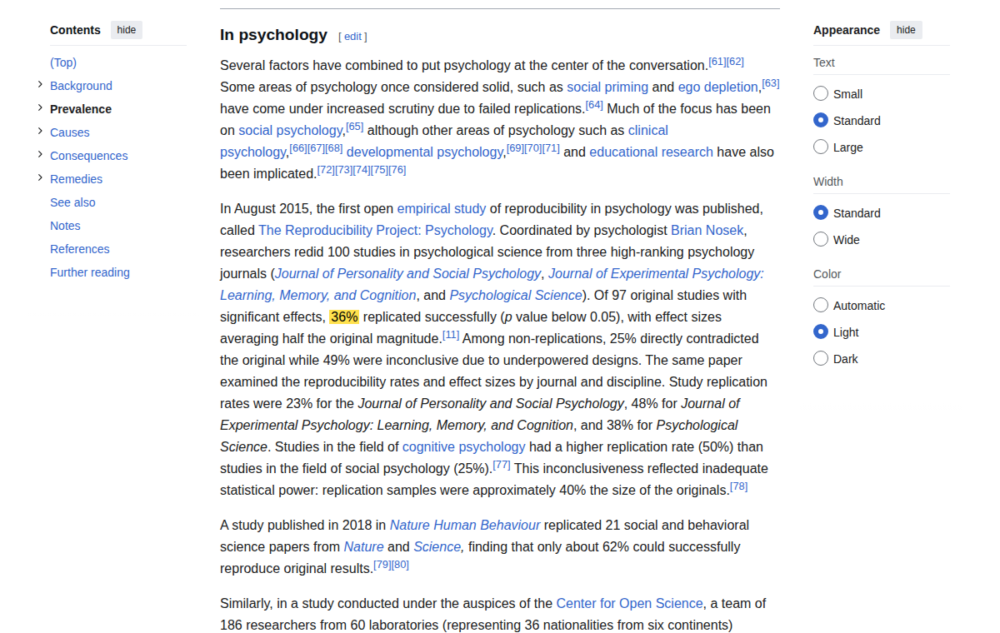

*Ekran görüntüsü: Tekrarlanabilirlik krizi — Open Science Collaboration (2015). Bağlantı kırılırsa kanıt olarak bu görüntü kalır; kaynağın en mühim kısmı sarı ile işaretlidir.*

### [K2] Piltdown Adamı — Doğa Tarihi Müzesi

- **Bağlantı:** <https://www.nhm.ac.uk/our-science/services/library/collections/piltdown-man.html> (erişim: 29 Eylül 2026)
- **Ne gösteriyor:** 1949'daki florür testleri, 1953'te Weiner–Le Gros Clark–Oakley'nin insan kafatasına orangutan çenesi eklendiğini göstermesi; dişlerin törpülenip boyandığı.

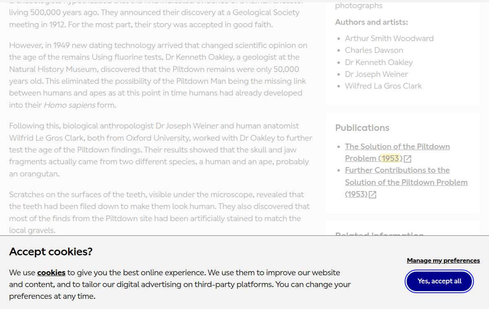

*Ekran görüntüsü: Piltdown Adamı — Doğa Tarihi Müzesi. Bağlantı kırılırsa kanıt olarak bu görüntü kalır; kaynağın en mühim kısmı sarı ile işaretlidir.*

### [K3] Hwang Woo-suk — NPR haberi (15 Aralık 2005)

- **Bağlantı:** <https://www.npr.org/2005/12/15/5055385/groundbreaking-stem-cell-research-to-be-retracted> (erişim: 29 Eylül 2026)
- **Ek bağlantı (ekran görüntüsü yok):** Dergi geri çekme notu: <https://www.science.org/doi/10.1126/science.1124926> (Science, 20 Ocak 2006)
- **Ne gösteriyor:** Kök hücre çalışmasının geri çekileceği; kıdemli yazarın sonuçların bir kısmının uydurma olduğunu kabul etmesi.

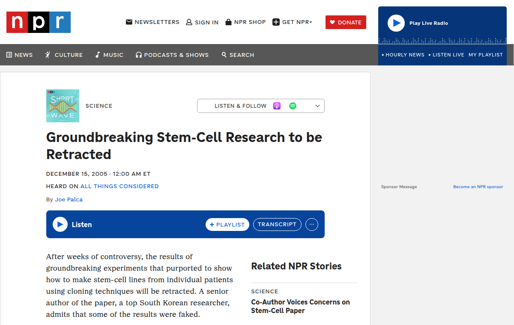

*Ekran görüntüsü: Hwang Woo-suk — NPR haberi (15 Aralık 2005). Bağlantı kırılırsa kanıt olarak bu görüntü kalır; kaynağın en mühim kısmı sarı ile işaretlidir.*

### [K4] Soğuk füzyon — Fleischmann ve Pons (1989)

- **Bağlantı:** <https://en.wikipedia.org/wiki/Cold_fusion> (erişim: 29 Eylül 2026)
- **Ne gösteriyor:** 1989 iddiasının medya çalkantısına yol açtığı, çoğunluğun aşırı ısıyı tekrarlayamadığı için iddiayı yanlış bulduğu.

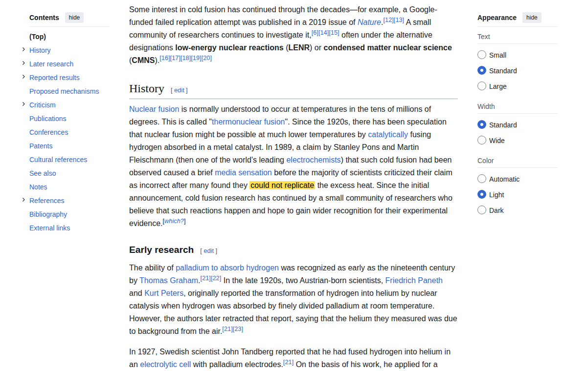

*Ekran görüntüsü: Soğuk füzyon — Fleischmann ve Pons (1989). Bağlantı kırılırsa kanıt olarak bu görüntü kalır; kaynağın en mühim kısmı sarı ile işaretlidir.*

### [K5] Harald Motzki — bibliyografya

- **Bağlantı:** <https://en.wikipedia.org/wiki/Harald_Motzki> (erişim: 29 Eylül 2026)
- **Ek bağlantı (ekran görüntüsü yok):** 1991 makalesi (JNES 50, s. 1-21): <https://www.taylorfrancis.com/chapters/edit/10.4324/9781315253695-15/musannaf-abd-al-razz%C4%81q-al-san-%C4%81n%C4%AB-source-authentic-ah%C4%81d%C4%ABth-first-century-harald-motzki>
- **Ne gösteriyor:** *The Origins of Islamic Jurisprudence* (2002, Marion H. Katz ile) ve diğer eserlerin künyesi.

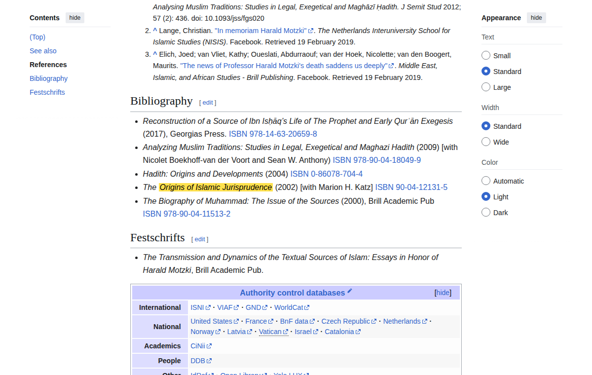

*Ekran görüntüsü: Harald Motzki — bibliyografya. Bağlantı kırılırsa kanıt olarak bu görüntü kalır; kaynağın en mühim kısmı sarı ile işaretlidir.*

### [K6] Musannef-i Abdürrezzâk — Motzki'nin 3.810 rivayetlik örneklemi

- **Bağlantı:** <https://en.wikipedia.org/wiki/Musannaf_Abd_al-Razzaq> (erişim: 29 Eylül 2026)
- **Ne gösteriyor:** Motzki'nin incelediği 3.810 rivayetlik örneklemin çoğunun üç hocadan (Ma'mer, İbn Cüreyc, Süfyân es-Sevrî) nakledilmiş olması; Musannef'in daha eski eserlerin derlemesi sayıldığı.

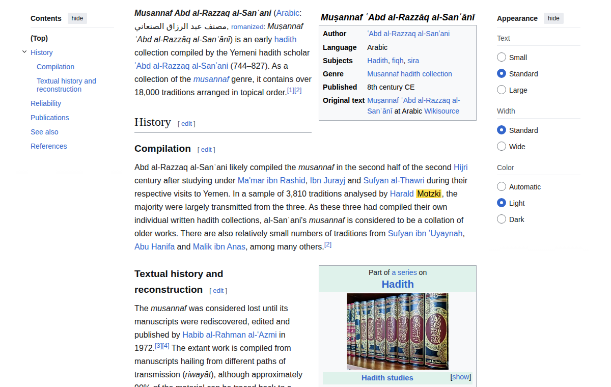

*Ekran görüntüsü: Musannef-i Abdürrezzâk — Motzki'nin 3.810 rivayetlik örneklemi. Bağlantı kırılırsa kanıt olarak bu görüntü kalır; kaynağın en mühim kısmı sarı ile işaretlidir.*

### [K7] Dârekutnî — el-İlzâmât ve Kitâbü't-Tetebbu'

- **Bağlantı:** <https://en.wikipedia.org/wiki/Al-Daraqutni> (erişim: 29 Eylül 2026)
- **Ne gösteriyor:** el-İlzâmât'ın 109 rivayeti; Kitâbü't-Tetebbu''un 217 rivayeti; Jonathan Brown'a atfen, işin "iki eserin bütünlüğüne saldırı değil, düzeltme" olduğu.

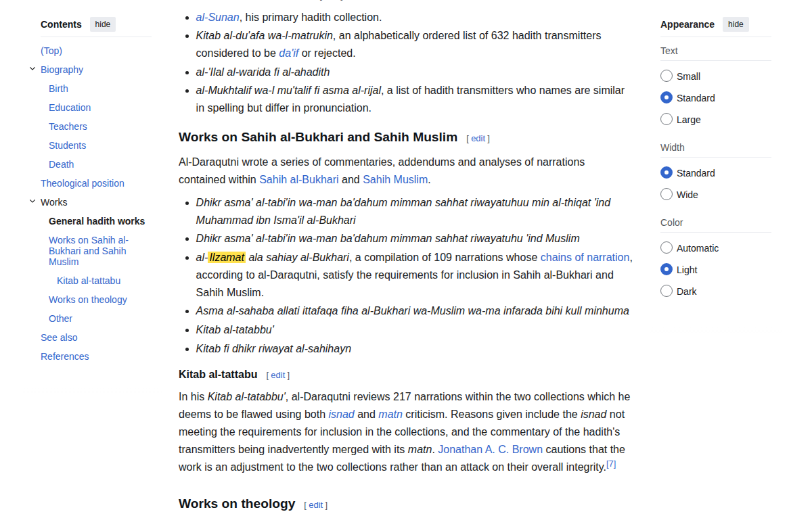

*Ekran görüntüsü: Dârekutnî — el-İlzâmât ve Kitâbü't-Tetebbu'. Bağlantı kırılırsa kanıt olarak bu görüntü kalır; kaynağın en mühim kısmı sarı ile işaretlidir.*

### [K8] Hişâm b. Urve

- **Bağlantı:** <https://en.wikipedia.org/wiki/Hisham_ibn_Urwah> (erişim: 29 Eylül 2026)
- **Ek bağlantı (ekran görüntüsü yok):** Karşı görüş (savunma): <https://yaqeeninstitute.org/read/paper/the-age-of-aisha-ra-rejecting-historical-revisionism-and-modernist-presumptions>
- **Ne gösteriyor:** İmam Mâlik'in Hişâm'ın Irak'ta nakledilen rivayetlerine itirazı; Hişâm'ın Irak döneminde zayıfladığı iddiası ve Zehebî ile el-Alâî'nin savunması.

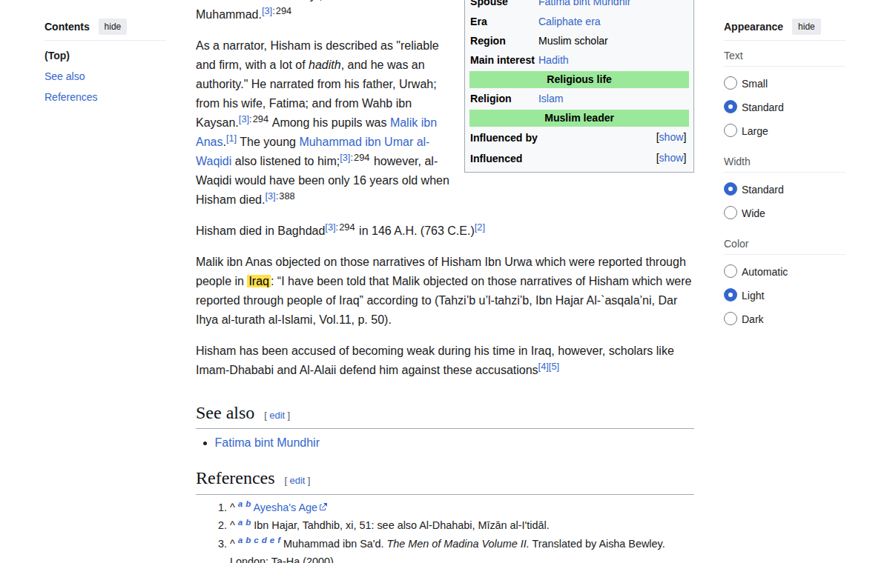

*Ekran görüntüsü: Hişâm b. Urve. Bağlantı kırılırsa kanıt olarak bu görüntü kalır; kaynağın en mühim kısmı sarı ile işaretlidir.*

### [K9] Esmâ bint Ebî Bekir — yaş farkı

- **Bağlantı:** <https://en.wikipedia.org/wiki/Asma_bint_Abi_Bakr> (erişim: 29 Eylül 2026)
- **Ne gösteriyor:** İbn Kesîr ve İbn Asâkir'in "Âişe'den on yaş büyük" rivayeti; aynı sayfada Zehebî'ye nispetle "fark 13-19 yıl" notu (ikincil kaynaklar tutmuyor).

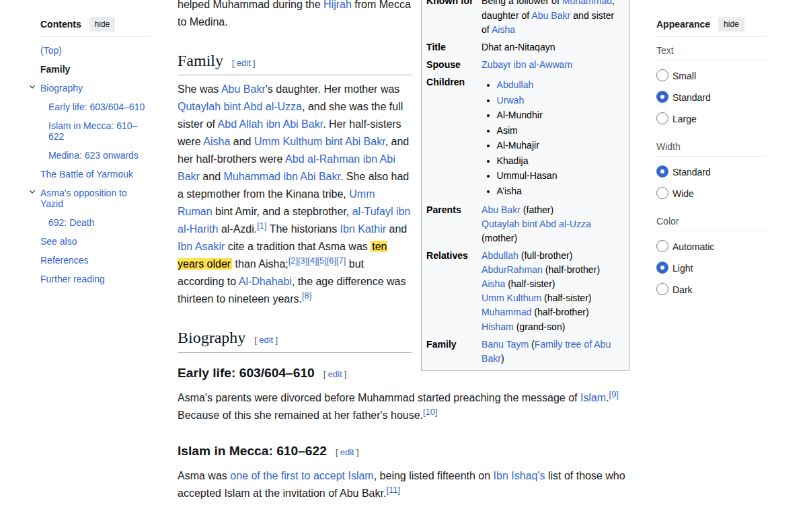

*Ekran görüntüsü: Esmâ bint Ebî Bekir — yaş farkı. Bağlantı kırılırsa kanıt olarak bu görüntü kalır; kaynağın en mühim kısmı sarı ile işaretlidir.*

### [K10] Little'ın Âişe rivayeti tezi — New Lines Magazine

- **Bağlantı:** <https://newlinesmag.com/essays/oxford-study-sheds-light-on-muhammad-underage-wife-aisha/> (erişim: 29 Eylül 2026)
- **Ne gösteriyor:** Evlilik yaşı hadisinin Mâlik'in *Muvatta*'ında bulunmadığı ve bunun "sükût delili" olarak kullanıldığı; bu, Fasıl IV §7.2'deki "sükût delili" eleştirisinin somut örneğidir.

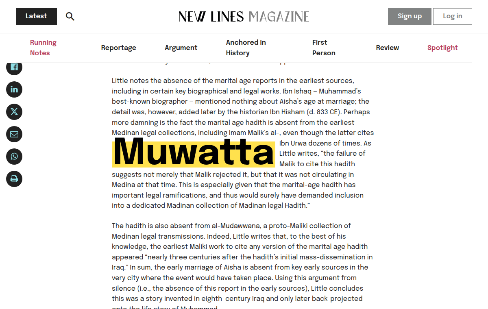

*Ekran görüntüsü: Little'ın Âişe rivayeti tezi — New Lines Magazine. Bağlantı kırılırsa kanıt olarak bu görüntü kalır; kaynağın en mühim kısmı sarı ile işaretlidir.*

### [K11] "Helâl-haramda sıkı, fazîlette gevşek" — Ahmed, İbn Mehdî, İbn Mübârek

- **Bağlantı:** <https://jamiat.org.za/weak-hadith-and-fadail-al-amal/> (erişim: 29 Eylül 2026)
- **Ne gösteriyor:** Sözün üç âlime nispeti ve Suyûtî'nin *Tedrîbü'r-râvî*'sine atfı.

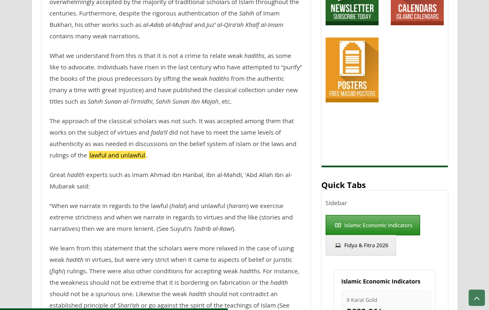

*Ekran görüntüsü: "Helâl-haramda sıkı, fazîlette gevşek" — Ahmed, İbn Mehdî, İbn Mübârek. Bağlantı kırılırsa kanıt olarak bu görüntü kalır; kaynağın en mühim kısmı sarı ile işaretlidir.*

### [K12] İbn Kesîr — Fussilet 41:9-12

- **Bağlantı:** <https://www.alim.org/quran/tafsir/ibn-kathir/surah/41/9/> (erişim: 29 Eylül 2026)
- **Ne gösteriyor:** Yerin iki günde, "dört gün"ün (rızık ve dağlar) bu iki günü içerecek biçimde anlaşıldığı, göğün iki günde tamamlandığı açıklaması.

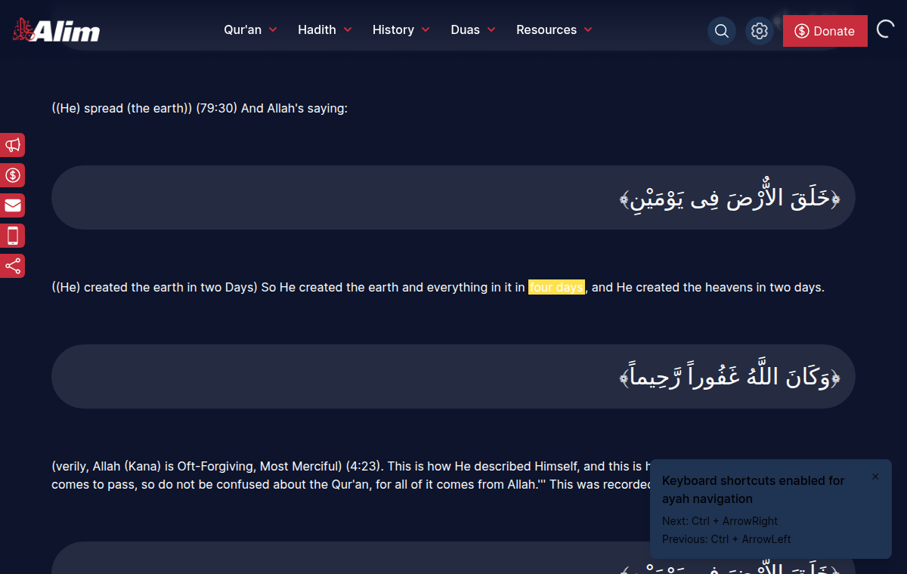

*Ekran görüntüsü: İbn Kesîr — Fussilet 41:9-12. Bağlantı kırılırsa kanıt olarak bu görüntü kalır; kaynağın en mühim kısmı sarı ile işaretlidir.*

### [K13] Serahsî, el-Mebsût'tan aktarılan cümle (irtidat hakkında)

- **Bağlantı:** <https://sabrangindia.in/article/apostasy-and-islam> (erişim: 29 Eylül 2026)
- **Ne gösteriyor:** "Dinden dönmek en büyük suç olmakla birlikte kul ile Yaratıcısı arasında bir mesele olup cezası âhirete ertelenmiştir" cümlesi.
- **Not:** Bu cümle irtidat hakkındadır; savaşın illeti (küfür/harb) meselesine tatbiki bu çalışmada teyit edilemedi.

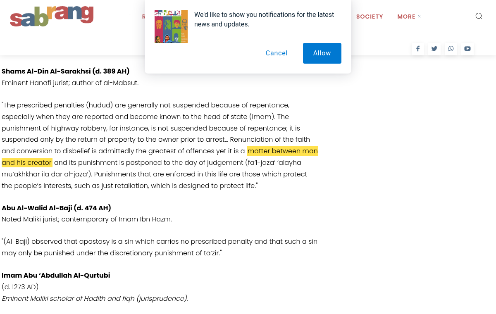

*Ekran görüntüsü: Serahsî, el-Mebsût'tan aktarılan cümle (irtidat hakkında). Bağlantı kırılırsa kanıt olarak bu görüntü kalır; kaynağın en mühim kısmı sarı ile işaretlidir.*

### Kur'ân ayetleri

Kur'ân ayetlerinin metni kaynağın kendisidir ve her mushafta bulunur; kolaylık için: [16:44](https://quran.com/16/44); [4:82](https://quran.com/4/82); [41:9](https://quran.com/41/9); [9:5](https://quran.com/9/5); [2:190](https://quran.com/2/190); [22:39](https://quran.com/22/39); [2:256](https://quran.com/2/256); [2:282](https://quran.com/2/282); [4:11](https://quran.com/4/11); [4:7](https://quran.com/4/7); [4:92](https://quran.com/4/92); [9:60](https://quran.com/9/60); [90:13](https://quran.com/90/13); [27:14](https://quran.com/27/14); [6:103](https://quran.com/6/103); [75:22](https://quran.com/75/22); [18:86](https://quran.com/18/86).


## Fasıl IV — Delil-Kuvveti Tablosu

| # | Netice | (T) |
| :-- | :-- | :-- |
| 2-a | Tevatür formülü (çok bağımsız haberci ⟹ yalan ihtimali çarpımla küçülür) | burhânî (koşullu) |
| 2-b | Bağımsızlık ihlâlinde ihtimal q'nun altına inemez | burhânî |
| 2-c | Mütevatir haber ilm-i zarurî verir | âdî yakîn; Ehl-i Sünnet'te kabul |
| 3-a | Hadis ilmi ciddî bir kaynak tenkidi aygıtına sahiptir | burhânî (gözlem) |
| 3-b | Bu aygıt genel tarihî nakil tenkidinden daha sıkıdır | cedelî-yüksek |
| 3-c | Hadislerin erken tarihlenmesi | akademik olarak açık |
| 3-d | Sahih âhâd akîdede tek başına delil olur mu | ihtilaflı — risale cumhurda |
| 4 | Hadis itirazı karar şeması | burhânî (tasnif) |
| 5 | Mücmel hüküm beyân ister; nakil ilkesinde simetri | burhânî |
| 6-a | Bilimcilik kendi kendini nakzeder; yöntemsel→metafizik doğalcılık atlaması | burhânî |
| 6-b | OSC 2015 tekrarlanabilirlik rakamları | yoklanmış olgu |
| 6-c | Piltdown, Hwang, soğuk füzyon örnekleri | yoklanmış tarihî olgu |
| 7 | Müsteşrik tezlerinin belirli metodolojik zayıflıkları | cedelî-yüksek (tartışmalı) |
| 8 | İtirazı sahibinin huyuyla çürütmek safsatadır | burhânî |
| 9 | Euthyphro çözümü; Hüsn-kubuh; nesnel ahlâk temeli | cedelî; ihtilaflı |
| 10 | Temel itirazlar tablosu | satır satır derecesiyle |
| 10-B | Cihad, kadın hukuku, kölelik, Hz. Âişe: dört sualle ele alındı | cedelî; kölelik itirazı: açık |
| 10-C | Tenakuz iddiası ancak vahdetler aynıysa doğrudur; örnek üç iddia | cedelî |

**Bu tablonun bir cümlelik özeti:** Fasıl IV **tevatürün matematiğini** burhânî olarak kurar, fakat **belirli haberlerin o koşulları taşıdığını** her defasında cedelî-yüksek bırakır; bu yüzden **Fasıl II'nin tarihî kollarının ağırlığı**, bu fasılda gösterilen **koşulların sağlandığı ölçüde** taşınır — ne fazla, ne eksik.
